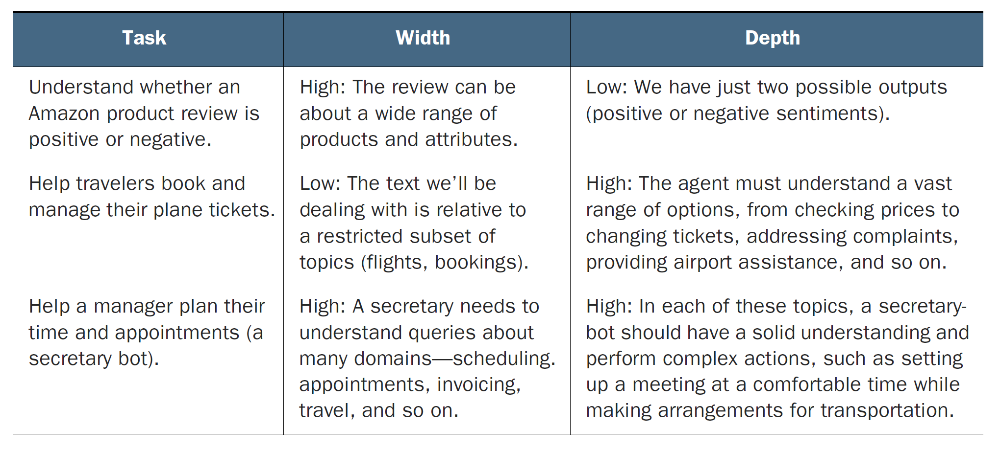

# Table of Contents

-   [UNDER CONSTRUCTION](#org05fe9d1)
-   [What will you learn?](#org04286af)
-   [The nature of language](#org208845b)
    -   [AI Sheds Light on How the Brain Processes Language](#org89adb3a)
    -   [Can computers learn language? (2019)](#org4b325a2)
    -   [OpenAI codex: automatic coding](#org4c51e91)
-   [Overview of NLP uses and tools](#org57f22d6)
    -   [Agent types](#org9827d3a)
    -   [Machine translation messing up](#orgb5ac462)
    -   [NLP methods summary](#org32494b3)
-   [AI for natural language](#orga053833)
    -   [Measuring language complexity](#orga784fea)
    -   [Broker bot](#org9cc7196)
-   [Questions for discussion](#org6b02e86)
-   [References](#org13bcd46)

# UNDER CONSTRUCTION

# What will you learn?

-   What is the nature of language?
-   What is Natural Language Processing (NLP)?
-   How is NLP success measured?
-   What is sentiment analysis?
-   How are chatbots designed?

# The nature of language

## [AI Sheds Light on How the Brain Processes Language](https://neurosciencenews.com/ai-language-processing-19536/)

> "One of the key computational features of predictive models such as
> GPT-3 is an element known as a forward one-way predictive
> transformer. This kind of transformer is able to make predictions
> of what is going to come next, based on previous sequences. A
> significant feature of this transformer is that it can make
> predictions based on a very long prior context (hundreds of words),
> not just the last few words.
> 
> Scientists have not found any brain circuits or learning mechanisms
> that correspond to this type of processing, Tenenbaum
> says. However, the new findings are consistent with hypotheses that
> have been previously proposed that prediction is one of the key
> functions in language processing, he says."

Source: [MIT, 2021](#org0563380).

## Can computers learn language? (2019)

In 2019, my sister, who is a professor of linguistics at West
Chester U., asked me to talk to her students about NLP. This is when
I began to get interested in it. The [mindmap](https://github.com/birkenkrahe/ai482/blob/main/10_ai_natural_language/can_computers_learn_languages.xmind) and [lecture notes](https://github.com/birkenkrahe/ai482/blob/main/10_ai_natural_language/can_computers_learn_languages_notes.pdf) for
this talk are in GitHub<a id="fnr.1" class="footref" href="#fn.1">1</a>.

This is also when I realized what a mess NLP was and how incomplete
our understanding of perhaps our most privileged ability, language,
stil is!

## OpenAI codex: automatic coding

**Assignment:** To get going, watch 5 minutes of this video (from [here](https://youtu.be/ISa10TrJK7w?t=115)
to [here](https://youtu.be/ISa10TrJK7w?t=367)) - recent coding successes with AI using natural language
([Neura Pod, 2021](#org3388e9e)).

The video reveals a particular (not uncommon) form of bias of what
AI can and should do for us. It is contained in this quote:

> "Programming is two things - one is: understand your problem. That
> includes talking to your users, thinking super hard about it,
> decomposing it in smaller pieces - these are the really cognitive
> aspects of building something. And then there's a second piece,
> which is: map a small functionality to code, whether it's an
> existing or an existing function, whether it's in your own codebase
> or out there in the world. And this second part is where the model
> really shines, like, I think it's better than I am at it, because it
> really has seen the whole universe of how people use code
> [&#x2026;<a id="fnr.2" class="footref" href="#fn.2">2</a>]. It really accelerates me as a programmer, and takes
> away the boring stuff so I can focus on the fun ones."

I just got into the GitHub Copilot beta pilot for OpenAI Codex -
will report if I learn anything!<a id="fnr.3" class="footref" href="#fn.3">3</a>

# Overview of NLP uses and tools

"What is NLP?" in 10 minutes. Video by [IBM Technology (2021](#org58ab61f)) - [via
YouTube](https://youtu.be/fLvJ8VdHLA0)

## Agent types

<table border="2" cellspacing="0" cellpadding="6" rules="groups" frame="hsides">

<colgroup>
<col  class="org-left" />

<col  class="org-left" />

<col  class="org-left" />
</colgroup>
<thead>
<tr>
<th scope="col" class="org-left">Use case<a id="fnr.4" class="footref" href="#fn.4">4</a></th>
<th scope="col" class="org-left"><a href="https://github.com/birkenkrahe/ai482/tree/main/8_machine_learning">Algorithm</a></th>
<th scope="col" class="org-left"><a href="https://github.com/birkenkrahe/ai482/tree/main/5_ai_agents">Agent type</a></th>
</tr>
</thead>

<tbody>
<tr>
<td class="org-left">Machine translation</td>
<td class="org-left">Deep learning</td>
<td class="org-left">Learning agent</td>
</tr>

<tr>
<td class="org-left">Virtual assistants (chatbots)</td>
<td class="org-left">Decision trees</td>
<td class="org-left">Utility-based</td>
</tr>

<tr>
<td class="org-left">Sentiment analysis</td>
<td class="org-left">Classification</td>
<td class="org-left">Model-based</td>
</tr>

<tr>
<td class="org-left">Spam detection</td>
<td class="org-left">Classification</td>
<td class="org-left">Goal-based</td>
</tr>
</tbody>
</table>

## Machine translation messing up

*Image: Google translate messing up.<a id="fnr.5" class="footref" href="#fn.5">5</a>*

This is even worse - `deepl` is often really good when it comes to
longer texts, but as a machine it is more on its own than Google
Translate.

*Image: DeepL translate messing up.<a id="fnr.5.100" class="footref" href="#fn.5">5</a>*

## NLP methods summary

<table border="2" cellspacing="0" cellpadding="6" rules="groups" frame="hsides">

<colgroup>
<col  class="org-left" />

<col  class="org-left" />

<col  class="org-left" />
</colgroup>
<thead>
<tr>
<th scope="col" class="org-left">METHOD</th>
<th scope="col" class="org-left">DEFINITION</th>
<th scope="col" class="org-left">EXAMPLE</th>
</tr>
</thead>

<tbody>
<tr>
<td class="org-left">Tokenization</td>
<td class="org-left">Breaking strings up</td>
<td class="org-left"><code>"the" "boy's" "cars" "are" "different" "colors"</code></td>
</tr>

<tr>
<td class="org-left">Stemming</td>
<td class="org-left">Identifying word stems</td>
<td class="org-left"><code>"car" "cars" "car's" "cars'"</code>: <code>car</code></td>
</tr>

<tr>
<td class="org-left">Lemmatization</td>
<td class="org-left">Morphological analysis</td>
<td class="org-left"><code>"am" "are "is"</code>: <code>be</code></td>
</tr>

<tr>
<td class="org-left">Part of speech tagging</td>
<td class="org-left">Syntactic analysis</td>
<td class="org-left"><code>Time flies like an arrow.</code></td>
</tr>

<tr>
<td class="org-left">Named Entity Recognition</td>
<td class="org-left">Text labelling</td>
<td class="org-left">Label token <code>Arizona</code> as <code>US state</code></td>
</tr>
</tbody>
</table>

Result of stemming and lemmatization ([Manning et al, 2008](#org89b8cd9)):

<table border="2" cellspacing="0" cellpadding="6" rules="groups" frame="hsides">

<colgroup>
<col  class="org-left" />

<col  class="org-left" />
</colgroup>
<tbody>
<tr>
<td class="org-left">"the boy's cars are different colors"</td>
<td class="org-left"><code>the boy car be differ color</code></td>
</tr>
</tbody>
</table>

Resolving syntactic ambiguities using POS tags ([Godayal, 2018](#org0e9949a)):

<table border="2" cellspacing="0" cellpadding="6" rules="groups" frame="hsides">

<colgroup>
<col  class="org-left" />

<col  class="org-left" />
</colgroup>
<tbody>
<tr>
<td class="org-left">Time flies like an arrow</td>
<td class="org-left">(1) Time is like an arrow, in that it passes fast</td>
</tr>

<tr>
<td class="org-left">&#xa0;</td>
<td class="org-left">(2) "Time flies" (as in "fruit flies") like [to eat] an arrow</td>
</tr>

<tr>
<td class="org-left">&#xa0;</td>
<td class="org-left">(3) You can time flies like you can time runners</td>
</tr>
</tbody>
</table>

Named Entity Recognition (NER): labelling text data

-   Named Entity Recognition - [video](https://youtu.be/Ge-sXjgup6g) ([Datasaur, 2021a](#org4657233))
-   ML-assisted text labeling - video (Datasaur, 2021b)

Further reading: [Lee, 2020](#org5e5d301).

# AI for natural language

Image source: [Mauro/Valigi (2021)](#orgb2961f7), chapter 5

## Measuring language complexity

<table border="2" cellspacing="0" cellpadding="6" rules="groups" frame="hsides">

<colgroup>
<col  class="org-left" />

<col  class="org-left" />

<col  class="org-left" />

<col  class="org-left" />
</colgroup>
<thead>
<tr>
<th scope="col" class="org-left">METRIC</th>
<th scope="col" class="org-left">TARGET</th>
<th scope="col" class="org-left">ORIGIN</th>
<th scope="col" class="org-left">METAPHOR</th>
</tr>
</thead>

<tbody>
<tr>
<td class="org-left">Width</td>
<td class="org-left">volume of the vocabulary</td>
<td class="org-left">domain diversity</td>
<td class="org-left">crown width</td>
</tr>

<tr>
<td class="org-left">Depth</td>
<td class="org-left">levels of understanding</td>
<td class="org-left">domain depth</td>
<td class="org-left">tree height</td>
</tr>

<tr>
<td class="org-left">Width x Depth</td>
<td class="org-left">complexity of patterns</td>
<td class="org-left">uses of language</td>
<td class="org-left">tree cover</td>
</tr>
</tbody>
</table>

*What is for example not captured with this measure?*<a id="fnr.6" class="footref" href="#fn.6">6</a>

## Broker bot

# Questions for discussion

-   Which two metrics are used to measure NLP performance?
-   Why is sentiment analysis a classification problem?
-   What does OpenAI's GPT-2 model do?
-   How does BrokerBot differ from Eliza the therapist bot?

# References

 MIT (Oct 25, 2021). Artificial Intelligence Sheds Light on
How the Brain Processes Language [news]. [URL: neurosciencenews.com.](https://neurosciencenews.com/ai-language-processing-19536/)

 Mauro/Valigi (2021). Zero to AI - a nontechnical,
hype-free guide to prospering in the AI era. Manning. [Online:
manning.com](https://www.manning.com/books/zero-to-ai).

 Neura Pod - Neuralink (Oct 3, 2021). OpenAI&Neuralink
[video]:1:55-6:05. [Online: youtube.com.](https://youtu.be/ISa10TrJK7w)

 IBM Technology/Martin Keen (Aug 11, 2021). What is NLP
(Natural Language Processing)? [video]. URL: [youtu.be/fLvJ8VdHLA0](https://youtu.be/fLvJ8VdHLA0)

 Manning/Raghavan/Schuetze (2008). Introduction to
Information Retrieval. Cambridge Univ Press ([PDF](https://nlp.stanford.edu/IR-book/)). [URL:
nlp.stanford.edu.](https://nlp.stanford.edu/IR-book/)

 Godayal/Malhotra (June 8, 2018). An introduction to part of
speech tagging and the Hidden Markov Model [blog]. [URL:
freecodecamp.org](https://www.freecodecamp.org/news/an-introduction-to-part-of-speech-tagging-and-the-hidden-markov-model-953d45338f24/)

 Lee (Sep 3, 2020). Data Labeling for Natural Language
Processing: A Comprehensive Guide. [URL: medium.com/datasaur](https://medium.com/datasaur/data-labeling-for-natural-language-processing-a-comprehensive-guide-741343fea20e).

 Datasaur (May 19, 2021). Datasaur Labeling
[video]. [URL: youtu.be/Ge-sXjgup6g](https://youtu.be/Ge-sXjgup6g)

 Datasaur (May 2, 2021). Datasaur.ai: ML-Assisted
Labeling [video]. [URL: youtu.be/Qsw7dhneBw4](https://youtu.be/Qsw7dhneBw4)

 Birkenkrahe (14 Nov 2021). Can Computers Learn Language?
Talk at West Chester U. [mindmap]. [URL: tinyurl.com](https://tinyurl.com/sn5hqh2)

# Footnotes

<a id="fn.1" href="#fnr.1">1</a> There is a fair amount of posturing in the notes and in the
talk, because my sister asked me to impress her students.

<a id="fn.2" href="#fnr.2">2</a> Using the GPT-3 model.

<a id="fn.3" href="#fnr.3">3</a> "GitHub Copilot is an AI pair programmer which suggests line
completions and entire function bodies as you type. GitHub Copilot is
powered by the OpenAI Codex AI system, trained on public Internet text
and billions of lines of code." ([Source](https://marketplace.visualstudio.com/items?itemName=GitHub.copilot)). Alas, I do not use Visual
Code Studio - an editor from Microsoft (now it makes sense why GitHub,
also owned by Microsoft, partners with OpenAI Codex - more customers
for both their platforms and ultimately for their cloud business,
Azure).

<a id="fn.4" href="#fnr.4">4</a> We've used this term "use case" in class without definition. In
the Unified Modeling Language (UML), a use case diagram shows all the
different ways in which a user might interact with a system. The more
colloquial use means that we look at all the different ways, in which
a concept might be applied or used.

<a id="fn.5" href="#fnr.5">5</a> Actually, "Du kannst mich mal gerne haben" (German) means "Bite
me."  While "jemanden gerne haben" means "to like someone", the
operational part of the German sentence is "Du kannst mich mal", which
is correctly machine translated as "Bite me." But the last part is
inserted to soften it (typically used like this in the South of
Germany).

<a id="fn.6" href="#fnr.6">6</a> Language ambiguities (overlaps). Different meaning as the result
of interaction (over time, space). Example: how language changes in
the course of a telephone conversation, a talk between lovers, or in
the course of a hostile company takeover or a conquest in war.
