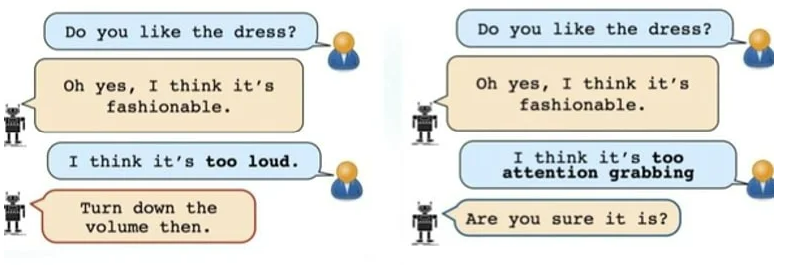
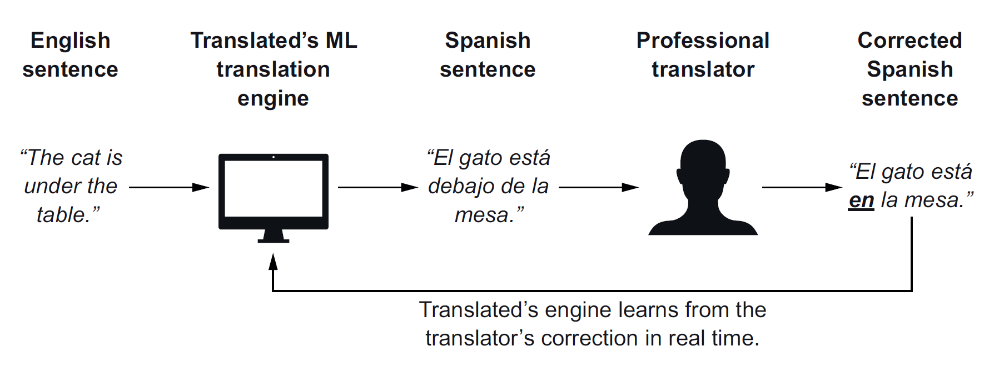

# Table of Contents

-   [What will you learn?](#orgb44a46b)
-   [The nature of language](#org835cba8)
    -   [Can computers learn language? (2019)](#org501f144)
    -   [OpenAI codex: automatic coding](#org0d1a26f)
-   [Overview of NLP uses and tools](#org68fe323)
    -   [Agent types](#orgf66d473)
    -   [Machine translation messing up](#org07f449a)
    -   [Idioms and similes](#org9695e62)
    -   [NLP methods summary](#org9f0631d)
-   [Zero to AI: AI for natural language](#org105d82c)
    -   [Measuring language complexity](#org735adcd)
    -   [NLP application scenarios](#orgaf51f86)
    -   [Sentiment analysis and autonomous spam detection](#org735d0e3)
    -   [Text classification and document search and retrieval](#org1b01bd6)
    -   [Natural conversation and transformer models](#org949683d)
        -   [Insight generation with Viable](#org6fb6d3e)
        -   [AI Sheds Light on How the Brain Processes Language](#org1ad4c47)
    -   [Case study: Translated](#orgcecfd39)
-   [Questions for discussion](#org871c7fc)
-   [References](#org426c176)

# What will you learn?

-   What is the nature of language?
-   What is Natural Language Processing (NLP)?
-   What are some NLP tools?
-   How is NLP success measured?
-   Different current NLP application scenarios

# The nature of language

## Can computers learn language? (2019)

In 2019, my sister, who is a professor of linguistics at West
Chester U., asked me to talk to her students about NLP. This is
when I began to get interested in it. The [mindmap](https://github.com/birkenkrahe/ai482/blob/main/10_ai_natural_language/can_computers_learn_languages.xmind) and [lecture notes](https://github.com/birkenkrahe/ai482/blob/main/10_ai_natural_language/can_computers_learn_languages_notes.pdf)
for this talk are in GitHub, and here is a [large screenshot](https://github.com/birkenkrahe/ai482/blob/main/10_ai_natural_language/can_computers_learn_languages.png) for
download<a id="fnr.1" class="footref" href="#fn.1">1</a>.

This is also when I realized what a mess NLP was and how incomplete
our understanding of perhaps our most privileged ability, language,
stil is!

## OpenAI codex: automatic coding

**Assignment:** To get going, watch 5 minutes of this video (from [here](https://youtu.be/ISa10TrJK7w?t=115)
to [here](https://youtu.be/ISa10TrJK7w?t=367)) - recent coding successes with AI using natural language
([Neura Pod, 2021](#org489e1da)).

The video reveals a particular (not uncommon) form of bias of what
AI can and should do for us. It is contained in this quote:

> "Programming is two things - one is: understand your problem. That
> includes talking to your users, thinking super hard about it,
> decomposing it in smaller pieces - these are the really cognitive
> aspects of building something. And then there's a second piece,
> which is: map a small functionality to code, whether it's an
> existing or an existing function, whether it's in your own codebase
> or out there in the world. And this second part is where the model
> really shines, like, I think it's better than I am at it, because it
> really has seen the whole universe of how people use code
> [&#x2026;<a id="fnr.2" class="footref" href="#fn.2">2</a>]. It really accelerates me as a programmer, and takes
> away the boring stuff so I can focus on the fun ones."

I just got into the GitHub Copilot beta pilot for OpenAI Codex -
will report if I learn anything!<a id="fnr.3" class="footref" href="#fn.3">3</a>

# Overview of NLP uses and tools

"What is NLP?" in 10 minutes. Video by [IBM Technology (2021](#org2482af7)) - [via
YouTube](https://youtu.be/fLvJ8VdHLA0)

## Agent types

<table border="2" cellspacing="0" cellpadding="6" rules="groups" frame="hsides">

<colgroup>
<col  class="org-left" />

<col  class="org-left" />

<col  class="org-left" />
</colgroup>
<thead>
<tr>
<th scope="col" class="org-left">Use case<a id="fnr.4" class="footref" href="#fn.4">4</a></th>
<th scope="col" class="org-left"><a href="https://github.com/birkenkrahe/ai482/tree/main/8_machine_learning">Algorithm</a></th>
<th scope="col" class="org-left"><a href="https://github.com/birkenkrahe/ai482/tree/main/5_ai_agents">Agent type</a></th>
</tr>
</thead>

<tbody>
<tr>
<td class="org-left">Machine translation</td>
<td class="org-left">Deep learning</td>
<td class="org-left">Learning agent</td>
</tr>

<tr>
<td class="org-left">Virtual assistants (chatbots)</td>
<td class="org-left">Decision trees</td>
<td class="org-left">Utility-based</td>
</tr>

<tr>
<td class="org-left">Sentiment analysis</td>
<td class="org-left">Classification</td>
<td class="org-left">Model-based</td>
</tr>

<tr>
<td class="org-left">Spam detection</td>
<td class="org-left">Classification</td>
<td class="org-left">Goal-based</td>
</tr>
</tbody>
</table>

## Machine translation messing up

*Image: Google translate messing up.<a id="fnr.5" class="footref" href="#fn.5">5</a>*

This is even worse - `deepl` is often really good when it comes to
longer texts, but as a machine it is more on its own than Google
Translate.

*Image: DeepL translate messing up.<a id="fnr.5.100" class="footref" href="#fn.5">5</a>*

## Idioms and similes

As briefly discussed on Nov 8. It seems the situation is dire but
not hopeless: new research using OpenAI's GPT-2 ([2021](#orgc585e29)) improves
recognition of idioms by up to 15%, but still not without human
help:

> "When chatbots are faced with human interaction containing similes and
> idioms, their performance falls to between 10 to 20%. [&#x2026;] The
> researchers still had to partially rely on human observers to identify
> figurative language within the dataset, before the text could be
> converted. Further study is needed in this area."

(Source: [Neuroscience news, 8 Nov 2021](https://neurosciencenews.com/chatbot-figurative-language-19613/))

## NLP methods summary

<table border="2" cellspacing="0" cellpadding="6" rules="groups" frame="hsides">

<colgroup>
<col  class="org-left" />

<col  class="org-left" />

<col  class="org-left" />
</colgroup>
<thead>
<tr>
<th scope="col" class="org-left">METHOD</th>
<th scope="col" class="org-left">DEFINITION</th>
<th scope="col" class="org-left">EXAMPLE</th>
</tr>
</thead>

<tbody>
<tr>
<td class="org-left">Tokenization</td>
<td class="org-left">Breaking strings up</td>
<td class="org-left"><code>"the" "boy's" "cars" "are" "different" "colors"</code></td>
</tr>

<tr>
<td class="org-left">Stemming</td>
<td class="org-left">Identifying word stems</td>
<td class="org-left"><code>"car" "cars" "car's" "cars'"</code>: <code>car</code></td>
</tr>

<tr>
<td class="org-left">Lemmatization</td>
<td class="org-left">Morphological analysis</td>
<td class="org-left"><code>"am" "are "is"</code>: <code>be</code></td>
</tr>

<tr>
<td class="org-left">Part of speech tagging</td>
<td class="org-left">Syntactic analysis</td>
<td class="org-left"><code>Time flies like an arrow.</code></td>
</tr>

<tr>
<td class="org-left">Named Entity Recognition</td>
<td class="org-left">Text labelling</td>
<td class="org-left">Label token <code>Arizona</code> as <code>US state</code></td>
</tr>
</tbody>
</table>

Result of stemming and lemmatization ([Manning et al, 2008](#org9fb9862)):

<table border="2" cellspacing="0" cellpadding="6" rules="groups" frame="hsides">

<colgroup>
<col  class="org-left" />

<col  class="org-left" />
</colgroup>
<tbody>
<tr>
<td class="org-left">"the boy's cars are different colors"</td>
<td class="org-left"><code>the boy car be differ color</code></td>
</tr>
</tbody>
</table>

Resolving syntactic ambiguities using POS tags ([Godayal, 2018](#org7d87582)):

<table border="2" cellspacing="0" cellpadding="6" rules="groups" frame="hsides">

<colgroup>
<col  class="org-left" />

<col  class="org-left" />
</colgroup>
<tbody>
<tr>
<td class="org-left">Time flies like an arrow</td>
<td class="org-left">(1) Time is like an arrow, in that it passes fast</td>
</tr>

<tr>
<td class="org-left">&#xa0;</td>
<td class="org-left">(2) "Time flies" (as in "fruit flies") like [to eat] an arrow</td>
</tr>

<tr>
<td class="org-left">&#xa0;</td>
<td class="org-left">(3) You can time flies like you can time runners</td>
</tr>
</tbody>
</table>

Named Entity Recognition (NER): labelling text data

-   Named Entity Recognition - [video](https://youtu.be/Ge-sXjgup6g) ([Datasaur, 2021a](#org9b7e842))
-   ML-assisted text labeling - video (Datasaur, 2021b)

Further reading: [Lee, 2020](#org066fd0c).

# Zero to AI: AI for natural language

Image source: [Mauro/Valigi (2021)](#org8b1f2d4), chapter 5

For this lecture, I have merely extracted what I think are the most
interesting features of this chapter. Overall, it gives a fair
impression of the state of the art without getting bogged down in
technical detail (true to the expected non-technical business
audience).

## Measuring language complexity

<table border="2" cellspacing="0" cellpadding="6" rules="groups" frame="hsides">

<colgroup>
<col  class="org-left" />

<col  class="org-left" />

<col  class="org-left" />

<col  class="org-left" />
</colgroup>
<thead>
<tr>
<th scope="col" class="org-left">METRIC</th>
<th scope="col" class="org-left">TARGET</th>
<th scope="col" class="org-left">ORIGIN</th>
<th scope="col" class="org-left">METAPHOR</th>
</tr>
</thead>

<tbody>
<tr>
<td class="org-left">Width</td>
<td class="org-left">volume of the vocabulary</td>
<td class="org-left">domain diversity</td>
<td class="org-left">crown width</td>
</tr>

<tr>
<td class="org-left">Depth</td>
<td class="org-left">levels of understanding</td>
<td class="org-left">domain depth</td>
<td class="org-left">tree height</td>
</tr>

<tr>
<td class="org-left">Width x Depth</td>
<td class="org-left">complexity of patterns</td>
<td class="org-left">uses of language</td>
<td class="org-left">tree cover</td>
</tr>
</tbody>
</table>

Greater area corresponds to greater "complexity"<a id="fnr.6" class="footref" href="#fn.6">6</a>.

*What is for example not captured with this measure?*<a id="fnr.7" class="footref" href="#fn.7">7</a>

Two application examples:

<table border="2" cellspacing="0" cellpadding="6" rules="groups" frame="hsides">

<colgroup>
<col  class="org-left" />

<col  class="org-left" />

<col  class="org-left" />
</colgroup>
<thead>
<tr>
<th scope="col" class="org-left">Application</th>
<th scope="col" class="org-left">Depth</th>
<th scope="col" class="org-left">Width</th>
</tr>
</thead>

<tbody>
<tr>
<td class="org-left">Sentiment analysis on tweets</td>
<td class="org-left">low: positive or negative review label</td>
<td class="org-left">high: many different subjects</td>
</tr>

<tr>
<td class="org-left">Classifying customer support tickets</td>
<td class="org-left">high: many different support types</td>
<td class="org-left">low: all tasks in one domain</td>
</tr>
</tbody>
</table>

## NLP application scenarios

This is a bit of a downer but not surprising: the application of
machine "intelligence" is a function of our understanding of an
entity. In the case of natural (i.e. human) language, this
understanding is not forthcoming:

> "In the last 40 years, there has been an explosion of research on
> [the] problem [of language evolution] as well as a sense that
> considerable progress has been made. We argue instead that the
> richness of ideas is accompanied by a poverty of evidence, with
> essentially no explanation of how and why our linguistic
> computations and representations evolved." ([Hauser et al, 2014](#org1fed824)).

However, notice advances with rational agents despite our inability
to understand, or define, human intelligence (which is an even
larger canvas than language).

Also, understanding of the "evolution of language" is not the same
as understanding of language. Another possibility is here that our
understanding of evolution as a concept (or theory) is incomplete
or erroneous. Cp. [Wolfe (2016)](#org678cc63) for some heretic thoughts on the
matter.

## Sentiment analysis and autonomous spam detection

-   Classification problems
-   Statistical method: naive Bayes<a id="fnr.8" class="footref" href="#fn.8">8</a>
-   "Learning by experience beats hand-coded rules"

## Text classification and document search and retrieval

This NLP workflow diagram includes some of the tools explained
earlier, showing the transfer from model training to deployment.

For document search, documents are looked up that have similar
embeddings as the query. The model is trained on existing
documents.

Success depends on the accuracy of the embeddings (the labelling
for training and testing). An important technical detail is
reduction of dimensions - the longer the embedding information
vector the better the search but the worse the algorithm performs.

Popular methods to achieve this reduction are [Singular Value
Decomposition (SVD)](https://www.displayr.com/singular-value-decomposition-in-r/) and [Principal Component Analysis (PCA)](https://www.datacamp.com/community/tutorials/pca-analysis-r)<a id="fnr.9" class="footref" href="#fn.9">9</a>.

## Natural conversation and transformer models

-   GPT-3 powers fast apps like [`viable`](#orga5e9dc1) ([1 min video](https://askviable.com/))
-   Massive token base (500 bn), ANN of nearly 100 layers deep<a id="fnr.10" class="footref" href="#fn.10">10</a>
-   GPT-3 does not really understand what it's saying
-   GPT-3 can get stuck on a loop or produce gibberish
-   Probabilistic reasoning is not the same as understanding

### Insight generation with Viable

> Using GPT-3, Viable identifies themes, emotions, and sentiment
> from surveys, help desk tickets, live chat logs, reviews, and
> more. It then pulls insights from this aggregated feedback and
> provides a summary in seconds.
> 
> For example, if asked, “What’s frustrating our customers about the
> checkout experience?”, Viable might provide the insight:
> “Customers are frustrated with the checkout flow because it takes
> too long to load. They also want a way to edit their address in
> checkout and save multiple payment methods.” (Source: [OpenAI](#orgfc2ef17))

Image: Viable sample feedback summary. Source: [OpenAI](#orgfc2ef17).

### [AI Sheds Light on How the Brain Processes Language](https://neurosciencenews.com/ai-language-processing-19536/)

<table border="2" cellspacing="0" cellpadding="6" rules="groups" frame="hsides">

<colgroup>
<col  class="org-left" />
</colgroup>
<tbody>
<tr>
<td class="org-left">MIT team analyzed different language models (incl. GPT-3<a id="fnr.11" class="footref" href="#fn.11">11</a>)</td>
</tr>

<tr>
<td class="org-left">"Best-performing next-word prediction models activity patterns resemble those seen in the human brain."</td>
</tr>

<tr>
<td class="org-left">"We found that the models that predict the neural responses well also tend to best predict human behavior responses, in the form of reading times. And then both of these are explained by the model performance on next-word prediction. This triangle really connects everything together."</td>
</tr>
</tbody>
</table>

> "One of the key computational features of predictive models such
> as GPT-3 is an element known as a forward one-way predictive
> transformer. This kind of transformer is able to make predictions
> of what is going to come next, based on previous sequences. A
> significant feature of this transformer is that it can make
> predictions based on a very long prior context (hundreds of
> words), not just the last few words.
> 
> Scientists have not found any brain circuits or learning
> mechanisms that correspond to this type of processing, Tenenbaum
> says. However, the new findings are consistent with hypotheses
> that have been previously proposed that prediction is one of the
> key functions in language processing, he says."

Source: [MIT, 2021](#org96d2ce4).

## Case study: Translated

> "Lok at the tasks that a company could perform using 1,000
> untrained interns. These are tasks that can be automated by AI."
> (Trombetti in [Zero to AI](#org8b1f2d4), p. 118)

`Translated` uses AI for binary classification of documents&#x2026;

&#x2026;but also to match customers and translators (greater depth)&#x2026;

&#x2026;and to improve translations in concert with humans (greater
width):

# Questions for discussion

-   How does (the idealized) BrokerBot differ from (the implemented)
    Eliza, the therapist bot?
-   Can the different AI applications of the `Translated` case study
    be transferred to other industries besides translation?
-   What stops us from getting better at Natural Language Processing?

# References

 MIT (Oct 25, 2021). Artificial Intelligence Sheds Light on
How the Brain Processes Language [news]. [URL: neurosciencenews.com.](https://neurosciencenews.com/ai-language-processing-19536/)

 Mauro/Valigi (2021). Zero to AI - a nontechnical,
hype-free guide to prospering in the AI era. Manning. [Online:
manning.com](https://www.manning.com/books/zero-to-ai).

 Neura Pod - Neuralink (Oct 3, 2021). OpenAI&Neuralink
[video]:1:55-6:05. [Online: youtube.com.](https://youtu.be/ISa10TrJK7w)

 IBM Technology/Martin Keen (Aug 11, 2021). What is NLP
(Natural Language Processing)? [video]. URL: [youtu.be/fLvJ8VdHLA0](https://youtu.be/fLvJ8VdHLA0)

 Manning/Raghavan/Schuetze (2008). Introduction to
Information Retrieval. Cambridge Univ Press ([PDF](https://nlp.stanford.edu/IR-book/)). [URL:
nlp.stanford.edu.](https://nlp.stanford.edu/IR-book/)

 Godayal/Malhotra (June 8, 2018). An introduction to part of
speech tagging and the Hidden Markov Model [blog]. [URL:
freecodecamp.org](https://www.freecodecamp.org/news/an-introduction-to-part-of-speech-tagging-and-the-hidden-markov-model-953d45338f24/)

 Lee (Sep 3, 2020). Data Labeling for Natural Language
Processing: A Comprehensive Guide. [URL: medium.com/datasaur](https://medium.com/datasaur/data-labeling-for-natural-language-processing-a-comprehensive-guide-741343fea20e).

 Datasaur (May 19, 2021). Datasaur Labeling
[video]. [URL: youtu.be/Ge-sXjgup6g](https://youtu.be/Ge-sXjgup6g)

 Datasaur (May 2, 2021). Datasaur.ai: ML-Assisted
Labeling [video]. [URL: youtu.be/Qsw7dhneBw4](https://youtu.be/Qsw7dhneBw4)

 Birkenkrahe (14 Nov 2021). Can Computers Learn Language?
Talk at West Chester U. [mindmap]. [URL: tinyurl.com](https://tinyurl.com/sn5hqh2)

 Dorner (1990). The logic of failure. In:
Phil. Trans.R. Soc. Lond. B 327:463-473 (1990).] [URL: gwern.net.](https://www.gwern.net/docs/existential-risk/1990-dorner.pdf)

 Hauser et al (2014). The mystery of language
evolution. Front.Psychol. 7
May 2014. <https://doi.org/10.3389/fpsyg.2014.00401>

 Wolfe (2016). The Kingdom of Speech. Little, Brown and
Company. [URL: wikipedia.org.](https://en.wikipedia.org/wiki/The_Kingdom_of_Speech)

 Luis Serrano (Feb 10, 2019). Naive Bayes classifier: A
friendly approach. [URL: youtu.be/Q8l0Vip5YUw](https://youtu.be/Q8l0Vip5YUw)

 Serrano (2021). Grokking Machine
Learning. Manning. [URL: bit.ly/grokkingML](https://www.manning.com/books/grokking-machine-learning)

 Graham (Aug 2002). A Plan for Spam [Blog]. [URL:
paulgraham.com](http://www.paulgraham.com/spam.html)

 openai.com (March 25, 2021). GPT-3 Powers the Next
Generation of Apps [blog]. URL: [openai.com](https://openai.com/blog/gpt-3-apps/)

 askviable.com (2021). It used to take hours to find
insights in customer feedback.  Now it takes seconds [website]. URL:
askviable.com.

 Neuroscience News (November 8, 2021). Want to Throw off
Your Chatbot? Use Figurative Language [blog]. URL:
[neurosciencenews.com](https://neurosciencenews.com/chatbot-figurative-language-19613/).

 Li (June 03, 2020). OpenAI's GPT-3 Language Model: A
Technical Overview [blog]. URL: [URL: lambdalabs.com](https://lambdalabs.com/blog/demystifying-gpt-3/).

# Footnotes

<a id="fn.1" href="#fnr.1">1</a> There is a fair amount of posturing in the notes and in the
talk, because my sister asked me to impress her students.

<a id="fn.2" href="#fnr.2">2</a> Using the GPT-3 model.

<a id="fn.3" href="#fnr.3">3</a> "GitHub Copilot is an AI pair programmer which suggests line
completions and entire function bodies as you type. GitHub Copilot is
powered by the OpenAI Codex AI system, trained on public Internet text
and billions of lines of code." ([Source](https://marketplace.visualstudio.com/items?itemName=GitHub.copilot)). Alas, I do not use Visual
Code Studio - an editor from Microsoft (now it makes sense why GitHub,
also owned by Microsoft, partners with OpenAI Codex - more customers
for both their platforms and ultimately for their cloud business,
Azure).

<a id="fn.4" href="#fnr.4">4</a> We've used this term "use case" in class without definition. In
the Unified Modeling Language (UML), a use case diagram shows all the
different ways in which a user might interact with a system. The more
colloquial use means that we look at all the different ways, in which
a concept might be applied or used.

<a id="fn.5" href="#fnr.5">5</a> Actually, "Du kannst mich mal gerne haben" (German) means "Bite
me."  While "jemanden gerne haben" means "to like someone", the
operational part of the German sentence is "Du kannst mich mal", which
is correctly machine translated as "Bite me." But the last part is
inserted to soften it (typically used like this in the South of
Germany).

<a id="fn.6" href="#fnr.6">6</a> In quotes because this is an almost trivial notion of
complexity. Compare it with the complexity defined by [Dorner (1990)](#orgb12796a) as
a function of dynamic variables.

<a id="fn.7" href="#fnr.7">7</a> Language ambiguities (overlaps). Different meaning as the result
of interaction (over time, space). Example: how language changes in
the course of a telephone conversation, a talk between lovers, or in
the course of a hostile company takeover or a conquest in war. More
generally, any features that cannot easily be captured with a feature
vector (e.g. because we don't even know what the variables are).

<a id="fn.8" href="#fnr.8">8</a> Here is an [excellent video](https://youtu.be/Q8l0Vip5YUw) ([Serrano, 2019](#org8a6cd3b)) explaining this
important statistical theorem about conditional probabilities. The
creator of the video has also just (Oct 21) published a well reviewed
book on machine learning (Serrano, 2021). You should also read the
original article by Paul Graham on spam detection ([2002](#org75b5543)).

<a id="fn.9" href="#fnr.9">9</a> The links go to two articles on doing this stuff using the
statistical programming language R. I prefer explaining and studying
these methods in concert with actual computations (instead of only
mathematically). However, if you can take the time, you should dive
into the mathematics, too (or suggest it as an example in a linear
algebra class).

<a id="fn.10" href="#fnr.10">10</a> [Li (2020)](#org2fe0e0b) has an excellent summary of GPT-3's technical
specs. In the last paragraph, the author speculates that the
transformer model is beginning to approach the structural capacity of
the human brain.

<a id="fn.11" href="#fnr.11">11</a> "Generative Pre-trained Transformer 3" created by OpenAI
([2021](#orgfc2ef17)).
