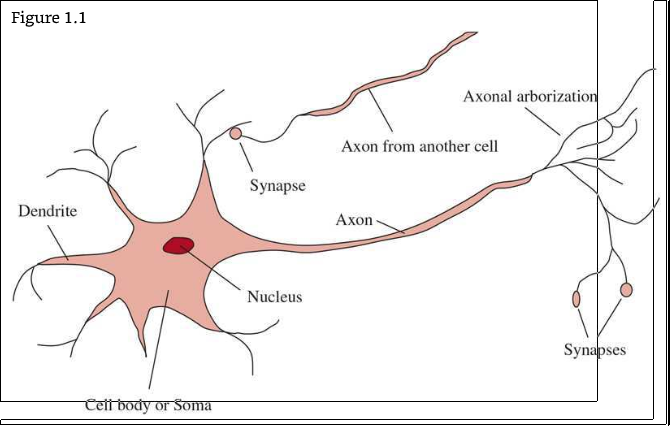
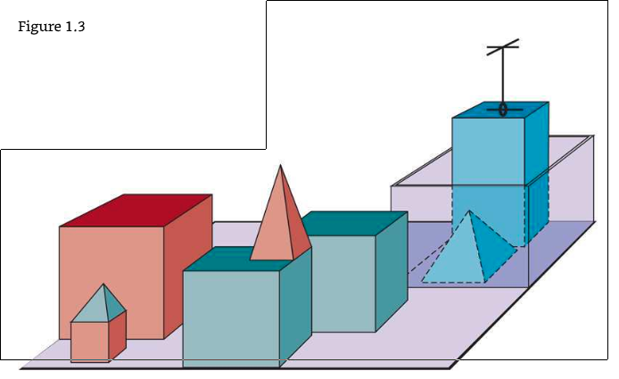
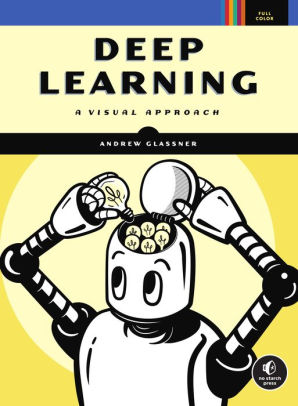
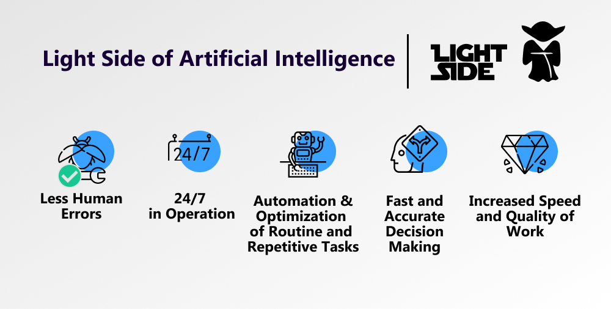
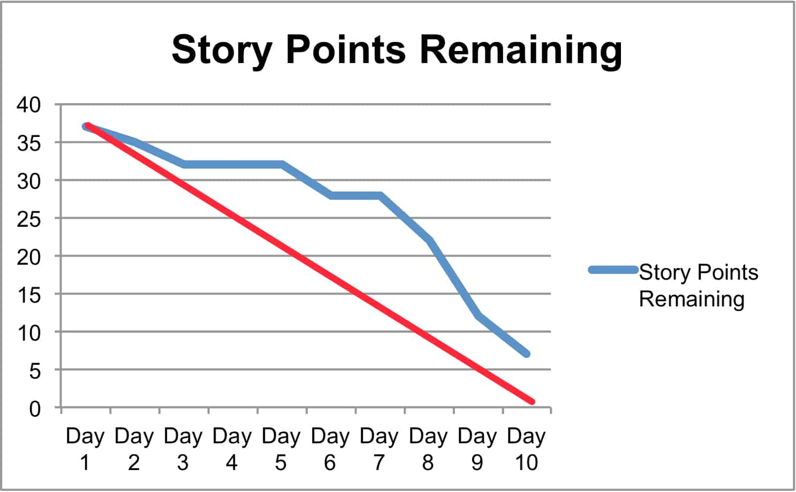
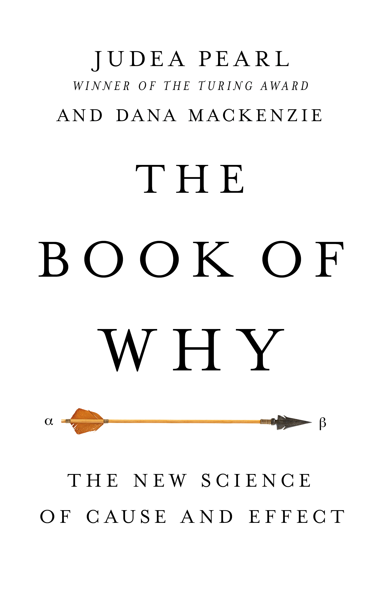
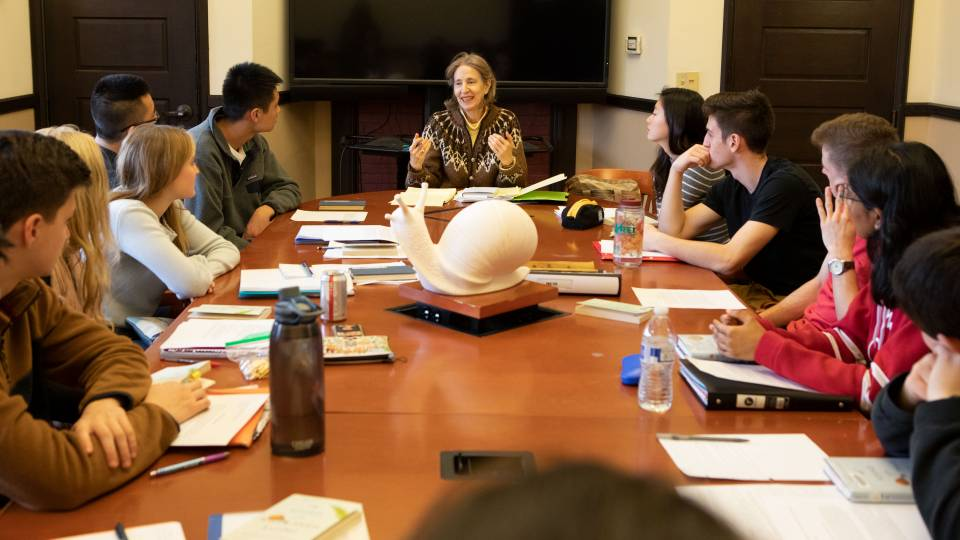
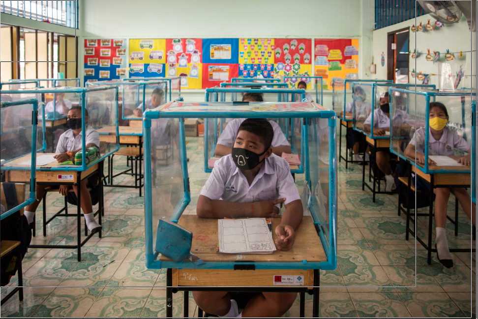
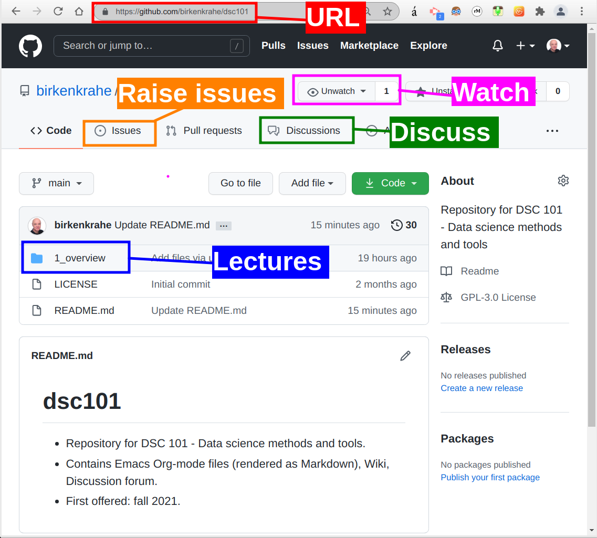

# Table of Contents

-   [What're you going to learn today?](#orgda14e42)
-   [Who am I?](#orgc2cd49a)
    -   [Science](#orga52a1b9)
    -   [Industry](#orgf635766)
    -   [Teaching](#org028953f)
    -   [Pleasure](#orgd0448da)
-   [What are your expectations?](#orgceed9f1)
-   [Which topics will we cover?](#orgd12a131)
    -   [Modern approach to AI](#org365ae61)
    -   [What is AI?](#orgae2d894)
    -   [History of AI](#orga3f95e5)
    -   [State of the Art of AI](#org8646fa2)
    -   [Risks and benefits of AI](#org475738d)
    -   [Agile management](#orga6e185b)
    -   [Causation](#org9e4eb25)
    -   [Schedule (see Syllabus)](#org49b444c)
-   [How will we do it?](#orgd0c68b3)
    -   [Classroom sessions](#org25c247a)
    -   [Lecture scripts with exercises (GitHub)](#orga1ac55f)
    -   [Your presentations](#org952cd89)
    -   [Your protocols](#org94415cb)
    -   [Stuff you bring to class](#org8101303)
-   [What do you have to do to pass?](#org024447d)
    -   [AIMA presentation (> 50%)](#orgeadc9b1)
    -   [Session protocol (> 50%)](#org9ffad8c)
    -   [Weekly participation (> 50%)](#org23be3ad)
    -   [Final AI application (> 50%)](#orgec45d48)
        -   [What constitutes an application?](#org26ae198)
        -   [Do you have examples for applications?](#org0f8c836)
        -   [Can I design an application?](#org493ea8c)
-   [What's next?](#orgcedad51)
    -   [In the course](#org338b1bc)
    -   [Your challenges](#org999b286)
-   [Any questions?](#org8e56cad)

# What're you going to learn today?

-   Who is your lecturer?
-   Who are you and what do you want?
-   Which topics will we cover?
-   How will we do it?
-   What do you have to do to pass?
-   What's next?

# Who am I?

## Science

-   Development of WWW
-   PhD theoretical particle physics
-   60 research publications
-   Assoc. Ed. Int. J. of Data Science
-   Ed. Board Int. J. of Big Data Mgmt.
-   Scientific member [d-cube@Berlin](https://www.hwr-berlin.de/en/research/research-centres-and-institutes/)

## Industry

-   Executive at Accenture & Shell
-   Coach and consultant
-   Certified psychotherapist
-   Startup mentor

## Teaching

-   Business informatics [@HWR Berlin](https://www.hwr-berlin.de/en/)
-   Visiting professor of data science @Lyon
-   Adviser for [CPU @LA](https://catholicpolytechnic.org/)
-   Internship supervision

## Pleasure

-   Playing: [Assassin's Creed Valhalla](https://en.wikipedia.org/wiki/Assassin%27s_Creed_Valhalla) (2020)
-   Reading: [Waugh, Sword of Honour](https://en.wikipedia.org/wiki/Sword_of_Honour) (1952-1961)
-   Watching: [The Middle](https://en.wikipedia.org/wiki/The_Middle_(TV_series)) (2009-2018)

# [What are your expectations?](https://ideaboardz.com/for/AI%20seminar%20expectations/4049030)

-   What do you want to learn here?
-   What would you like to avoid?
-   What did you take away from another course?
-   What did you really not like in another course?

# Which topics will we cover?

## Modern approach to AI

Source: [AIMA, 10th ed.](http://aima.cs.berkeley.edu/) (2021)

## What is AI?

## History of AI

## State of the Art of AI

## Risks and benefits of AI

Source: [qulix.com](https://www.qulix.com/about/benefits-and-risks-of-ai/) (22 May 2020)

## Agile management

Image: [Scrum](https://scrum.org) burndown chart

## Causation

## Schedule (see [Syllabus](https://github.com/birkenkrahe/ai482/blob/main/syllabus.md))

Image: [Princeton U.](https://www.princeton.edu/news/2018/12/03/life-unpacked-freshman-seminar-explores-search-meaningful-life)

# How will we do it?

## Classroom sessions

## Lecture scripts with exercises ([GitHub](https://github.com/birkenkrahe/ai482))

## Your presentations

## Your protocols

-   Image: Unsplash ([@Ryan Arnst](https://unsplash.com/photos/jAQKshrauDQ))

## Stuff you bring to class

-   Image: Unsplash ([@Evan Demicoli](https://unsplash.com/photos/HGCqL-tRcac))

# What do you have to do to pass?

## AIMA presentation (> 50%)

## Session protocol (> 50%)

-   Image: Unsplash ([@Ryan Arnst](https://unsplash.com/photos/jAQKshrauDQ))

## Weekly participation (> 50%)

## Final AI application (> 50%)

Source: Unsplash ([@Minh Pham](https://unsplash.com/photos/HI6gy-p-WBI))

### What constitutes an application?

-   IMRaD structure ([video](https://youtu.be/dip7UwZ3wUM))
-   Problem to be solved
-   Literature review
-   Methodology
-   Results / Idea / Business model
-   Discussion with limitations
-   References

### Do you have examples for applications?

-   Chapters in AIMA
-   (Parts of) Research papers
-   Scientific or industry blogs

### Can I design an application?

-   Keep It Simply Scientific (IMRaD)
-   Read and take notes (see [FAQ](https://github.com/birkenkrahe/org/blob/master/FAQ.md))
-   Researchers are beginners
-   Designers are creators

# What's next?

## In the course

-   Lecture "What is AI?"
-   Lab discussion and questions
-   Come up with application ideas
-   Schedule protocol and presentation

## Your challenges

<table border="2" cellspacing="0" cellpadding="6" rules="groups" frame="hsides">

<colgroup>
<col  class="org-left" />

<col  class="org-left" />
</colgroup>
<thead>
<tr>
<th scope="col" class="org-left">What?</th>
<th scope="col" class="org-left">When?</th>
</tr>
</thead>

<tbody>
<tr>
<td class="org-left">Get AIMA ([3rd ed.](http://aima.eecs.berkeley.edu/3rd-ed/)/ [4th ed.](http://aima.cs.berkeley.edu/))</td>
<td class="org-left">ASAP</td>
</tr>

<tr>
<td class="org-left">Schedule protocol/presentation</td>
<td class="org-left">Aug 30</td>
</tr>

<tr>
<td class="org-left">1st sprint review</td>
<td class="org-left">Sep 10</td>
</tr>

<tr>
<td class="org-left">Check FAQs x 2 in GitHub</td>
<td class="org-left">n.d.</td>
</tr>
</tbody>
</table>

n  | Ask questions (class/GitHub)   | n.d.   |

*\*) do this every week until December*

# Any questions?

[This presentation is available online.](https://github.com/birkenkrahe/ai482/tree/main/1_overview)

