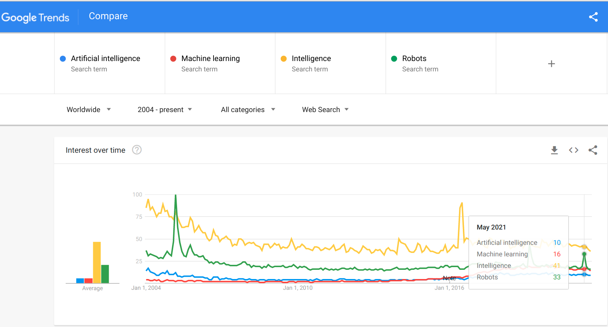
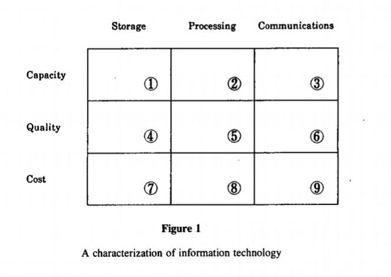
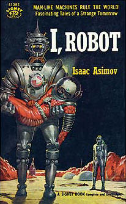

# Table of Contents

-   [What're you going to learn?](#org73b9b9e)
-   [What is intelligence?](#orgefb0015)
    -   [Search patterns](#org581dbaa)
    -   [Group work](#orgbc8ea03)
-   [Different approaches to AI](#org2a8b731)
    -   [Fields of systematic inquiry](#orga0c8591)
    -   [Fundamental questions](#orgeafc869)
    -   [Four approaches](#org7e19d17)
        -   [Four scenarios](#orgfb187d9)
        -   [Acting humanly ("Turing test" approach)](#orgd6d81b5)
        -   [Thinking humanly ("cognitive modeling" approach)](#orgc7387a7)
        -   [Thinking rationally ("laws of thought" approach)](#org4404023)
        -   [Acting rationally ("rational agent" approach)](#orgb4bc1ca)
-   [Major issues](#org7474a62)
    -   [Bounded rationality](#orgacb037a)
    -   [Value alignment](#orgec7c6b7)
-   [Asimov's robot laws](#org7cb4e85)
-   [What's next?](#orgead60e1)
-   [Any questions?](#org8e29be5)
-   [References](#org2ffa870)

# What're you going to learn?

-   What is intelligence?
-   Different approaches to AI
-   The standard model of AI
-   Bounded rationality
-   The Value alignment problem
-   What's next?

# What is intelligence?

## Search patterns

## Group work

-   Get together in groups of 2-3
-   Define INTELLIGENCE (5')
-   Define ARTIFICIAL INTELLIGENCE (5')
-   Briefly present your results (10')

# Different approaches to AI

Which fields of inquiry (= disciplines) to use?

## Fields of systematic inquiry

-   Language
-   Philosophy
-   Science
-   History

## Fundamental questions

-   Should we focus on humans?
-   Should we focus on machines?

## Four approaches

<table border="2" cellspacing="0" cellpadding="6" rules="groups" frame="hsides">

<colgroup>
<col  class="org-left" />

<col  class="org-left" />

<col  class="org-left" />
</colgroup>
<thead>
<tr>
<th scope="col" class="org-left">&#xa0;</th>
<th scope="col" class="org-left">**THOUGHT / LOGIC**</th>
<th scope="col" class="org-left">**BEHAVIOR / ACTION**</th>
</tr>
</thead>

<tbody>
<tr>
<td class="org-left">**HUMANITY**</td>
<td class="org-left">*Cognitive modeling*</td>
<td class="org-left">*Turing Test*</td>
</tr>

<tr>
<td class="org-left">**RATIONALITY**</td>
<td class="org-left">*Laws of Thought*</td>
<td class="org-left">*Rational Agents*</td>
</tr>
</tbody>
</table>

### Four scenarios

### Acting humanly ("Turing test" approach)

<table border="2" cellspacing="0" cellpadding="6" rules="groups" frame="hsides">

<colgroup>
<col  class="org-left" />
</colgroup>
<tbody>
<tr>
<td class="org-left">Natural language processing</td>
</tr>

<tr>
<td class="org-left">Knowledge representation</td>
</tr>

<tr>
<td class="org-left">Automated reasoning</td>
</tr>

<tr>
<td class="org-left">Machine learning</td>
</tr>

<tr>
<td class="org-left">Computer vision</td>
</tr>

<tr>
<td class="org-left">Robotics</td>
</tr>
</tbody>
</table>

### Thinking humanly ("cognitive modeling" approach)

<table border="2" cellspacing="0" cellpadding="6" rules="groups" frame="hsides">

<colgroup>
<col  class="org-left" />
</colgroup>
<tbody>
<tr>
<td class="org-left">Introspection</td>
</tr>

<tr>
<td class="org-left">Psychological experiments</td>
</tr>

<tr>
<td class="org-left">Brain imaging</td>
</tr>

<tr>
<td class="org-left">Cognitive science</td>
</tr>

<tr>
<td class="org-left">Algorithms</td>
</tr>
</tbody>
</table>

### Thinking rationally ("laws of thought" approach)

<table border="2" cellspacing="0" cellpadding="6" rules="groups" frame="hsides">

<colgroup>
<col  class="org-left" />
</colgroup>
<tbody>
<tr>
<td class="org-left">Syllogistic reasoning</td>
</tr>

<tr>
<td class="org-left">Logic</td>
</tr>

<tr>
<td class="org-left">Expert systems</td>
</tr>

<tr>
<td class="org-left">Uncertainty</td>
</tr>

<tr>
<td class="org-left">Probability</td>
</tr>
</tbody>
</table>

### Acting rationally ("rational agent" approach)

<table border="2" cellspacing="0" cellpadding="6" rules="groups" frame="hsides">

<colgroup>
<col  class="org-left" />
</colgroup>
<tbody>
<tr>
<td class="org-left">Combination approach</td>
</tr>

<tr>
<td class="org-left">Constructivist</td>
</tr>

<tr>
<td class="org-left">Doing the right thing</td>
</tr>

<tr>
<td class="org-left">Standard model</td>
</tr>

<tr>
<td class="org-left">Control theory</td>
</tr>
</tbody>
</table>

# Major issues

-   Bounded Rationality
-   Value alignment problem

## Bounded rationality

Image: [Bakopoulos, 1985](#org70b3f3c)

## Value alignment

Image: [The Mechanical Turk](https://www.amazon.com/Turk-Famous-Eighteenth-Century-Chess-Playing-Machine/dp/B000HWZ28Q)

# [Asimov's robot laws](https://en.wikipedia.org/wiki/Three_Laws_of_Robotics)

Image: cover of "I, Robot" by Isaac Asimov (1940)

# What's next?

-   Scientific foundations of AI

# Any questions?

[This presentation is available online.](https://github.com/birkenkrahe/ai482/tree/main/2_what_is_ai)

# References

 Bakopoulos, J. Yannis, "Toward a More Precise
Concept of Information Technology" (1985). ICIS 1985 Proceedings. 4.
<http://aisel.aisnet.org/icis1985/4>

