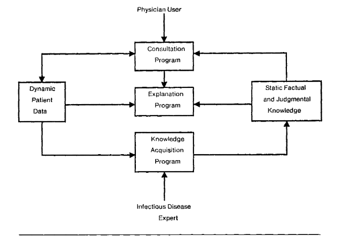

# Table of Contents

-   [History of AI](#orgf429ef2)
    -   [AI right now](#orgee11f01)
    -   [Timeline](#orgd48434c)
-   [References](#orgf1f9ad7)

# History of AI

AI as a systematic, scientific field of investigation dates back about
80 years - the early 1940s. Its beginnings coincide with the
beginnings of digital computing, which is not surprising.

As you saw in the 1961 MIT film, computers and "thinking machines" are
largely identified. Much of the history of AI since those early days
has been about understanding the differences and similarities between
computer science and AI.

Quite early on, in the late 1950s, another term entered public
consciousness (a superset of scientific consciousness, which is
usually, but not always, and not by necessity, preceded by scientific
consciousness): machine learning.

The three terms on which the field of AI studies is founded are
therefore: intelligence, thinking, and learning. We still don't know
much by way of science about any of these<a id="fnr.1" class="footref" href="#fn.1">1</a>. This could be one
reason why AI in practice has gradually moved away from trying to
imitate humans - the term 'learning' in 'machine learning' corresponds
to only a barely visible fraction of the entire spectrum of human
learning. It's really more of a brand label, and less of a meaningful
attribute. The same could be said for the brand "AI" itself.

This experience - not being able to make much use of humanity - has
lead to AI as a discipline increasingly dominated by machines, and by
machine-relevant things. Which is not bad in itself - many
technological developments rely on inventors and practictioners
getting very close to their contraptions and inventions: the
development of engines, of cars, of rockets, and all the exploration
attached to these (energy, mobility, space) are examples. These were
improved not by looking back over one's shoulder at people but by
focusing on the artifacts themselves. Similar things are happening in
AI right now.

## AI right now

By way of an outlook - here are the topics featured as part of a major
AI research program at Stanford U. ([Hoffmann-Yee Research Grants](https://hai.stanford.edu/events/hoffman-yee-symposium)) at
the end of 2021:

1.  Toward grounded, adaptive communication agents
2.  Curious, self-aware AI agents to build cognitive models and
    understand developmental disorders
3.  Intelligent wearable robotic devices for augmenting human
    locomotion
4.  An AI "Time Machine" for investigating the history of concepts
5.  AI tutors to help prepare students for the 21st century workforce

As you can read in the textbook, AIMA, development of agents (=
devices that do something, exhibiting "rational behavior") is supposed
to dominate. Let's take a closer look to see if that's true.

<table border="2" cellspacing="0" cellpadding="6" rules="groups" frame="hsides">

<colgroup>
<col  class="org-left" />

<col  class="org-left" />
</colgroup>
<thead>
<tr>
<th scope="col" class="org-left">TOPIC</th>
<th scope="col" class="org-left">AI APPLICATION</th>
</tr>
</thead>

<tbody>
<tr>
<td class="org-left">Agents for human communication</td>
<td class="org-left">Human behavior</td>
</tr>

<tr>
<td class="org-left">Curiosity and self-awareness</td>
<td class="org-left">Human behavior, Human thinking</td>
</tr>

<tr>
<td class="org-left">Wearable robots</td>
<td class="org-left">Human behavior</td>
</tr>

<tr>
<td class="org-left">Historical data analysis</td>
<td class="org-left">Human thinking</td>
</tr>

<tr>
<td class="org-left">Tutoring</td>
<td class="org-left">Human behavior</td>
</tr>
</tbody>
</table>

## Timeline

<table border="2" cellspacing="0" cellpadding="6" rules="groups" frame="hsides">

<colgroup>
<col  class="org-right" />

<col  class="org-left" />

<col  class="org-left" />

<col  class="org-left" />
</colgroup>
<thead>
<tr>
<th scope="col" class="org-right">DATE</th>
<th scope="col" class="org-left">TOPIC</th>
<th scope="col" class="org-left">EXAMPLE</th>
<th scope="col" class="org-left">PUBLICATION</th>
</tr>
</thead>

<tbody>
<tr>
<td class="org-right">1940</td>
<td class="org-left">Turing machines</td>
<td class="org-left">Artificial neurons</td>
<td class="org-left">[Turing, 1950](https://www.csee.umbc.edu/courses/471/papers/turing.pdf)</td>
</tr>

<tr>
<td class="org-right">-1960</td>
<td class="org-left">[Hebbian learning](https://www.sciencedirect.com/topics/engineering/hebbian-learning)</td>
<td class="org-left">Pavlovian response</td>
<td class="org-left">[Hebb, 1949](https://neuroquotient.com/en/pshychology-and-neuroscience-hebb-principle-rule/)</td>
</tr>

<tr>
<td class="org-right">&#xa0;</td>
<td class="org-left">Machine learning</td>
<td class="org-left">Checkers program</td>
<td class="org-left">[Samuel, 1952](https://drive.google.com/file/d/1mm-NXhidpnkzWSD47jnoJWza8aP0q7f8/view?usp=sharing)</td>
</tr>
</tbody>

<tbody>
<tr>
<td class="org-right">1960</td>
<td class="org-left">Chatbots</td>
<td class="org-left">[Eliza / Parry](http://eliza.botlibre.com/)</td>
<td class="org-left">[Weizenbaum, 1966](https://jerz.setonhill.edu/if/canon/eliza.htm)</td>
</tr>

<tr>
<td class="org-right">-1980</td>
<td class="org-left">Natural language</td>
<td class="org-left">Hacker, [SHRDLU](https://hci.stanford.edu/winograd/shrdlu/)</td>
<td class="org-left">Winograd, 1971</td>
</tr>

<tr>
<td class="org-right">&#xa0;</td>
<td class="org-left">Supervised learning</td>
<td class="org-left">Perceptrons</td>
<td class="org-left">[Ritvikmath, 2019](https://youtu.be/4Gac5I64LM4)</td>
</tr>
</tbody>

<tbody>
<tr>
<td class="org-right">1980</td>
<td class="org-left">Genetic programming</td>
<td class="org-left">Pattern recognition (BEAGLE)</td>
<td class="org-left">[Forsyth, 1981](http://www0.cs.ucl.ac.uk/staff/W.Langdon/ftp/papers/kybernetes_forsyth.pdf)</td>
</tr>

<tr>
<td class="org-right">-2010</td>
<td class="org-left">Expert systems</td>
<td class="org-left">Drug recommender ([MYCIN](https://aithefuture.wordpress.com/2018/05/08/mycin/))</td>
<td class="org-left">[Schank/Tesler, 1969](https://drive.google.com/file/d/1i1CL6jLvqUw4frKltVrkX8MJg2U3AnAC/view?usp=sharing)</td>
</tr>
</tbody>

<tbody>
<tr>
<td class="org-right">2010</td>
<td class="org-left">"[Deep Learning](https://youtu.be/0jspaMLxBig)"<a id="fnr.2" class="footref" href="#fn.2">2</a></td>
<td class="org-left">Image recognition</td>
<td class="org-left">[Sejnowski, 2020](https://jontallen.ece.illinois.edu/uploads/498-NS.21/Sejnowski-EffectivenessDeepLearningAI.20.pdf)</td>
</tr>

<tr>
<td class="org-right">-2020</td>
<td class="org-left">&#xa0;</td>
<td class="org-left">Machine translation</td>
<td class="org-left">&#xa0;</td>
</tr>
</tbody>
</table>

*Image: MYCIN - an early expert system for medical consultation
(aithefuture, 2018)*

# References

aithefuture (8 May 2018).  MYCIN Expert System [Website]. Online:
[aithefuture.wordpress.com](https://aithefuture.wordpress.com/2018/05/08/mycin/).

Calbet J (14 Mar 2018). Hebb's Rule with an analogy. Psychology and
neuroscience [Blog]. [Online: neuroquotient.com](https://neuroquotient.com/en/pshychology-and-neuroscience-hebb-principle-rule/).

Forsyth R (1981). Beagle - A Darwinian Approach to Pattern
Recognition. In: Kybernetes 10:159-166.

Samuel AL (1959). Some Studies in Machine Learning Using the Game of
Checkers. In: IBM Journal 3(3):535-554.

Schank RC / Tesler LG (1969). A Conceptual Dependency Parser for
Natural Language. In: Proc. Int. Conf. on Comp. Linguistics COLING
1969, Sanga Saby, Sweden. [Online: aclanthology.org](https://aclanthology.org/C69-0201.pdf).

Sejnowski TJ (2020). The unreasonable effectiveness of deep learning
in artificial intelligence<a id="fnr.3" class="footref" href="#fn.3">3</a>. In: Proc. Nat. Acad. Sc. 117(49):
30033-30038. <10.1073/pnas.1907373117>.

Turing AM (1950). Computing Machinery and Intelligence. In: Mind
49:433-460.

Weizenbaum, J (1966). ELIZA - A Computer Program for the Study of
Natural Language Communication between Man and Machine. In:
Communications of the ACM 9 (1966): 36-45.

Wigner E (1960). The unreasonable effectiveness of mathematics in
the natural sciences. In: Comm. in Pure and Applied Mathematics
13(1).

# Footnotes

<a id="fn.1" href="#fnr.1">1</a> Without wanting to go into it in great detail: what is, and what
is not scientific knowledge, is of great interest and relevance not
just for AI. In the data modeling seminar the other day, I dissected a
quote by noted psychologist Jean Piaget, which essentially said that
we do not have direct access to reality except through models. Those
of you trained in philosophy, may remember the parable of Plato's
Cave, which is essentially about the same thing but puts God (in
Plato's parable, this is the sun), in the picture, too. In fact, for
God-fearing people, no concept of reality is complete without
Him. There is, fortunately, no real dissent between science and faith
(in fact, for most of human history, the opposite is the case).

<a id="fn.2" href="#fnr.2">2</a> This is a long interview on Deep Learning between Lex Fridman
and Andrew Ng. Fridman is an AI researcher at MIT, Ng at Stanford U. I
love Fridman's interviews - he regularly has exciting guests like Elon
Musk, Roger Penrose, and others.

<a id="fn.3" href="#fnr.3">3</a> The title is a pun on a famous article by physicist Eugene
Wigner (1960), "[The Unreasonable Effectiveness Of Mathematics In The
Natural Sciences](https://www.maths.ed.ac.uk/~v1ranick/papers/wigner.pdf)", which is worth reading, too.
