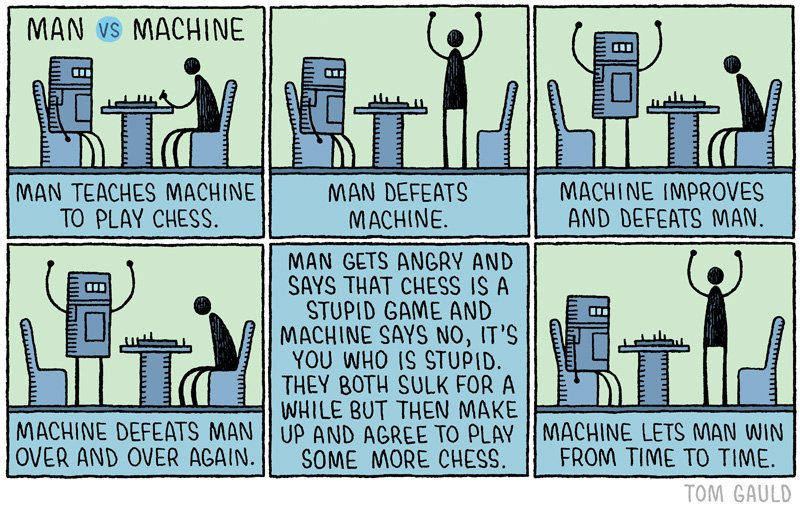

# Table of Contents

-   [What will you learn today?](#org0e58394)
-   [Types of analogies](#org93062c2)
-   [What analogy is](#orgd57f455)
-   [A first example](#org512f026)
    -   [What analogies are not](#org56bdfb6)
-   [Simple examples](#org39f41d8)
    -   [Finding a good man](#orga349bb2)
    -   [Explaining a joke](#org9766396)
    -   [Life is sweet](#orge239a0a)
-   [Complex examples](#org0af2c4e)
    -   [The peanut analogy](#org758381b)
    -   [The Terminator analogy](#orgabe5087)
    -   [The Star Wars analogy](#orgec6c626)
-   [Man vs Machine](#orgae17fbf)
-   [References](#org2b814bd)

# What will you learn today?

-   Types of analogies
-   What analogy is
-   Simple examples
-   Complex examples

# Types of analogies

-   Metaphor
-   Simile
-   Idiom
-   Figure of speech
-   Idiom
-   Proverbs

# [What analogy is](#org609e837)

Explain one thing in terms of another to suggest similarities

# A first example

> Your lips are like a red, red rose.

## What analogies are not

-   Analogies have limitations.
-   Analogies are not just true.
-   They are meant to persuade.

# [Simple examples](#org3ee19ea)

-   What is being highlighted?
-   What are the limitations?

## Finding a good man

> 
> 
> Finding a good man is like finding a needle in a haystack.

**Highlighted:** Finding a needle in a haystack takes a long time, so the task at
hand is likely to be hard and tedious.

**Issues:** (1) If "finding a good man" is hard or not depends on
your view of men. My experience is that it is much harder to find a
"bad man". (2) Christians say that we're all fallen, i.e. bad to
begin with - which means that it is strictly impossible to find a
good man.

## Explaining a joke

> 
> 
> Explaining a joke is like dissecting a frog. You understand it
> better but the frog dies in the process.

(By E.B. White.) **Highlighted:** Sometimes it is better not to know
too much.

**Issues:** (1) that the animal dies when we dissect it, is
obvious. It may be a price we're willing to pay for the
knowledge. Killing frogs is not an issue for everyone. People have
died to gain knowledge - Marie Curie is a famous
example. Astronauts willing to go to space is another. (2)
Explaining a joke always happens outside of the joke itself. You
could argue that it does not destroy the joke (when it is told).

## Life is sweet

> 
> 
> Life is like a box of chocolates - you never know what you're going
> to get.

(Used in Forrest Gump.) **Highlighted:**

**Issues:** (1) This is trivially true if you've not made the
chocolates yourself. However, you don't know how it's going to
taste even if you made them. (2) Life is a lot more than that. And
if you make certain good or bad decisions, you can be more sure
what your life's going to be like. Life is not just handed to you
like a box of chocolates. (3) Life is not always sweet, chocolate
is.

# Complex examples

-   What is being highlighted?
-   What are the limitations?

## [The peanut analogy](#org3ee19ea)

> 
> 
> "Withdrawal of U.S. troops will become like salted peanuts to the
> American public; the more U.S. troops come home, the more will be
> demanded." - Henry Kissinger in a Memo to President Richard Nixon.

## [The Terminator analogy](#org16c071f)

> 
> 
> “There are two doors. Behind door 1 is a completely sealed room,
> with a regular, gasoline-fueled car. Behind door 2 is an identical,
> completely sealed room, with an electric car. Both engines are
> running full blast. I want you to pick a door to open, and enter
> the room and shut the door behind you. [&#x2026;] This is the choice the
> world is making right now.”

## [The Star Wars analogy](#org1847b1a)

> The Rebel Alliance is the human body and the construction crews are
> the protein-making machinery within cells. (Cp.[xkcd cartoon](#orgb6b0e2c))

# [Man vs Machine](#org8a29c22)

# References

 Munroe R (n.d.). Pulsar Analogy [Cartoon]. [Online:
xkcd.com.](https://xkcd.com/2413)

 N.a. (n.d.). Analogy Examples With Simple Explanations
[Website]. [Online: yourdictionary.com.](https://examples.yourdictionary.com/analogy-ex.html)

 Clark B (4 Aug 2020). The Persuasive Power of
Analogy [Blog]. [Online: copyblogger.com.](https://copyblogger.com/persuasive-analogies/)

 Munroe R (n.d.). mRNA Vaccine [Cartoon]. [Online:
xkcd.com.](https://xkcd.com/2425)

 Chamary JV (25 Feb 2021). This Star Wars Analogy
Explains How RNA Vaccines Work [Blog]. [Online: forbes.com.](https://www.forbes.com/sites/jvchamary/2021/02/25/coronavirus-star-wars-mrna-vaccine/?sh=44b8718f5050)

 Gauld T (n.d.). Man vs. Machine [Cartoon]. [Online: redd.it.](https://i.redd.it/io5zqjcus9uy.jpg)

