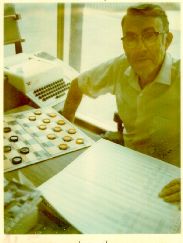

# Followup September 8, 2021

## Metropolis (1927)

Alas, I kind of botched the plot description of this film. In
fact, it's eerily more like the 2020's - it involves identity
theft and transfer of the stolen identity of the female
protagonist, Maria to the robot (aka "Hel"), who "unleashes chaos
throughout Metropolis, driving men to murder and stirring dissent
among the workers."

In fact, the plot [summary on Wikipedia](https://en.wikipedia.org/wiki/Metropolis_(1927_film)#Plot) is so confused that I
recommend you watch the film for yourself! [It's on YouTube](https://youtu.be/OZ_mcUz8hkQ)<a id="fnr.1" class="footref" href="#fn.1">1</a>.

Whatever the whole story, this is Frankenstein with
robots. Interestingly, I had a conversation with a Catholic priest
yesterday where he likened social media to Frankenstein, and I
Frankenstein has been used as a metaphor for data science ([Reaney,
2017](#org8825c8e)).

## Darling Sweetheart (1951)

The challenge: "Can computers really create anything new?"

The answer by [Ferranti Mark 1 (1951)](https://en.wikipedia.org/wiki/Ferranti_Mark_1):

> Darling Sweethart
> You are my avid fellow feeling
> My affection curiously clings
> to your passionate wish. My
> liking yearns to your heart. You
> \#are my wistful sympathy: my
> tender liking.
> Yours beautifully,
> Manchester University Computer

(Source: [Copeland, 1993](#orge574179))

## Samuel's checkers bot

*Image: Arthur Samuel (1901-1990) playing checkers at SAIL
(1970).*

> "Samuel's papers on machine learning are still worth studying. With
> great creativity and working essentially alone, doing his own
> programming, he invented several seminal techniques in rote learning
> and generalization learning, using such underlying techniques as
> mutable evaluation functions, hill climbing, and signature tables. One
> still hears proposals for research in this area less sophisticated
> than his work of the 1950s." ([McCarthy, 1990](#orga9e279b))

Samuel's original article that first introduced the term "machine
learning" is highly readable ([Samuel, 1959](#org7b9066d)). I've assigned it to
students as a term project in the past. The abstract of the
reprint (2000) reads as follows:

> "The studies reported here have been concerned with the
> programming of a digital computer to behave in a way which, if
> done by human beings or animals, would be described as involving
> the process of learning. While this is not the place to dwell on
> the importance of machine-learning procedures, or to discourse on
> the philosophical aspects,1 there is obviously a very large amount
> of work, now done by people, which is quite trivial in its demands
> on the intellect but does, nevertheless, involve some learning. We
> have at our command computers with adequate data-handling ability
> and with sufficient computational speed to make use of
> machine-learning techniques, but our knowledge of the basic
> principles of these techniques is still rudimentary. Lacking such
> knowledge, it is necessary to specify methods of problem solution
> in minute and exact detail, a time-consuming and costly
> procedure. Programming computers to learn from experience should
> eventually eliminate the need for much of this detailed
> programming effort."

There is a followup article ([Samuel, 1967](#orgc2e35a6)). 

## References

 Artificial Intelligence - A Philosophical
Introduction, by Jack Copeland, London: Blackwell, 1993).

 Reaney M (30 Oct 2017). Frankenstein's Data
Scientist [Blog]. [Online: datasciencecentral.com](https://www.datasciencecentral.com/profiles/blogs/frankenstein-s-data-scientist).

 McCarthy J (1990). Arthur Samuel: Pioneer in Machine
Learning. [Online: infolab.stanford.edu](http://infolab.stanford.edu/pub/voy/museum/samuel.html).

 Samuel AN (1959). Some studies in machine learning using
the game of checkers. In: IBM Journal of Research and Development
3(3):210–229. doi.org/10.1147/rd.33.0210. [Online: GDrive.](https://drive.google.com/file/d/1mm-NXhidpnkzWSD47jnoJWza8aP0q7f8/view?usp=sharing)

 Samuel AN (1967). Some Studies in Machine Learning Using
the Game of Checkers. II-Recent Progress. In: IBM Journal, Nov
1967:601-617. [Online: virginia.edu](https://www.cs.virginia.edu/~evans/greatworks/samuel.pdf). 

# Footnotes

<a id="fn.1" href="#fnr.1">1</a> I have it on blueray disc - when this term is over, perhaps we
should put on an "AI movie night", whaddayathink?
