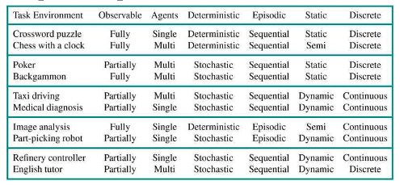

# Table of Contents

-   [AI applications that might change the world](#orged8ec74)
-   [Agents and environments](#org4d250dd)
    -   [Microworld-view](#org1aafff2)
    -   [Rational agent success](#orgf8f72c1)
    -   [Example: robotic vacuum-cleaner](#org487dcbb)
    -   [Definition of a rational agent](#orgeb1afe0)
    -   [Process view](#orgc29948b)
-   [Task environments](#org235de04)
    -   [Current research](#orgccf3ef0)
    -   [Remote Mars rover navigation](#org423f5ce)
    -   [PEAS example: automated taxi driver](#org11a2b9c)
    -   [PEAS Challenge](#org0098f8c)
    -   [Task environment properties](#org23c90b1)
    -   [Environment of the automated taxi driver](#org1d5c81d)
    -   [Systemic interpretation](#org1a1d176)
    -   [Homework](#orgf3e1362)
-   [References](#org972c361)
    -   [Publications](#org83bd7f2)
    -   [Websites](#org9eb1af6)
-   [Whiteboards](#org9662823)

# AI applications that might change the world<a id="fnr.1" class="footref" href="#fn.1">1</a>

<table border="2" cellspacing="0" cellpadding="6" rules="groups" frame="hsides">

<colgroup>
<col  class="org-right" />

<col  class="org-left" />

<col  class="org-left" />

<col  class="org-left" />
</colgroup>
<thead>
<tr>
<th scope="col" class="org-right">No</th>
<th scope="col" class="org-left">AI APPLICATION</th>
<th scope="col" class="org-left">TYPE</th>
<th scope="col" class="org-left">AI FIELD</th>
</tr>
</thead>

<tbody>
<tr>
<td class="org-right">1</td>
<td class="org-left">Alexa/Siri/[MyCroft](https://mycroft.ai/)</td>
<td class="org-left">Conversational agent</td>
<td class="org-left">Natural Language Processing</td>
</tr>

<tr>
<td class="org-right">2</td>
<td class="org-left">Autonomous vehicles</td>
<td class="org-left">Driving agent</td>
<td class="org-left">Pattern recognition</td>
</tr>

<tr>
<td class="org-right">3</td>
<td class="org-left">Autonomous drones</td>
<td class="org-left">Delivery agent</td>
<td class="org-left">Pattern recognition</td>
</tr>
</tbody>

<tbody>
<tr>
<td class="org-right">4</td>
<td class="org-left">[Neuralink](https://neuralink.com/)</td>
<td class="org-left">Brain support agent</td>
<td class="org-left">Neuroscience</td>
</tr>

<tr>
<td class="org-right">5</td>
<td class="org-left">[Facebook Glass](https://about.fb.com/news/2021/09/introducing-ray-ban-stories-smart-glasses/)</td>
<td class="org-left">Social media agent</td>
<td class="org-left">Pattern recognition</td>
</tr>

<tr>
<td class="org-right">6</td>
<td class="org-left">[Automatic writing](https://www.jarvis.ai/)</td>
<td class="org-left">Writing agent</td>
<td class="org-left">Natural Language Processing</td>
</tr>

<tr>
<td class="org-right">7</td>
<td class="org-left">[Automatic programming](https://openai.com/blog/openai-codex/)</td>
<td class="org-left">Programming agent</td>
<td class="org-left">Natural Language Processing</td>
</tr>
</tbody>
</table>

# Agents and environments

The purpose of this section is to bridge the gap between AI ideas
and practice. To do this, we adopt the rational agent approach
promoted in [AIMA](#org720000f), and implemented in day-to-day AI systems, like
robot vacuum cleaners that operate in the real world, or
personalized shopping apps that operate in virtual commercial space.

The abstract insights about rational agents are useful as an
analytic framework, much like the distinction between supervised and
unsupervised learning that we will look at next.

These lecture notes corresponds to some of the chapter 2 content of
the textbook ([Russell/Norvig](#org720000f), 2021).

## Microworld-view

The diagram shows a world- or space-oriented view of an agent and
its environment. The microworld view is less intuitive than the
process-view<a id="fnr.2" class="footref" href="#fn.2">2</a> - think about your learning as a student: you
don't dwell on the fact that you move from your personal into
classroom space - and it would be difficult to see how to optimize
this spatial movement (for learning). Instead, you operate - like
an agent - with process steps (go to class, listen to lecture, do
exercise, take notes etc.). It is easier to think of input and
output and optimizing functions when following a process<a id="fnr.3" class="footref" href="#fn.3">3</a>.

Source: [AIMA](#org720000f) - agent-world vs. environment view

## Rational agent success

Success of a rational agent in this simple picture depends on:

1.  the performance measure that defines success
2.  the agent's knowledge of the environment
3.  the actions that the agent can perform
4.  the agent's percept sequence to date

## Example: robotic vacuum-cleaner

The microworld of the vacuum cleaner has a known boundary, and it
is divided in subspaces that the agent can navigate. In each
subspace, there is an unspecified amount of dirt. The overall
mission is to clean the space.

<table border="2" cellspacing="0" cellpadding="6" rules="groups" frame="hsides">

<colgroup>
<col  class="org-left" />

<col  class="org-left" />

<col  class="org-left" />
</colgroup>
<thead>
<tr>
<th scope="col" class="org-left">ASPECT</th>
<th scope="col" class="org-left">EXAMPLE</th>
<th scope="col" class="org-left">FUNCTIONS</th>
</tr>
</thead>

<tbody>
<tr>
<td class="org-left">Performance</td>
<td class="org-left">Award cleanliness</td>
<td class="org-left">Maximize</td>
</tr>

<tr>
<td class="org-left">Environment</td>
<td class="org-left">Spatial dimensions</td>
<td class="org-left">Minimize</td>
</tr>

<tr>
<td class="org-left">Actions</td>
<td class="org-left">Movements + sucking</td>
<td class="org-left">Table</td>
</tr>

<tr>
<td class="org-left">Perceptions</td>
<td class="org-left">Location + dirt</td>
<td class="org-left">Table</td>
</tr>
</tbody>
</table>

Can such a simple agent behave irrationally, too?<a id="fnr.4" class="footref" href="#fn.4">4</a>

It is worth noting that irrational behavior in humans can lead to
unforeseen (and unforeseeable) innovations and optimizations, but
also, of course, to destructive behavior. In fact, one could argue
that controlled irrationality is the core of creative behavior and
originality.

## Definition of a rational agent

> "For each possible percept sequence, a rational agent should select
> an action that is expected to maximize its performance measure,
> given the evidence provided by the percept sequence and whatever
> built-in knowledge the agent has." ([AIMA](#org720000f))

## Process view

The definition suggests a process-oriented description of the
behavior of a rational agent. Such a process is shown in the BPMN
diagram below.

# Task environments

The greatest challenge for the agent is operating in a given
environment. To design agents that can manage this challenge, we
classify different types of environments.

## Current research

Recent article: "Solving the Robot Off-Loading Problem": helping
robots choose when to communicate with the cloud without latency or
lost data issues ([Myers, 2021](#orgaef36c9)). 

## Remote Mars rover navigation

In 2015, the then-VP of the German software giant SAP demonstrated
remote control of a Mars rover during an SAP developers conference
presentation - using the 2015 feature film "The Martian" as a
prompt.

Since the presentation is quite long, I cut it into 7 different
parts and put it into [this playlist](https://youtube.com/playlist?list=PL6SfZh1-kWXnWedFzgEwt6R6zhjdBxJsT) for classroom use. The demo
uses every software layer indicated in the diagram below. And
rather than only talk about stuff, the presenter shows how it is
done and how all these different systems work together. 

Of course, the talk is steeped in technical and commercial language
that you will not understand - but hopefully, with my comments
(below each video) and the glossary below, you'll be able to follow
the story. Enjoy!

Image explanation: SAP system architecture on premise (local, at
the company) vs. cloud (non-local, at a server center) - this is
the so-called SAAS (Software As A Service) business model. "HANA"
refers to a database technology. "SAP ERP" and "S4/HANA" are
information systems that support the entire company value chain -
from production to customer delivery. These are the largest
available information systems, and SAP is the leading provider of
such systems. In fact, it'll be difficult to find a large company
anywhere that does not run its processes using SAP. The "cloud
platform" contains all sorts of new services, some of them
AI-driven, like "Analytics" and "Internet of Things".

## PEAS example: automated taxi driver

PEAS description for an automated taxi driver (transport agent):

<table border="2" cellspacing="0" cellpadding="6" rules="groups" frame="hsides">

<colgroup>
<col  class="org-left" />

<col  class="org-left" />

<col  class="org-left" />

<col  class="org-left" />
</colgroup>
<thead>
<tr>
<th scope="col" class="org-left">PERFORMANCE MEASURE</th>
<th scope="col" class="org-left">ENVIRONMENT</th>
<th scope="col" class="org-left">ACTUATORS</th>
<th scope="col" class="org-left">SENSORS</th>
</tr>
</thead>

<tbody>
<tr>
<td class="org-left">Safe, fast, legal, comfy trip, max profits, min accident</td>
<td class="org-left">Roads, traffic, police, pedestrians, customers, weather</td>
<td class="org-left">Steering, accelerator, brake, signal, horn, display, speech</td>
<td class="org-left">Camera, radar, GPS, speedometer, engine, accelerometer, microphone, touchscreen</td>
</tr>
</tbody>
</table>

> "Virtual task environments (not in the physical world) can be as
> complex as real ones." ([AIMA](#org720000f))

**What do you think:** are AUGMENTED reality environments more, less,
or equally complex?<a id="fnr.5" class="footref" href="#fn.5">5</a>

## PEAS Challenge

Identify PEAS elements for each of these agent types!

-   Medical diagnosis system
-   Satellite image analysis system
-   Part-picking robot
-   Refinery controller
-   Interactive English tutor
    
    [[Solution](https://github.com/birkenkrahe/ai482/blob/main/5_ai_agents/img/challenge.png), [AIMA](#org720000f) table 2.5]

All of these applications are present today in their respective
industrial environments - health care, weather forecasting,
factories, processing plants, and online learning platforms.

Notice how when you think about actuators and sensors, you might
automatically think of humanoid robots. However, the most efficient
solution need not be humanoid (using human behavior, or physiology
as a design blueprint) - except when humans are directly involved
(health care, tutoring).

## Task environment properties

The following properties is a taxonomy akin to a classification of
insects or plants in nature: like these, the properties of agents
refer to an evolving ecology. Also, they are used to explore and,
in a way, define machine "intelligence".

<table border="2" cellspacing="0" cellpadding="6" rules="groups" frame="hsides">

<colgroup>
<col  class="org-left" />

<col  class="org-left" />
</colgroup>
<thead>
<tr>
<th scope="col" class="org-left">PROPERTY</th>
<th scope="col" class="org-left">OPTIONS</th>
</tr>
</thead>

<tbody>
<tr>
<td class="org-left">1) Observability</td>
<td class="org-left">Fully, partially or unobservable<a id="fnr.6" class="footref" href="#fn.6">6</a></td>
</tr>

<tr>
<td class="org-left">2) Multiplicity</td>
<td class="org-left">single or multi-agent</td>
</tr>

<tr>
<td class="org-left">3) Performativity</td>
<td class="org-left">competitive or cooperative</td>
</tr>

<tr>
<td class="org-left">4) Determinacy</td>
<td class="org-left">deterministic, non-deterministic or stochastic<a id="fnr.7" class="footref" href="#fn.7">7</a></td>
</tr>

<tr>
<td class="org-left">5) Causality</td>
<td class="org-left">sequential or episodic</td>
</tr>

<tr>
<td class="org-left">6) Stativity</td>
<td class="org-left">static or dynamic or semidynamic (score<a id="fnr.8" class="footref" href="#fn.8">8</a>)</td>
</tr>

<tr>
<td class="org-left">7) Temporality</td>
<td class="org-left">Discrete or continuous (state/time)</td>
</tr>

<tr>
<td class="org-left">8) Physicality</td>
<td class="org-left">Known or unknown (laws)</td>
</tr>

<tr>
<td class="org-left">9) Virtuality</td>
<td class="org-left">Virtual or real</td>
</tr>

<tr>
<td class="org-left">10) Locality</td>
<td class="org-left">Local or non-local</td>
</tr>
</tbody>
</table>

## Environment of the automated taxi driver

Let's look at the automated taxi driver as an example:

1.  **Observability:** The environment is partially observable - for
    example, the agent cannot observe (or even find out directly)
    what other drivers are thinking.
2.  **Multiplicity:** The agent could treat another vehicle as an
    object or as an agent, too. Which relationship it is depends on
    the design of both vehicles involved: are any messages exchanged
    between them, or are there decisions where one agent's actions
    depend on the other? For example, if the taxi agent has a sensor
    that is directly fed data from the other vehicle, they'd form a
    two-agent system whose actions depend on one another.
3.  **Performativity:** this applies only to multi-agent systems. The
    taxi environment is both cooperative (with other non-taxi
    vehicles), and competitive (with other taxi drivers).
4.  **Determinacy:** the taxi environment is non-deterministic since
    the behavior of traffic cannot be predicted with
    certainty. Certain aspects (e.g. traffic density, weather
    conditions etc.) are stochastic and can be predicted with
    quantities attached to them ("10% probability of rain during
    this trip").
5.  **Causality:** short term, episodic actions, have long-term
    consequences for the taxi agent - the agent has to think ahead
    based on the past driving history and its past actions. For
    example, when it suddenly begins to rain, it has to adjust its
    breaking behavior.
6.  **Stativity:** the driving environment changes continuously,
    requiring agent responses ("The street is wet, what do you want
    to do?") and adjustments.
7.  **Temporality:** taxi driving is a continous state and a continous
    time problem - speed and location of the taxi change all the
    time, and they change smoothly, not abruptly. Driving actions
    are also continuous. Sensor input itself is discrete (digital
    signals) but is treated as continuous (distributions are
    smoothed).
8.  **Physicality:** some of the environment is unknown e.g. when the
    journey starts. This means that the taxi driver needs to learn
    properties of its environment that cannot be hard-coded at the
    start of the journey.
9.  **Virtuality:** the automated taxi driver has both a virtual
    (testing and simulation) environment and a real
    environment. Performance, actuation and sensing are relevant for
    both environments but only the real environment is productive.
10. **Locality:** the taxi driver deals with both local and non-local
    data, e.g. construction sites along the road are non-local,
    while road signs encountered during the drive are local. For
    the performance, local data are more relevant.

> "The hardest [agent task environment] case is partially observable,
> multiagent, nondeterministic, sequential, dynamic, continous, and
> unknown."  ([AIMA](#org720000f))

Here are examples for some of these categories.

[Image source: [AIMA](#org720000f) table 2.6]

## Systemic interpretation

These properties define the agent as a system with a boundary
between itself and the environment, with elements (actuators,
sensors), and relationships between these elements. This means that
the properties are not limited to AI systems - you could use them
to describe other cybernetic systems, like heating systems.

## Homework

Pick any of the online exercises for this chapter of [AIMA](#org720000f) (ch. 2)
and work out a solution, or sketch a path towards a solution
(e.g. by describing what one might do, in which order), or sketch
specific problems and issues for discussion, and present in class
(for: Friday October 1).

Several of the exercises (from ex. 7) relate to material that we
have not covered yet (structure of agent programs and types of
agents), but we will have, before fall break. I think it might be
cool to continue working on some of these exercises for the
remainder of the term. You can also easily turn them into
presentations.

# References

## Publications

 Bee Z (24 Jan 2021). Grammarly is Garbage, and Here's Why
[Video]. [Online: YouTube.com](https://youtu.be/Q5rB9jDbTPU).

Chen M et al (14 Jul 2021). Evaluating Large Language Models Trained
on Code. Preprint: [arxiv:2107.03374](https://arxiv.org/abs/2107.03374).

 Dörner D (1990). The logic of failure. In:
Phil. Trans. R. Soc. Lond. B 327:463-473.

Facebook (9 Sep 2021). Introducing Ray-Ban Stories: First-Generation
Smart Glasses. [Online: fb.com.](https://about.fb.com/news/2021/09/introducing-ray-ban-stories-smart-glasses/)

 Matloff N (2020). Probability and Statistics for Data
Science: Math + R + Data. CRC Press.

 Myers A (8 Sept 2021). Solving the Robot Off-Loading
Problem. [Online: hai.stanford.edu](https://hai.stanford.edu/news/solving-robot-loading-problem).

 Reed Floren (1 April 2021). Jarvis.ai How to Write Blog
Posts in 10 Minutes with Conversion.AI [Video]. [Online: youtube.com](https://youtu.be/z5_3S5nKfWQ?t=540).

 Russell S/Norvig P (2021). AI - A Modern Approach (4th
ed). Pearson.

## Websites

-   mycroft.ai - MyCroft AI speech assistant
-   openai.com - OpenAI Codex for natural language translation to code
-   neuralink.com - brain interface software and hardware
-   jarvis.ai - blog writing software

# Whiteboards

-   [September 20, 2021](https://drive.google.com/drive/folders/1cVty0VxQ2pU99cOk8LD-rJPsOi0pOm7Z?usp=sharing)
-   September 22, 2021
-   September 24, 2021

# Footnotes

<a id="fn.1" href="#fnr.1">1</a> 1-3 came from course participants (see [whiteboard, Sept 20](https://drive.google.com/drive/folders/1cVty0VxQ2pU99cOk8LD-rJPsOi0pOm7Z?usp=sharing)), 4-7
are my personal opinion. "Automatic writing" includes AI-driven
spell-checking apps like Grammarly (beware - cp. [Bee 2021](#org9a5af7d), though the
[Grammarly engineering blog](https://www.grammarly.com/blog/engineering/) is quite interesting). Quote from a video
demonstrating jarvis.ai ([Reed Floren, 2021](#orgd53a2df)): "I've created a 1000 word
article in minutes on a topic that I really know nothing about."

<a id="fn.2" href="#fnr.2">2</a> Much like in probability: these are usually introduced via state
spaces (e.g. the different combinations when rolling a dice). A better
way of thinking about probability is as a process of creating one
record after another - essentially an event log of stochastic
events. Cp. [Matloff (2020)](#org1da1905).

<a id="fn.3" href="#fnr.3">3</a> You could also look at the job of learning in terms of incoming
or outgoing data, or different data formats. This would be closer to
computer processing and further from the human experience.

<a id="fn.4" href="#fnr.4">4</a> The answer is yes: whenever the maximizing or minimizing
functions are not executed well, e.g. because of lack of environmental
knowledge, or because the performance measure is ill-defined, or
because of faulty sensor data. In the case of the Rumba: not moving
(action), or not sucking (action), not respecting the boundaries
(environment), stopping short of cleaning well because of faulty
rewarding (performance), etc.

<a id="fn.5" href="#fnr.5">5</a> The answer depends on the measure of "complexity". For the sake
of argument, one could assume the complexity of the real world to be
"1", and of a completely static virtual world "0". Alternatively, you
have to use a complexity measure that can be quantified and
e.g. implemented in a program like Dörner's in "The logic of failure"
([Dörner, 1990](#org24626cc)).

<a id="fn.6" href="#fnr.6">6</a> "Unobservable" in principle means that the agent has no sensors
in all task environments (it must have some data otherwise it could
not perform its optimization strategy).

<a id="fn.7" href="#fnr.7">7</a> AIMA distinguishes between non-deterministic (aka uncertain) and
stochastic (aka uncertain but with a quantifiable probability).

<a id="fn.8" href="#fnr.8">8</a> In a semidynamic environment, the enviroment itself does not
change but a performance score does - chess with a clock is an
example: when the clock is ticking, the performance time changes even
though the board is static.
