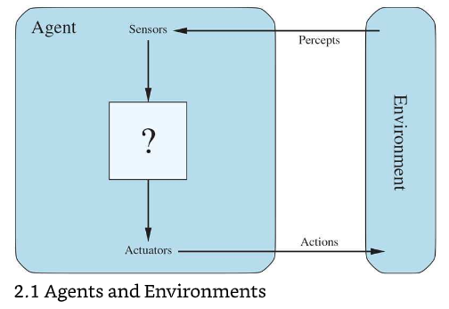

# Table of Contents

-   [Agents and environments](#orgdea20b5)
    -   [Microworld-view](#org11380b6)
    -   [Rational agent success](#org27dd1ca)
    -   [Example: Vacuum-cleaner "Rumba"](#orgbeddbb2)
    -   [Definition of a rational agent](#org598b73f)
    -   [Process view](#org7842b9f)
-   [References](#org803aa10)
-   [Whiteboards](#orgb55c02f)

# Agents and environments

The purpose of this section is to bridge the gap between AI ideas
and practice. To do this, we adopt the rational agent approach
promoted in AIMA, and implemented in day-to-day AI systems, like
robot vacuum cleaners that operate in the real world, or
personalized shopping apps that operate in virtual commercial space.

The abstract insights about rational agents are useful as an
analytic framework, much like the distinction between supervised and
unsupervised learning that we will look at next.

This lecture corresponds to the chapter 2 content of the textbook
([Russell/Norvig](#orgcdc6331), 2021).

## Microworld-view

The diagram shows a world- or space-oriented view of an agent and
its environment. The microworld view is less intuitive than the
process-view<a id="fnr.1" class="footref" href="#fn.1">1</a> - think about your learning as a student: you
don't dwell on the fact that you move from your personal into
classroom space - and it would be difficult to see how to optimize
this spatial movement (for learning). Instead, you operate - like
an agent - with process steps (go to class, listen to lecture, do
exercise, take notes etc.). It is easier to think of input and
output and optimizing functions when following a process<a id="fnr.2" class="footref" href="#fn.2">2</a>.

Source: AIMA - agent-world vs. environment view

## Rational agent success

Success of a rational agent in this simple picture depends on:

1.  the performance measure that defines success
2.  the agent's knowledge of the environment
3.  the actions that the agent can perform
4.  the agent's percept sequence to date

## Example: Vacuum-cleaner "Rumba"

The microworld of the vacuum cleaner has a known boundary, and it
is divided in subspaces that the agent can navigate. In each
subspace, there is an unspecified amount of dirt. The overall
mission is to clean the space.

<table border="2" cellspacing="0" cellpadding="6" rules="groups" frame="hsides">

<colgroup>
<col  class="org-left" />

<col  class="org-left" />

<col  class="org-left" />
</colgroup>
<thead>
<tr>
<th scope="col" class="org-left">ASPECT</th>
<th scope="col" class="org-left">EXAMPLE</th>
<th scope="col" class="org-left">FUNCTIONS</th>
</tr>
</thead>

<tbody>
<tr>
<td class="org-left">Performance</td>
<td class="org-left">Award cleanliness</td>
<td class="org-left">Maximize</td>
</tr>

<tr>
<td class="org-left">Environment</td>
<td class="org-left">Spatial dimensions</td>
<td class="org-left">Minimize</td>
</tr>

<tr>
<td class="org-left">Actions</td>
<td class="org-left">Movements + sucking</td>
<td class="org-left">Table</td>
</tr>

<tr>
<td class="org-left">Perceptions</td>
<td class="org-left">Location + dirt</td>
<td class="org-left">Table</td>
</tr>
</tbody>
</table>

Can such a simple agent behave irrationally, too?<a id="fnr.3" class="footref" href="#fn.3">3</a>

It is worth noting that irrational behavior in humans can lead to
unforeseen (and unforeseeable) innovations and optimizations, but
also, of course, to destructive behavior. In fact, one could argue
that controlled irrationality is the core of creative behavior and
originality.

## Definition of a rational agent

> "For each possible percept sequence, a rational agent should select
> an action that is expected to maximize its performance measure,
> given the evidence provided by the percept sequence and whatever
> built-in knowledge the agent has." ([AIMA](#orgcdc6331))

## Process view

The definition suggests a process-oriented description of the
behavior of a rational agent. Such a process is shown in the BPMN
diagram below.

# References

 Russell S/Norvig P (2021). AI - A Modern Approach (4th
ed). Pearson.

 Matloff N (2020). Probability and Statistics for Data
Science: Math + R + Data. CRC Press.

# Whiteboards

-   [September 20, 2021](https://drive.google.com/drive/folders/1cVty0VxQ2pU99cOk8LD-rJPsOi0pOm7Z?usp=sharing)
-   September 22, 2021
-   September 24, 2021

# Footnotes

<a id="fn.1" href="#fnr.1">1</a> Much like in probability: these are usually introduced via state
spaces (e.g. the different combinations when rolling a dice). A better
way of thinking about probability is as a process of creating one
record after another - essentially an event log of stochastic
events. Cp. [Matloff (2020)](#orgfbc62e9).

<a id="fn.2" href="#fnr.2">2</a> You could also look at the job of learning in terms of incoming
or outgoing data, or different data formats. This would be closer to
computer processing and further from the human experience.

<a id="fn.3" href="#fnr.3">3</a> The answer is yes: whenever the maximizing or minimizing
functions are not executed well, e.g. because of lack of environmental
knowledge, or because the performance measure is ill-defined, or
because of faulty sensor data. In the case of the Rumba: not moving
(action), or not sucking (action), not respecting the boundaries
(environment), stopping short of cleaning well because of faulty
rewarding (performance), etc.
