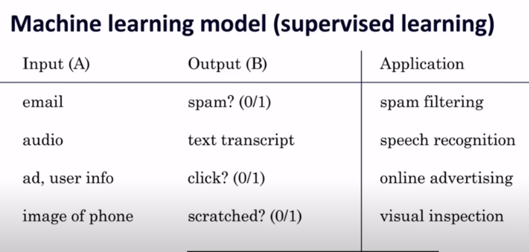

# Table of Contents

-   [Machine learning](#orgdd9a6da)
-   [AI research-to-production gap](#orgb42bb78)
    -   [Small data](#org6645f87)
    -   [Change management](#org7c52991)
    -   [Full cycle of machine learning projects](#org7214d9d)
    -   [Summary](#org75c2c3b)
    -   [Further information](#org5b65f35)
-   [References](#orgba730e8)

# Machine learning

After looking at the [history of AI](https://github.com/birkenkrahe/ai482/tree/main/4_ai_history), and some of the foundations of a
dominant AI methodology ([intelligent agents](https://github.com/birkenkrahe/ai482/tree/main/5_ai_agents)), we need to take stock
of what AI actually achieves today, and why it's such a hot
topic. It turns out that most of the running AI applications
("production AI") is related to machine learning (ML), i.e. learning
agents, especially supervised learning - recognizing (= classifying)
known patterns learnt from big data samples. Ng's first definition
of ML is Samuel's seminal 1959 definition ([stanfordonline,
2020](#org51d9f29))<a id="fnr.1" class="footref" href="#fn.1">1</a>:

> Machine learning: field of study that gives computers the ability to
> learn without being explicitly programmed.

Ng gives a list of supervised learning tasks that have successfully
been addressed by machines.

[(Source: Stanford HAI 2020)](https://youtu.be/tsPuVAMaADY?t=547), 

# AI research-to-production gap

In this video AI researcher Andrew Ng addresses three issues to
explain why ML is not more successful in the real world ([Stanford
HAI, 2020](#org86abb56)). Many academic research results are spectacular, but in
real settings, e.g. hospitals, you don't find AI (except in
embedded, i.e. invisible systems like cameras, sensors etc.).

For details, see student session protocols. Here you find only
technical glossary additions and stuff that was left out of the
protocols.

## Small data

Examples for [small data algorithms](https://youtu.be/tsPuVAMaADY?t=1054) include GANs and GPT-3.

GANs stands for Generative Adversarial Network (cp. [Wikipedia](https://en.wikipedia.org/wiki/Generative_adversarial_network)),
which is a game theoretical ML application where two neural
networks learn by competing with each other. Originated in 2014.

GPT-3 is the Generative Pre-trained Transformer 3 (cp. [Wikipedia](https://en.wikipedia.org/wiki/GPT-3))
used especially in natural language processing (NLP), e.g. to
simulate human language. Originated in 2020.

## Change management

## Full cycle of machine learning projects

## Summary

## Further information

Stanford HAI (Apr 29, 2021). Healthcare's AI Future: A Conversation
with Fei-Fei Li & Andrew Ng.

# References

 Stanford HAI (Sep 23, 2020). Andrew Ng: Bridging AI's
Proof-of-Concept to Production Gap [video]. [Online: youtube.com](https://youtu.be/tsPuVAMaADY).

 stanfordonline (Apr 17, 2020). Lecture 1 - Stanford CS229:
Machine Learning - Andrew Ng (Autumn 2018) [video]. [Online:
youtube.com](https://youtu.be/jGwO_UgTS7I?t=2180).

# Footnotes

<a id="fn.1" href="#fnr.1">1</a> In the same lecture, Ng relates another, more recent definition
of the kind of problem that ML addresses, called a "well-posed problem":

> A computer is said to *learn* from experience E with respect to some
> task T and some performance measure P, if its performance on T, as
> measured by P, improves with experience E.

In the language of our last lesson, E is the precept, and T could be
any task, no matter how complex, as long as we can define a P.
