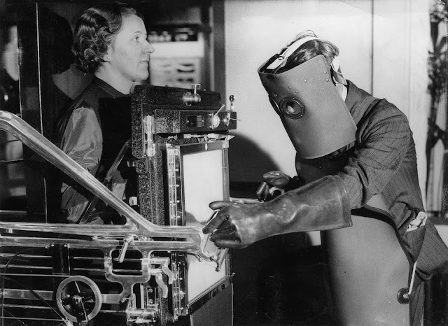

# Table of Contents

-   [Machine learning](#org89a1b61)
-   [AI research-to-production gap](#org998f564)
    -   [Small data](#org539dfa5)
    -   [Generalization and robustness](#orgc7bac95)
    -   [Change management](#orgd2157c3)
        -   [A naive model](#org8208e81)
        -   [Ideal process model](#org1414090)
        -   [Building blocks](#org92f117a)
        -   [Glossary](#org35b97db)
    -   [Full cycle of machine learning projects](#org6d81d84)
    -   [Summary](#orgb205fcd)
    -   [Further information](#org15eb36b)
-   [References](#orgef9c99b)

# Machine learning

After looking at the [history of AI](https://github.com/birkenkrahe/ai482/tree/main/4_ai_history), and some of the foundations of a
dominant AI methodology ([intelligent agents](https://github.com/birkenkrahe/ai482/tree/main/5_ai_agents)), we need to take stock
of what AI actually achieves today, and why it's such a hot
topic. It turns out that most of the running AI applications
("production AI") is related to machine learning (ML), i.e. learning
agents, especially supervised learning - recognizing (= classifying)
known patterns learnt from big data samples. Ng's first definition
of ML is Samuel's seminal 1959 definition ([stanfordonline,
2020](#org2486122))<a id="fnr.1" class="footref" href="#fn.1">1</a>:

> Machine learning: field of study that gives computers the ability to
> learn without being explicitly programmed.

Ng gives a list of supervised learning tasks that have successfully
been addressed by machines using a simple I/O model [(Source:
Stanford HAI 2020)](https://youtu.be/tsPuVAMaADY?t=547).

<table border="2" cellspacing="0" cellpadding="6" rules="groups" frame="hsides">

<colgroup>
<col  class="org-left" />

<col  class="org-left" />

<col  class="org-left" />
</colgroup>
<thead>
<tr>
<th scope="col" class="org-left">Input (A)</th>
<th scope="col" class="org-left">Output (O)</th>
<th scope="col" class="org-left">ML application</th>
</tr>
</thead>

<tbody>
<tr>
<td class="org-left">email</td>
<td class="org-left">spam? (0/1)</td>
<td class="org-left">spam filtering</td>
</tr>

<tr>
<td class="org-left">ad, user info</td>
<td class="org-left">click? (0/1)</td>
<td class="org-left">online advertising</td>
</tr>

<tr>
<td class="org-left">phone image</td>
<td class="org-left">scratched? (0/1)</td>
<td class="org-left">visual inspection</td>
</tr>

<tr>
<td class="org-left">audio</td>
<td class="org-left">text transcript</td>
<td class="org-left">speech recognition</td>
</tr>
</tbody>
</table>

In most of these, the AI only needs to classify the input as one of
two kinds (0/1), e.g. in spam filtering: spam or not spam. Audio ML
is more complicated, because it relies on understanding natural
language.

# AI research-to-production gap

In this video AI researcher Andrew Ng addresses three issues to
explain why ML is not more successful in the real world ([Stanford
HAI, 2020](#orgdff13e6)). Many academic research results are spectacular, but in
real settings, e.g. hospitals, you don't find AI (except in
embedded, i.e. invisible systems like cameras, sensors etc.).

For details, see student session protocols. Here you find only
technical glossary additions and stuff that was left out of the
protocols.

## Small data

Examples for [small data algorithms](https://youtu.be/tsPuVAMaADY?t=1054) include GANs and GPT-3.

GANs stands for Generative Adversarial Network (cp. [Wikipedia](https://en.wikipedia.org/wiki/Generative_adversarial_network)),
which is a game theoretical ML application where two neural
networks learn by competing with each other. Originated
in 2014. Here is a nice video introduction ([Serrano, 2020](#orga853850)).

GPT-3 is the Generative Pre-trained Transformer 3 (cp. [Wikipedia](https://en.wikipedia.org/wiki/GPT-3))
used especially in natural language processing (NLP), e.g. to
simulate human language. Originated in 2020. Here is an example of
such a simulated conversation between two GPT-3 trained AIs
([Soslow, 2021](#orga93b8bf)).

## Generalization and robustness

It doesn't seem to me as if this problem is well understood though
the problem setting is clear: humans environments are too complex
for using AI applications developed and tested in the lab.

*Image: an old X-ray machine (Source: [vintage.es](#org9b6c7e5))*

## Change management

Change is a hugely complex issue, partly because of the generality
of the concept, and partly because of the deep-seated knowledge
that behavioral change is usually hard to bring about - the harder,
the more established a behavior is. There is a hundred years of
management literature alone written about it. And of course, almost
all of the serious fiction literature of the world is about
transformative, real change. Still, it is not clear to me if
"change management" isn't an oxymoron.

### A naive model

(Source: Society of competitive intelligence)

### Ideal process model

(Source: Accenture)

### Building blocks

(Source: SIEMENS)

### Glossary

-   [Explainable AI?](https://pubmed.ncbi.nlm.nih.gov/33375658/) ([Linardatos et al, 2020](#org8da80cc)) - XAI 
    
    > The field of Explainable Artificial Intelligence (XAI) [&#x2026;] is
    > concerned with the development of new methods that explain and
    > interpret machine learning models,

-   [AI Auditing?](https://www.ey.com/en_gl/assurance/how-artificial-intelligence-will-transform-the-audit) ([Boillet, 2018](#org2b685b6)) - Risk analysis

## Full cycle of machine learning projects

## Summary

## Further information

Stanford HAI (Apr 29, 2021). Healthcare's AI Future: A Conversation
with Fei-Fei Li & Andrew Ng.

# References

 Boillet J (Jul 20, 2018). How AI will transform the
audit [video]. [Online: ey.com](https://www.ey.com/en_gl/assurance/how-artificial-intelligence-will-transform-the-audit).

 Linardatos et al (2020). Explainable AI: A Review of Machine
Learning Interpretability Methods. In: Entropy 23(1).  [doi:
10.3390/e23010018. PMID: 33375658; PMCID: PMC7824368](https://pubmed.ncbi.nlm.nih.gov/33375658/).

 Serrano L (May 5, 2020). A Friendly Introduction to
Generative Adversarial Networks (GANs) [video]. [Online: youtube.com](https://youtu.be/8L11aMN5KY8).

 Jack Soslow (Apr 13, 2021). Two AIs talk about becoming
human. (GPT-3) [video]. [Online: youtube.com](https://youtu.be/jz78fSnBG0s).

 Stanford HAI (Sep 23, 2020). Andrew Ng: Bridging AI's
Proof-of-Concept to Production Gap [video]. [Online: youtube.com](https://youtu.be/tsPuVAMaADY).

 stanfordonline (Apr 17, 2020). Lecture 1 - Stanford CS229:
Machine Learning - Andrew Ng (Autumn 2018) [video]. [Online:
youtube.com](https://youtu.be/jGwO_UgTS7I?t=2180).

 n.a.(3 Feb 2016). 15 Incredible Vintage Photos of People
Getting X-Rays Over the Decades [website]. [Online: vintage.es](https://www.vintag.es/2016/02/incredible-vintage-photos-of-people.html).

# Footnotes

<a id="fn.1" href="#fnr.1">1</a> In the same lecture, Ng relates another, more recent definition
of the kind of problem that ML addresses, called a "well-posed problem":

> A computer is said to *learn* from experience E with respect to some
> task T and some performance measure P, if its performance on T, as
> measured by P, improves with experience E.

In the language of our last lesson, E is the precept, and T could be
any task, no matter how complex, as long as we can define a P.
