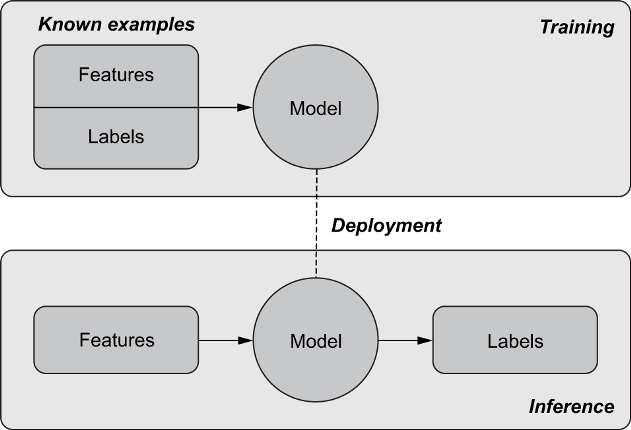

# What will you learn?

-   Machine learning (ML) modeling basics
-   <del>Using supervised and unsupervised ML</del>
-   <del>Identifying customer groups / churn / upselling</del>
-   <del>Case study: using AI on electric grid data</del>
-   <del>Case study: mining retail analytics with AI</del>

# ML basics

Following Mauro/Valigi (2021), we use an online real estate platform
as an example to illustrate how machine learning can work.

The core business problem is matching sellers and buyers. The core
value is the house price. We want to build a machine learning (ML)
model that predicts house prices based on real estate market data.

When a new house comes on the market, we want the AI to predict a
price based on other comparable houses. The AI computes a similarity
measure.

Source of all images: [Mauro/Valigi, 2021](#org0bdce9c).

## Problem

The machine learning problem - predict the best price for homes
listed on a real estate platform. *Image: purchasing process.*

*Which other **problems** suited for ML do you know?*<a id="fnr.1" class="footref" href="#fn.1">1</a>

## Process

Image: Machine learning phases - training, deployment,
inference.

*Is this an **agile** process? Why or why not?*

## Data

Though the availability of data ("Big Data") drives much of the ML
development, the basic data format and the way the data are used to
establish ML models, are well known and have long been in use.

### Data format

Image: Table with features and labels for several examples.

Both features and labels are variables. Features are
given/independent, and labels are targets/dependent. The label
variables are what we want to predict.

### Data use

The available data is split into training and test sets. The
training data is used to make the model learn, and the test data is
used to test the model on unknown data, simulating the real-world
application.

## Programming

How does this kind of program relate to traditional rule-based
programming?

## Concepts

<table border="2" cellspacing="0" cellpadding="6" rules="groups" frame="hsides">

<colgroup>
<col  class="org-left" />

<col  class="org-left" />
</colgroup>
<tbody>
<tr>
<td class="org-left">ML algorithm ("the AI")</td>
<td class="org-left">Allows computers to learn from data</td>
</tr>

<tr>
<td class="org-left">Features</td>
<td class="org-left">Model input, characteristics of an object that the AI can learn from</td>
</tr>

<tr>
<td class="org-left">Label</td>
<td class="org-left">Model output or target we want the AI to predict</td>
</tr>

<tr>
<td class="org-left">Training</td>
<td class="org-left">Phase when the AI is fed with past features to learn patterns</td>
</tr>

<tr>
<td class="org-left">Model</td>
<td class="org-left">Output of the training phase, capable of making predictions</td>
</tr>

<tr>
<td class="org-left">Inference</td>
<td class="org-left">Phase in which the model is used with new examples</td>
</tr>

<tr>
<td class="org-left">Training data</td>
<td class="org-left">Data used to create the model ("learning")</td>
</tr>

<tr>
<td class="org-left">Test data</td>
<td class="org-left">Data used to apply the model ("production")</td>
</tr>
</tbody>
</table>

Image: illustration of a supervised learning algorithm.

  

## Discussion

-   How does machine learning relate to the "intelligent agents"
    concept?
-   What do you think are the advantages and disadvantages of this
    approach?
-   Do you recognize these concepts in your own AI application
    (solo presentation or team project)? Does ML play a role here?
    Which one?

# References

 Mauro/Valigi (2021). Zero to AI - a nontechnical,
hype-free guide to prospering in the AI era. Manning. [Online:
manning.com](https://www.manning.com/books/zero-to-ai).

# Footnotes

<a id="fn.1" href="#fnr.1">1</a> (1) Predicting final grades from midterm and other student
performance data. (2) Predicting how much/which products a customer
will buy depending on his purchasing history. (3) Predicting if a
customer will buy or bail. (3) Predicting if email is spam or not. (4)
Predicting if an image is a cat or dog (or neither).
