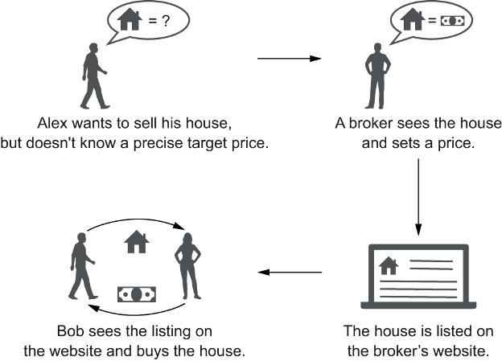
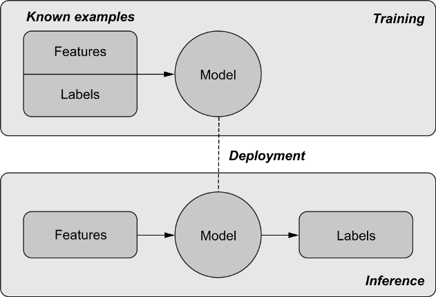
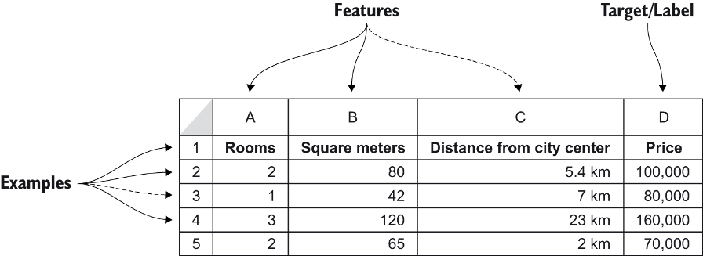
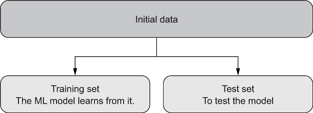
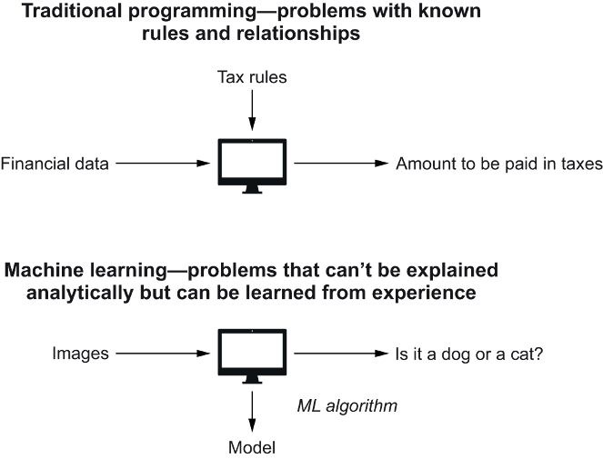
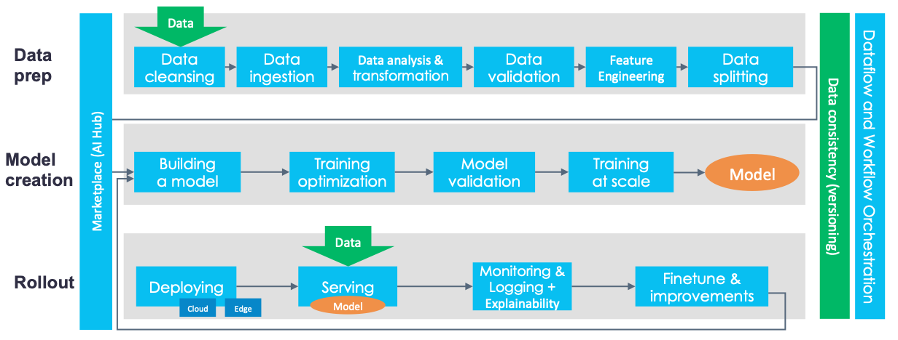
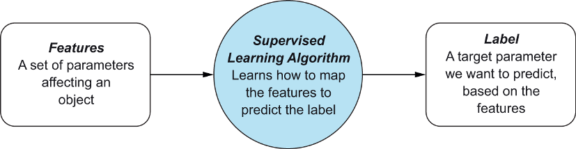

# Table of Contents

-   [What will you learn?](#orgbf79185)
-   [ML basics](#orgc9ebed1)
    -   [Problem](#org86aa004)
    -   [Process](#orge337671)
    -   [Data](#orgbc1c722)
        -   [Data format](#org4ca30c9)
        -   [Data use](#org2fc119c)
    -   [Programming](#orgb0c844b)
        -   [Rules vs. learning](#orga7f5a56)
        -   [Research vs. deployment](#org3bed6ef)
    -   [Concepts](#orgc41ed52)
    -   [Discussion](#org4996f9b)
-   [References](#org9d0c0be)

# What will you learn?

-   Machine learning (ML) modeling basics
-   Problems
-   Process
-   Data
-   Programming

# ML basics

Following Mauro/Valigi (2021), we use an online real estate platform
as an example to illustrate how machine learning can work.

The core business problem is matching sellers and buyers. The core
value is the house price. We want to build a machine learning (ML)
model that predicts house prices based on real estate market data.

When a new house comes on the market, we want the AI to predict a
price based on other comparable houses. The AI computes a similarity
measure.

Source of all images: [Mauro/Valigi, 2021](#org7f713be).

## Problem

The machine learning problem - predict the best price for homes
listed on a real estate platform. *Image: purchasing process.*

*Which other **problems** suited for ML do you know?*<a id="fnr.1" class="footref" href="#fn.1">1</a>

## Process

Image: Machine learning phases - training, deployment,
inference.

*Is this an **agile** process? Why or why not?*

## Data

Though the availability of data ("Big Data") drives much of the ML
development, the basic data format and the way the data are used to
establish ML models, are well known and have long been in use.

### Data format

Image: Table with features and labels for several examples.

Both features and labels are variables. Features are
given/independent, and labels are targets/dependent. The label
variables are what we want to predict.

### Data use

The available data is split into training and test sets. The
training data is used to make the model learn, and the test data is
used to test the model on unknown data, simulating the real-world
application.

## Programming

### Rules vs. learning

How does this kind of program relate to traditional rule-based
programming?

### Research vs. deployment

The story of deployment is a lot more complicated than shown
here:

> "As little as 5% of the actual code for machine learning
> production systems is the model itself. What turns a collection of
> machine learning solutions into an end-to-end machine learning
> platform is an architecture that embraces technologies designed to
> speed up modelling, automate the deployment, and ensure scalability
> and reliability in production." ([Hellstrom, 2020](#orgda98491)) 

Te bulk of the activities listed in this quote form part of the
"MLOps" challenge that Andrew Ng also mentioned ([Ng, 2020](#orgd3a6d7e)). The
figure below gives a schematic overview:

## Concepts

<table border="2" cellspacing="0" cellpadding="6" rules="groups" frame="hsides">

<colgroup>
<col  class="org-left" />

<col  class="org-left" />
</colgroup>
<tbody>
<tr>
<td class="org-left">ML algorithm ("the AI")</td>
<td class="org-left">Allows computers to learn from data</td>
</tr>

<tr>
<td class="org-left">Features</td>
<td class="org-left">Model input, characteristics of an object that the AI can learn from</td>
</tr>

<tr>
<td class="org-left">Label</td>
<td class="org-left">Model output or target we want the AI to predict</td>
</tr>

<tr>
<td class="org-left">Training</td>
<td class="org-left">Phase when the AI is fed with past features to learn patterns</td>
</tr>

<tr>
<td class="org-left">Model</td>
<td class="org-left">Output of the training phase, capable of making predictions</td>
</tr>

<tr>
<td class="org-left">Inference</td>
<td class="org-left">Phase in which the model is used with new examples</td>
</tr>

<tr>
<td class="org-left">Training data</td>
<td class="org-left">Data used to create the model ("learning")</td>
</tr>

<tr>
<td class="org-left">Test data</td>
<td class="org-left">Data used to test the model</td>
</tr>

<tr>
<td class="org-left">Production data</td>
<td class="org-left">Data used to run the model in the field ("deployed")</td>
</tr>
</tbody>
</table>

Image: illustration of a supervised learning algorithm.

## Discussion

-   How does machine learning relate to the **"intelligent agents"**
    concept (as in [AIMA](#org1331b61))?<a id="fnr.2" class="footref" href="#fn.2">2</a>
-   What do you think are the **advantages** and **disadvantages** of
    this approach?<a id="fnr.3" class="footref" href="#fn.3">3</a>
-   Do you **recognize** any of these concepts in your own AI
    application (solo presentation or team project)? Does ML play a
    role here?  Which one?

# References

 Hellstrom (21 Feb 2020). A Tour of End-to-End Machine
Learning Platforms [Blog]. [Online: databaseline.tech.](https://databaseline.tech/a-tour-of-end-to-end-ml-platforms/)

 Mauro/Valigi (2021). Zero to AI - a nontechnical,
hype-free guide to prospering in the AI era. Manning. [Online:
manning.com](https://www.manning.com/books/zero-to-ai).

 Stanford HAI (Sep 23, 2020). Andrew Ng: Bridging AI's
Proof-of-Concept to Production Gap [video]. [Online: youtube.com](https://youtu.be/tsPuVAMaADY).

 Russel/Norvig (2021). AI a Modern Approach 4th
ed. Pearson. [Online: aima.cs.berkeley.edu.](http://aima.cs.berkeley.edu/)

# Footnotes

<a id="fn.1" href="#fnr.1">1</a> (1) Predicting final grades from midterm and other student
performance data. (2) Predicting how much/which products a customer
will buy depending on his purchasing history. (3) Predicting if a
customer will buy or bail. (3) Predicting if email is spam or not. (4)
Predicting if an image is a cat or dog (or neither).

<a id="fn.2" href="#fnr.2">2</a> The relationship between AI and ML is briefly explained in AIMA
at the start. Part V of the book deals exclusively with machine
learning. The distinctions (data science, AI, machine learning) are
not precise at all though.

<a id="fn.3" href="#fnr.3">3</a> We discussed some of them in class. Some issues were also
mentioned by Andrew Ng: data validation and availability; change
management (for deployment); scaling; value identification;
maintenance/debugging.
