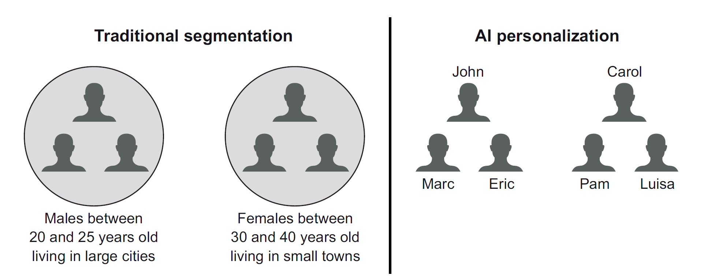
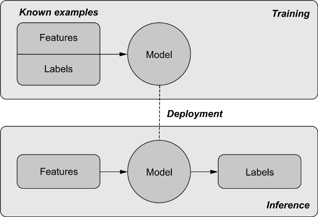
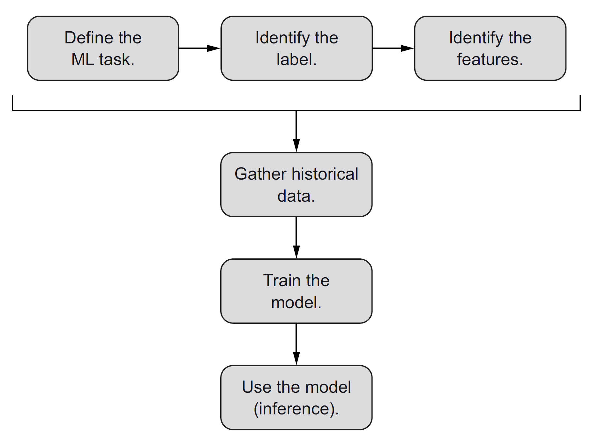
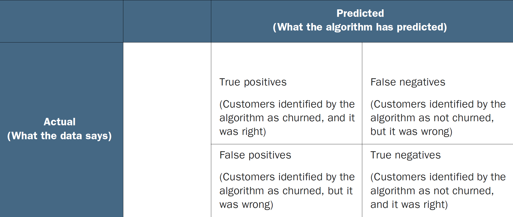
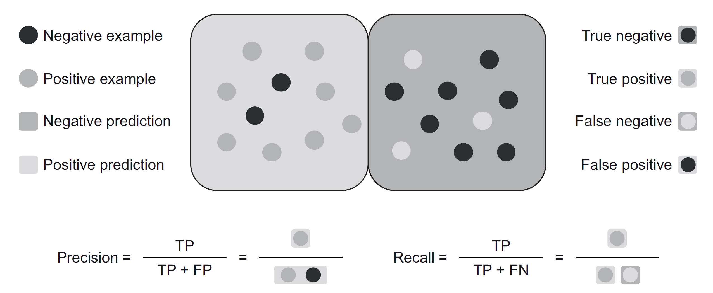
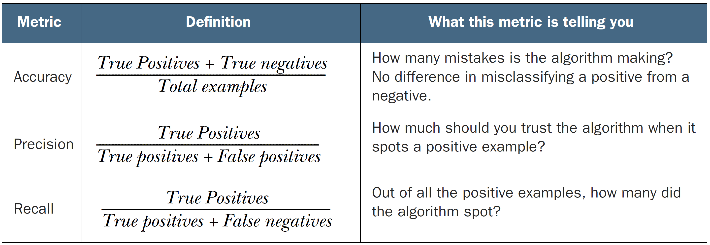
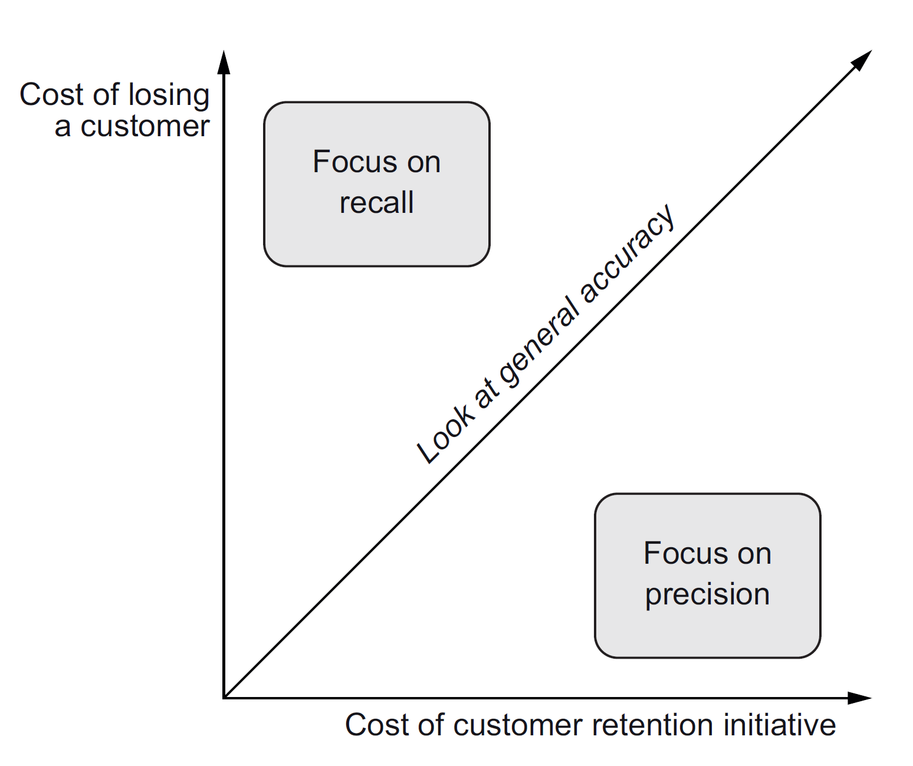
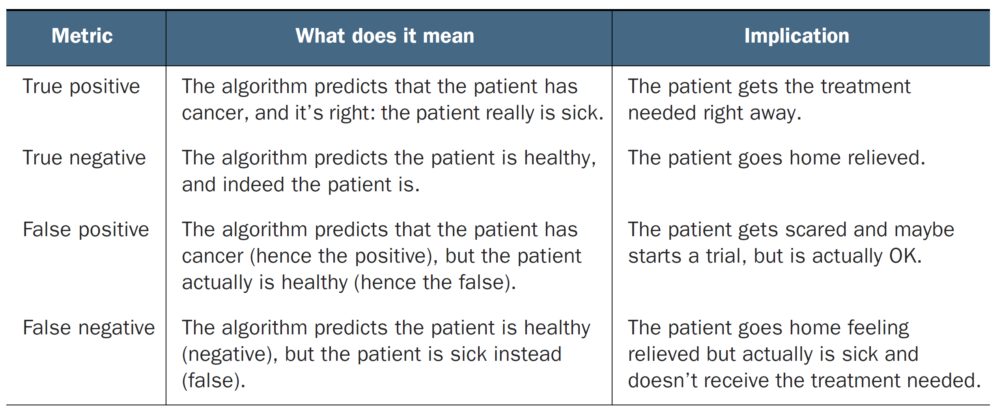
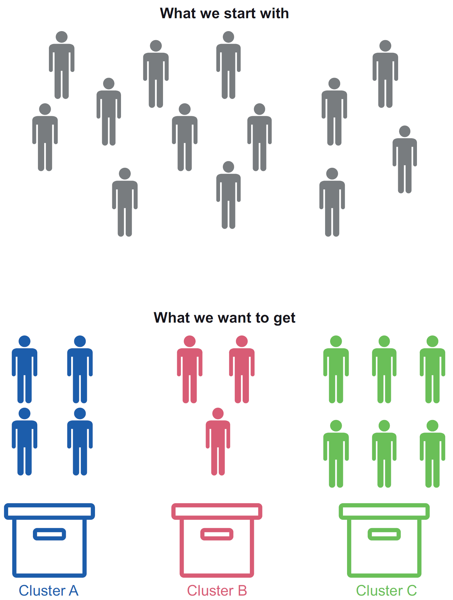
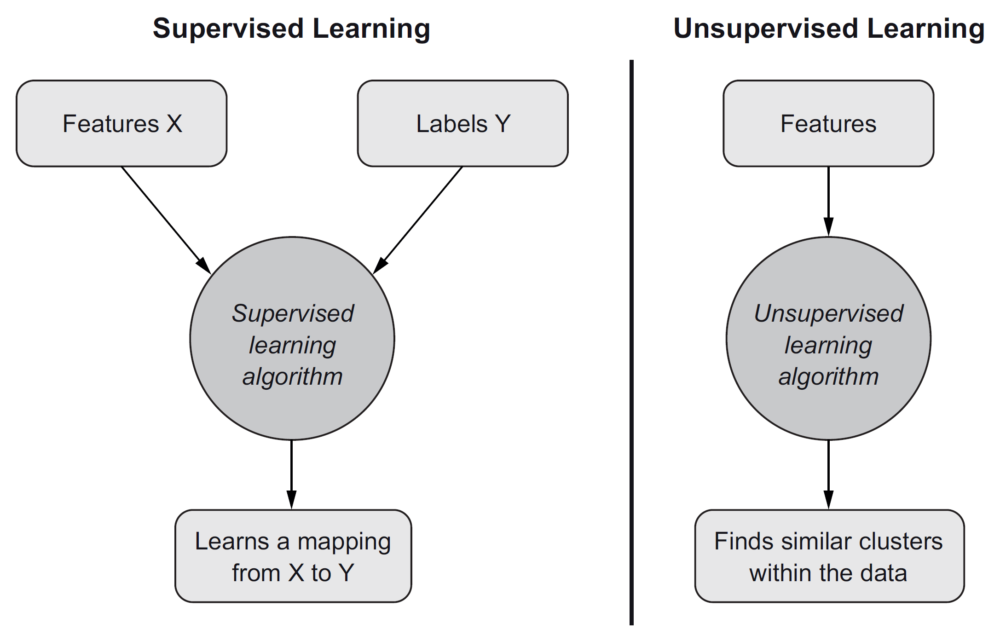

# Table of Contents

-   [What will you learn?](#orge7058ab)
    -   [Problem: personalization at scale](#orgcf654d7)
    -   [Marketing sample problems](#orga6ffae9)
    -   [Predicting churning customers](#org9c54326)
    -   [Measuring algorithm performance](#org4b3e27a)
    -   [Accuracy, precision and recall](#orgae643e5)
        -   [Definitions](#org60fac4f)
        -   [Business use](#orgfed807d)
        -   [Health care application](#org43f133b)
    -   [Perform automatic customer segmentation](#org4cc6bc1)
        -   [Unsupervised learning = finds labels](#org18ba382)
        -   [Supervised vs. unsupervised learning](#org001ba55)
    -   [Concepts](#org46560e0)
    -   [Discussion](#org34ecfb7)
-   [References](#org3031734)

# What will you learn?

-   Customer churn and segmentation decisions
-   Measuring algorithm performance
-   Using supervised vs. unsupervised ML
    
    Image source: [Mauro/Valigi (2021)](#orgb71ad76), chapter 3

## Problem: personalization at scale

-   Customers respond best to **personalized** messages<a id="fnr.1" class="footref" href="#fn.1">1</a>
-   AI delivers personalization **at scale**<a id="fnr.2" class="footref" href="#fn.2">2</a>
    
    
    
    > "With AI, you can reach personalization at scale, learning about
    > people from their specific actions and characteristics and targeting
    > them for who they really are and not for the handcrafted bucket they
    > fall into."
    
    *Is this statement true? Is "who you really are" hidden in the
    data that you generate as customers?*

## Marketing sample problems

-   Identifying which customers are likely to leave your service
    ("churn")
-   Identifying which customers are likely to buy a new service
-   Identifying similar customer groups (customer segmentation)
    
    Remember the basic process:
    
    

## Predicting churning customers

<table border="2" cellspacing="0" cellpadding="6" rules="groups" frame="hsides">

<colgroup>
<col  class="org-left" />

<col  class="org-left" />
</colgroup>
<tbody>
<tr>
<td class="org-left">Churn</td>
<td class="org-left">percentage of customers leaving a business over time</td>
</tr>
</tbody>
</table>

-   Label: customer belongs to one of two classes<a id="fnr.3" class="footref" href="#fn.3">3</a>:
    -   Class 0 = not churned (still active)
    -   Class 1 = customer about to churn (jump ship)
-   Identify features
    
    
    
    *Which phase is missing in this model?<a id="fnr.4" class="footref" href="#fn.4">4</a>*

## Measuring algorithm performance

-   Statistical vs. practical metrics:
    -   Link between stats and decisions not obvious
-   Dealing with errors:
    
    -   Not all errors are the same
    
    
    *Table: confusion matrix - predictions vs. truth*

## Accuracy, precision and recall

A critical part of developing ML models is to check for
errors. This is unfortunately not straightforward because of the
stochastic nature of the methods. One has to come up with methods
that eliminate false answers (conditional probabilities).

### Definitions

<table border="2" cellspacing="0" cellpadding="6" rules="groups" frame="hsides">

<colgroup>
<col  class="org-left" />

<col  class="org-left" />
</colgroup>
<tbody>
<tr>
<td class="org-left">Accuracy</td>
<td class="org-left">What's the ratio of correct vs total predictions?</td>
</tr>

<tr>
<td class="org-left">Precision</td>
<td class="org-left">How many predicted customers were really going to churn?</td>
</tr>

<tr>
<td class="org-left">Recall</td>
<td class="org-left">How many customers who churned were predicted?</td>
</tr>
</tbody>
</table>

*Image: illustration of precision and recall metrics*

*Table: How to use accuracy, precision and recall metrics*

### Business use

Depending on the model accuracy/recall/precision profile, the
model can be employed either to minimize costs of losing
customers, or of retaining customers. Which is more important
depends on the business model.

For example, the way of winning/retaining customers of a digital
subscription service like Netflix or Spotify is very different
from winning/retaining customers of a real retail location like a
physical Walmart store.

*Image: focus depends on cost of losing vs. retaining customers*

### Health care application

This example illustrates that eliminating stochastic error can be
a life or death issue - it's not always about selling more stuff.

*Image: Implications of confusion on cancer detection*

## Perform automatic customer segmentation

<table border="2" cellspacing="0" cellpadding="6" rules="groups" frame="hsides">

<colgroup>
<col  class="org-left" />

<col  class="org-left" />
</colgroup>
<tbody>
<tr>
<td class="org-left">Segmentation</td>
<td class="org-left">Group customers who share behaviors and characteristics</td>
</tr>
</tbody>
</table>

Typical marketing questions:

-   Should we group people aged 20-25 or those aged 20-29?
-   Can we put large and small city students in one cluster?
-   Should we put males and females in different clusters?

Ways to decide all depend on **patterns**:

-   Go by your gut feeling ("1980s")
-   Look at the data (EDA) and let marketing decide
-   Let AI cluster customer segments

### Unsupervised learning = finds labels

> "In unsupervised learning, an algorithm is fed with unlabeled
> examples, and is asked to devide the examples into groups that
> share some similarities."

*Image: How a clustering algorithm works*

### Supervised vs. unsupervised learning

*Image: Input/output differences between supervised and
unsupervised learning*

## Concepts

<table border="2" cellspacing="0" cellpadding="6" rules="groups" frame="hsides">

<colgroup>
<col  class="org-left" />

<col  class="org-left" />
</colgroup>
<tbody>
<tr>
<td class="org-left">Scaling</td>
<td class="org-left">Speed, usability, storage, concurrent access</td>
</tr>

<tr>
<td class="org-left">Personalization</td>
<td class="org-left">Opposite of standardization (or segmentation)</td>
</tr>

<tr>
<td class="org-left">Churning</td>
<td class="org-left">Likelihood of losing a customer</td>
</tr>

<tr>
<td class="org-left">Error measures</td>
<td class="org-left">Accuracy, precision, recall</td>
</tr>

<tr>
<td class="org-left">Confusion matrix</td>
<td class="org-left">True and false positive or negative predictions</td>
</tr>

<tr>
<td class="org-left">Predictor</td>
<td class="org-left">Label generated by a supervised learning algorithm</td>
</tr>

<tr>
<td class="org-left">Unsupervised learning</td>
<td class="org-left">Clustering problem without labels</td>
</tr>
</tbody>
</table>

## Discussion

-   What are the issues with each of the pattern identification
    methods listed above (gut feeling/EDA/AI)
-   What are some principal technical issues with supervised and
    unsupervised learning?
-   What is the potential cost of letting AI make more and more
    decisions in sales and marketing?

# References

 Hellstrom (21 Feb 2020). A Tour of End-to-End Machine
Learning Platforms [Blog]. [Online: databaseline.tech.](https://databaseline.tech/a-tour-of-end-to-end-ml-platforms/)

 Mauro/Valigi (2021). Zero to AI - a nontechnical,
hype-free guide to prospering in the AI era. Manning. [Online:
manning.com](https://www.manning.com/books/zero-to-ai).

 Stanford HAI (Sep 23, 2020). Andrew Ng: Bridging AI's
Proof-of-Concept to Production Gap [video]. [Online: youtube.com](https://youtu.be/tsPuVAMaADY).

 Russel/Norvig (2021). AI a Modern Approach 4th
ed. Pearson. [Online: aima.cs.berkeley.edu.](http://aima.cs.berkeley.edu/)

# Footnotes

<a id="fn.1" href="#fnr.1">1</a> It is worth noting that strict personalization is
philosophically impossible because humans are not machines (or
animals): our preferences change over time, often irrationally so.

<a id="fn.2" href="#fnr.2">2</a> 'Scaling' is a major efficiency quantity in our times of mass
applications. It relates to the ability of anything to apply to large
numbers - ideally at infinitum. "Scaling laws", or power laws,
describe growth where one quantity grows with a power. Exponential
growth is an example. In IT and application development, scaling is
desired for the number of people - e.g. an application on your phone
should scale to any number of concurrent users. This implies demands
on storage, speed, usability, and other characteristics.

<a id="fn.3" href="#fnr.3">3</a> Note that the choice of label depends on the underlying business
model. Digital services like Netflix or Spotify are easier to deal
with since customers have to actively unsubscribe. Food retail is not
so easy: customers don't tell you that they don't intend to come
back.

<a id="fn.4" href="#fnr.4">4</a> Answer: the testing phase. Once the model has been trained on a
part (usually 75%) of the historic (accurate, real) data, it is tested
using the remaining historic data. If it then performs according to
expectation, it is released "into the wilde", that is deployed to
identify labels from existing feature data sets.
