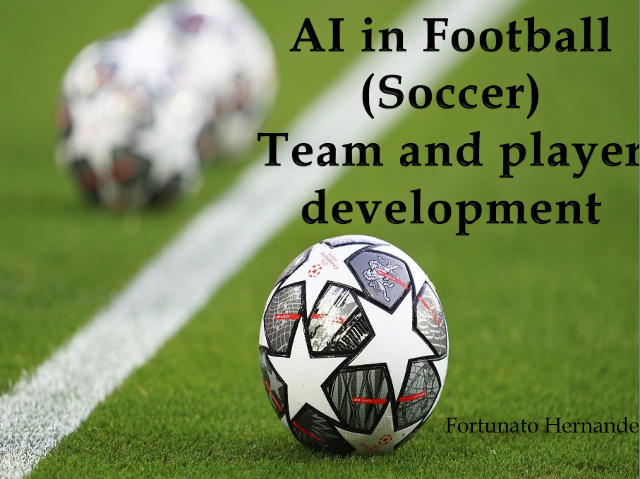
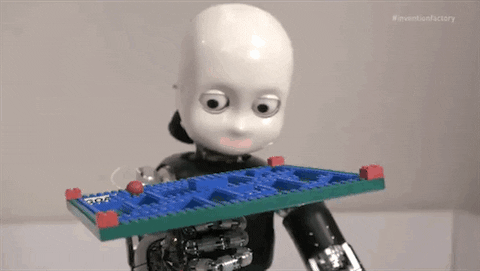
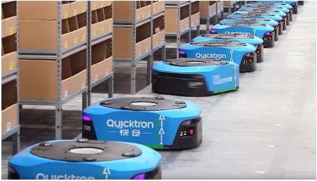
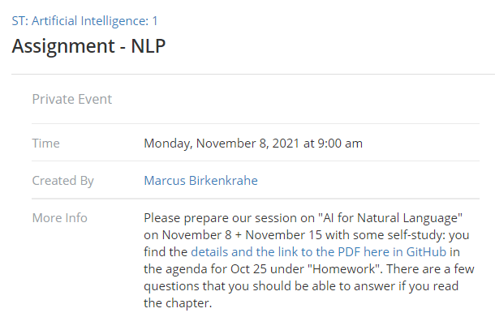
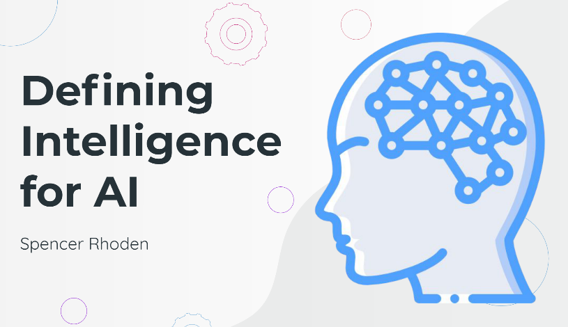
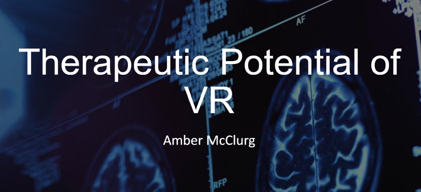
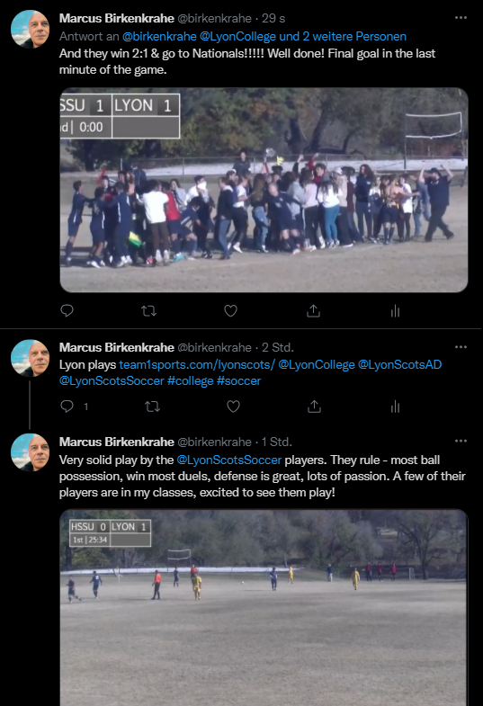

# Table of Contents

-   [Week 2 - August 25](#org98f8159)
-   [Week 2 - August 27](#org27bd2b7)
-   [Week 3 - August 30](#orgda855ec)
-   [Week 4 - September 8](#orgab11d0b)
-   [Week 4 - September 10](#org2b6a674)
-   [Week 5 - September 13](#orgd3b8354)
-   [Week 5 - September 15](#org0ee7482)
-   [Week 5 - September 17](#orgeece264)
-   [Week 6 - September 20/22](#org65481b5)
-   [Week 6 - September 24](#org133da9e)
-   [Week 7 - September 27](#org672954e)
-   [Week 7 - September 29](#org37eba1b)
-   [Week 7 - October 1](#org7092103)
-   [Week 8 - October 6](#org0b2fdd1)
-   [Week 8 - October 8](#org881ac43)
-   [Week 9 - October 11](#org6237ce4)
-   [Week 9 - October 14](#org47b0991)
-   [Week 9 - October 15](#org318c45c)
-   [Week 10 - October 18](#org7a32c05)
-   [Week 10 - October 22](#orgc40dcc3)
-   [Week 11 - October 25](#org2d77b34)
-   [Week 11 - October 27+29](#org663acff)
-   [Week 12 - November 3](#orgce1e84e)
-   [Week 12 - November 5](#orgf331625)
-   [Week 13 -  November 8 - NLP 1](#org1cae149)
-   [Week 13 - November 10+12](#org9d9728e)
-   [Week 14 - November 15 - NLP 2](#org39a4269)
-   [Week 14 - November 17](#org05a1597)
-   [Week 15 - November 22 - RPA](#org341e0cb)
-   [Week 16 - Nov 29-Dec 3](#orgbe621fc)
-   [References](#org0df028b)

# Week 2 - August 25

-   Housekeeping
-   Four approaches to AI
-   Major issues
-   Next week: AI applications

## Housekeeping

-   Protocol ([GitHub](https://github.com/birkenkrahe/ai482/blob/main/2_what_is_ai/protocol_23_aug.md))
-   Bookmarks ([GitHub](https://github.com/birkenkrahe/ai482/blob/main/bookmarks.md))
-   Missing sessions:
    -   Google meet? (Poll: Y/N)
    -   Agendas will be posted

# Week 2 - August 27

-   Housekeeping
-   Rational agents
-   Major issues
    
    *Image: "Grace, the ultra-lifelike nurse robot" ([Cairns, 2021](#org1676820))*

## Housekeeping

-   [Google meet](https://meet.google.com/pkv-torj-fyt)
-   Staying on top of AI (blogs)
-   AI presentation = individual
-   AI application = team
-   Make them work in tandem

### [Curated] AI blogs

-   [Top 10 blogs and sites (2021)](https://blog.feedspot.com/ai_blogs/)
-   [10 Best AI Blogs To Follow (2017)](https://blog.education-ecosystem.com/10-artificial-intelligence-blogs/)
-   [Google AI Blog](https://ai.googleblog.com/)
-   [Microsoft AI Blog](https://blogs.microsoft.com/ai/)
-   [Amazon AI Blog](https://aws.amazon.com/blogs/machine-learning/)

## References

 [Cairns, R (19 Aug 2021). Meet Grace, the
ultra-lifelike nurse robot. Online: cnn.com.](https://www.cnn.com/2021/08/19/asia/grace-hanson-robotics-android-nurse-hnk-spc-intl/index.html)

# Week 3 - August 30

-   Housekeeping
-   Mon: AI approaches pros/cons
-   Wed: Ideas generation
-   Fri: Project canvas

## Housekeeping

-   [Google meet](https://meet.google.com/nmy-dydn-kwy)
-   [AI Test 2: What is AI?](https://lyon.schoology.com/assignment/5257337255/assessment_questions)
-   [Followup](https://github.com/birkenkrahe/ai482/blob/main/2_what_is_ai/followup_08_27.md) / [Diary](https://github.com/birkenkrahe/ai482/blob/main/diary.md)
-   [Scrum FAQs](https://github.com/birkenkrahe/org/blob/master/FAQ.md#orge594cc2) / TODO: video (MB)

## Ideas generation

-   Goal: choice of topic
-   Presentation (solo)
-   [Submit presentation ideas (Wed)](https://github.com/birkenkrahe/ai482/discussions/4)
-   AI application (**pick a team!**)
-   Project canvas (Fri)

## AI approaches pros/cons

-   [Group exercise](https://github.com/birkenkrahe/ai482/blob/main/2_what_is_ai/2_what_is_ai.md#pros-and-cons)
-   [Results on Kanban board](https://ideaboardz.com/for/AI%20approaches%20pros%20&amp;%20cons/4063343)
-   [Present and discuss in class](https://github.com/birkenkrahe/ai482/blob/main/3_ai_projects/AI_approaches_pros_cons.pdf)

# Week 4 - September 8

> "I'm concerned with the world in which we'll live tomorrow."

## Housekeeping

-   Test 3: research project
-   Project canvas & sprint review
-   Group work: history of AI

## Project

-   [Project Canvas (sample)](https://github.com/birkenkrahe/ai482/blob/main/3_ai_projects/ProjectCanvasSampleAI.pdf)
-   [First sprint review](https://github.com/birkenkrahe/ai482/tree/main/3_ai_projects/1_sprint_review)

## History of AI

-   ["The Thinking Machine" (1961)](https://youtu.be/5YBIrc-6G-0)
-   Structured group discussion<a id="fnr.1" class="footref" href="#fn.1">1</a>
-   Protocol: Fortunato

## Group discussion

<table border="2" cellspacing="0" cellpadding="6" rules="groups" frame="hsides">

<colgroup>
<col  class="org-left" />
</colgroup>
<tbody>
<tr>
<td class="org-left">A: Can technologists learn anything from historical documents? If yes (or no), why (not)?</td>
</tr>

<tr>
<td class="org-left">B: What's the feeling tone of the film? Optimism, scepticism, ambitions?</td>
</tr>

<tr>
<td class="org-left">C: SWOT analysis (Strenghts/Weaknesses/Opportunities/Threats)</td>
</tr>

<tr>
<td class="org-left">D: What are the key questions/issues here: are they still current?</td>
</tr>
</tbody>
</table>

# Week 4 - September 10

-   [Followup: The Thinking Machine I](https://github.com/birkenkrahe/ai482/blob/main/4_ai_history/followup_09_08_2021.md)
-   [Learning & Agile Methods](https://github.com/birkenkrahe/org/blob/master/diary.md)
-   [First sprint reviews](https://github.com/birkenkrahe/ai482/tree/main/3_ai_projects/1_sprint_review) (Team project)
-   Still no ideas? [See Stanford '21 conference](https://hai.stanford.edu/2021-spring-conference-agenda)

# Week 5 - September 13

-   Housekeeping
-   Analogies
-   Are we machines?

## Housekeeping

-   No more tests (participation 50%)
-   Use the protocols instead
-   This week: history and philosophy of AI

## Analogies

-   Full lecture available ([GitHub](https://github.com/birkenkrahe/ai482/blob/main/4_ai_history/analogy.org))
-   *"Your lips are like a red, red rose."*
-   What are the limitations of this analogy?
-   Analogies are persuasion tools

## Are we machines?

-   [The Thinking Machine (15'-33')](https://youtu.be/5YBIrc-6G-0?t=920)
-   Pair up to discuss the analogies
-   Argue: "How are humans NOT like machines."
-   Briefly present your findings

# Week 5 - September 15

> "Intelligent behavior is rule-obeying behavior."

## Automatic creativity?

### [Plotto book (Legro, 2012)](#org7463a76)

### [Wycliffe Hill's 1931 plot robot (Collins, 2009)](#orgb22ebad)

### [Plotto game (Redgrave, 2018)](#org72e53d0)

## Creativity and AI

-   [The Thinking Machine (34'-47')'](https://youtu.be/5YBIrc-6G-0?t=920)
-   When do you feel creative?
-   Do you think AI could help or replace this?
-   What's intelligent about your AI application?
-   Briefly present your findings

## References

 Collins P (6 Jul 2009). The King of All Formulas
[Blog]. [Online: slate.com.](https://slate.com/news-and-politics/2009/07/the-man-who-invented-the-hollywood-schlock-machine.html)

 Legro M (6 Jan 2012). Plotto: The Master Book of All
Plots [Blog]. [Online: brainpickings.org.](https://www.brainpickings.org/2012/01/06/plotto/)

 Redgrave AL (29 Apr 2018). Plotto Demo
[Video]. [Online: youtube.com](https://youtu.be/VbWrs8wm5sA).

# Week 5 - September 17

-   Topic change? Anyone interested in "Grammarly"?
-   History of AI after 1960
-   Next: Intelligent Agents (AIMA)
-   Next: AI in Sales and Marketing (example)

# Week 6 - September 20/22

-   Intelligent agents - PEAS
-   [Lectures in GitHub](https://github.com/birkenkrahe/ai482/tree/main/5_ai_agents)

# Week 6 - September 24

-   Types of intelligent agents ([Iacobelli, 2015](https://youtu.be/UjQ1AzSvCp8?t=1302))
-   AI state of the art
    -   Part I: AI research-to-production gap ([Stanford HAI, 2020](https://youtu.be/tsPuVAMaADY?t=367))
    -   Part II: Change management
    -   Part III: Full cycle of ML projects

*Image source: [Williams, 2020](#orgbe5ddda).*

# Week 7 - September 27

-   Recap: what do you remember?
-   See also: "[Healthcare's AI Future](https://youtu.be/Gbnep6RJinQ)"
-   Small data algorithms: [GANs/GPT-3](https://github.com/birkenkrahe/ai482/tree/main/6_ai_state_of_the_art#small-data)
-   Today: "Change management and ML"
-   Next: "Full ML project cycle"

*Image: Two AIs talk about becoming human (Soslow, 2021)*

# Week 7 - September 29

-   Recap: what do you remember?
-   Followup on: [efficiency vs resilience](https://github.com/birkenkrahe/ai482/blob/main/6_ai_state_of_the_art/README.md#org476fe42)
-   New diary entry: [taking stock](https://github.com/birkenkrahe/ai482/blob/main/diary.md#org1e569bc) (Sept 27)

# Week 7 - October 1

-   Today: [AIMA Exercises:](https://aimacode.github.io/aima-exercises/agents-exercises/) anyone? (My part)
-   Oct 6: [AI100 report 2021](https://hai.stanford.edu/news/new-report-assesses-progress-and-risks-artificial-intelligence) (lecture/discussion)
-   Oct 8: [Upload PDF here by 9 AM](https://github.com/birkenkrahe/ai482/tree/main/presentations/2nd_sprint_review) (everybody)

# Week 8 - October 6

-   New diary entry - "[Florida man](https://github.com/birkenkrahe/org/blob/master/diary.md#org56850d9)"
-   Today: [future of AI ("AI100")](https://github.com/birkenkrahe/ai482/tree/main/7_future_of_ai)
-   Fri/Mon: [2nd sprint review](https://github.com/birkenkrahe/ai482/tree/main/presentations/2nd_sprint_review)
-   Tell me your solo presentation topics!

# Week 8 - October 8

-   Fri+Mon: [2nd sprint review](https://github.com/birkenkrahe/ai482/tree/main/presentations/2nd_sprint_review)
-   Fri: Homecoming visit
-   Mon: [sprint review](https://github.com/birkenkrahe/org/blob/master/FAQ.md) critique

# Week 9 - October 11

-   Last [2nd sprint reviews](https://github.com/birkenkrahe/ai482/tree/main/presentations/2nd_sprint_review)
-   [Sprint review](https://github.com/birkenkrahe/org/blob/master/FAQ.md) critique:
    How to create a **great** presentation ([FAQ](https://github.com/birkenkrahe/org/blob/master/FAQ.md#org60f0ff8))
-   New diary/FAQ: [leaving Linux](https://github.com/birkenkrahe/org/blob/master/diary.md#org835fde8)
-   Next: your [presentations](https://github.com/birkenkrahe/ai482/blob/main/schedule.md):
    1.  Jacob on [AI in the military](https://github.com/birkenkrahe/ai482/blob/main/presentations/Sampley_Autonomous%20Drones%20in%20the%20U.S.%20Military.pdf)
    2.  Emma on AI in soccer

# Week 9 - October 14

-   Presentation: [AI in the military](https://github.com/birkenkrahe/ai482/blob/main/presentations/Sampley_Autonomous%20Drones%20in%20the%20U.S.%20Military.pdf) (Jacob Sampley)
-   Lecture: [Machine learning basics](https://github.com/birkenkrahe/ai482/tree/main/8_ai_sales_marketing)<a id="fnr.2" class="footref" href="#fn.2">2</a>

# Week 9 - October 15

-   Presentation Feedback ([protocols](https://github.com/birkenkrahe/ai482/tree/main/protocols#org8c0aa28))
-   Presentation: AI in soccer playing (Emma Brandes)
-   Lecture: [Machine learning basics](https://github.com/birkenkrahe/ai482/tree/main/8_ai_sales_marketing)<a id="fnr.2.100" class="footref" href="#fn.2">2</a>

# Week 10 - October 18

-   Lecture: [Machine learning basics](https://github.com/birkenkrahe/ai482/tree/main/8_machine_learning)
-   [Protocols](https://github.com/birkenkrahe/ai482/tree/main/protocols) (extra credit!)

# Week 10 - October 22

-   [Presentation](https://github.com/birkenkrahe/ai482/tree/main/presentations): Search algorithms (Dat O)
-   [Protocol/Feedback](https://github.com/birkenkrahe/ai482/tree/main/protocols#orgcad7132)

# Week 11 - October 25

## Lecture

[AI for Sales and Marketing](https://github.com/birkenkrahe/ai482/tree/main/9_ai_sales_marketing) (Zero to AI ch.3)

*Image: [machine learning by xkcd](https://xkcd.com/1838/)*

## Homework

Please prepare our session on "AI for Natural Language" on November
1 with some self-study:

1.  To get going, watch 5 minutes of this video (from [here](https://youtu.be/ISa10TrJK7w?t=115) to
    [here](https://youtu.be/ISa10TrJK7w?t=367)) - recent coding successes with AI using natural
    language. This shows recent successes with the GPT-3 model.

2.  Read chapter 5 of "Zero to AI" ([PDF](https://drive.google.com/file/d/1MVSgQhbCX5c2Km7Pjdcy6NiZp3RgauB3/view?usp=sharing)). This is a non-technical
    discussion of different Natural Language Processing (NLP)
    applications. Some questions that you should be able to answer
    afterwards:
    -   Which two metrics are used to measure NLP performance?
    -   Why is sentiment analysis a classification problem?
    -   What does OpenAI's GPT-2 model do?
    -   How does `BrokerBot` differ from `Eliza` the therapist bot?
    -   Which tasks can be automated by AI according to the founder of
        the company featured in the case study at the end?

## What's happening

-   [Research paper recommender at semantic scholar](https://medium.com/ai2-blog/stay-up-to-date-with-the-latest-research-in-your-field-d237d643210)
-   [Open AI and Neuralink](https://youtu.be/ISa10TrJK7w) (video, 3 Oct 2021)<a id="fnr.3" class="footref" href="#fn.3">3</a>
-   News: [AAAI Squirrel AI Award for Cynthia Rudin](https://scitechdaily.com/a-new-nobel-computer-scientist-wins-1-million-artificial-intelligence-prize/)

*Image: Interesting choice of membership categories. (Neurapod)*

# Week 11 - October 27+29

<table border="2" cellspacing="0" cellpadding="6" rules="groups" frame="hsides">

<colgroup>
<col  class="org-left" />

<col  class="org-left" />

<col  class="org-left" />
</colgroup>
<tbody>
<tr>
<td class="org-left"><a href="https://github.com/birkenkrahe/ai482/tree/main/presentations">Presentation</a></td>
<td class="org-left">AI and Football: player health</td>
<td class="org-left">Malcolm</td>
</tr>

<tr>
<td class="org-left"><a href="https://github.com/birkenkrahe/ai482/tree/main/presentations">Presentation</a></td>
<td class="org-left">AI and Soccer: player development</td>
<td class="org-left">Fortunato</td>
</tr>

<tr>
<td class="org-left">Diary (<a href="https://github.com/birkenkrahe/ai482/blob/main/diary.md#monday-october-25">Mon 25</a>)</td>
<td class="org-left">Snapshot and surveillance in China</td>
<td class="org-left">MB</td>
</tr>
</tbody>
</table>

# Week 12 - November 3

Wyatt's solo [presentation](https://github.com/birkenkrahe/ai482/tree/main/presentations): Smart Robots in Industrial Production.

## To get in the mood, meet Moxie&#x2026;and despair

"Meet Moxie - The Revolutionary Robot Companion for
Social-Emotional Learning" - <https://embodied.com/>

Video: <https://youtu.be/7-uBtY-MOdI> "Because soft skills are
essential skills." (Which chain of causation is set up here?)

> "Supporting parents and empowering children to build
> social-emotional skills that promote confidence and
> resilience. For children ages 5-10, Moxie’s play-based activities
> use evidence-based techniques to build social-emotional skills
> that promote mental well-being."

# Week 12 - November 5

3rd sprint review! ([See FAQ](https://github.com/birkenkrahe/org/blob/master/FAQ.md#what-should-we-do-in-the-third-sprint))

## [New `org` diary entry "Join me in spring 2022!"](https://github.com/birkenkrahe/org/blob/master/diary.md#join-me-in-spring-2022-nov-3)

# Week 13 -  November 8 - NLP 1

-   What is NLP? ([IBM Technology, 2021](#orgc8ea39b))<a id="fnr.4" class="footref" href="#fn.4">4</a>
    -   Tokenization
    -   Lemmatization
    -   Part-Of-Sentence Tagging

-   AI for Natural Language (reading [homework](https://github.com/birkenkrahe/ai482/blob/main/agenda.md#homework)):
    -   Main challenges
    -   Sentiment analysis
    -   Document search and retrieval
    -   Case study: Translated / machine translationi

# Week 13 - November 10+12

-   [Spencer's Solo](https://github.com/birkenkrahe/ai482/blob/main/presentations/solo/Spencer%20-%20Intelligence%20and%20AI%20.pdf): Defining Intelligence
-   [Amber's Solo](https://github.com/birkenkrahe/ai482/blob/main/presentations/solo/Therapeutic%20Potential%20of%20VR%20McClurg.pdf): Therapeutic Potential of VR

# Week 14 - November 15 - NLP 2

## Scots

## Agenda

<table border="2" cellspacing="0" cellpadding="6" rules="groups" frame="hsides">

<colgroup>
<col  class="org-left" />

<col  class="org-left" />
</colgroup>
<tbody>
<tr>
<td class="org-left">Lecture</td>
<td class="org-left">AI with Natural Language Part 2</td>
</tr>

<tr>
<td class="org-left">Project</td>
<td class="org-left">Feedback for the final presentations</td>
</tr>

<tr>
<td class="org-left">CHATBOTS</td>
<td class="org-left">&#xa0;</td>
</tr>

<tr>
<td class="org-left">Video</td>
<td class="org-left">How to Make a Simple Chatbot in Under 10 Minutes (No Coding [Google] Dialogflow) (<a href="#org7190928">Batir, 2020</a>).</td>
</tr>

<tr>
<td class="org-left">Article</td>
<td class="org-left">Building a chatbot assistant with IBM Watson in 30 min (<a href="#org1ee4210">Yates, 2021</a>; <a href="#org1ee4210">McGregor, 2021</a>)</td>
</tr>

<tr>
<td class="org-left">Tutorial</td>
<td class="org-left"><a href="https://www.ibm.com/products/watson-assistant/visual-builder">Visual chatbot builder for anyone to use</a> (<a href="#orgb3121b7">IBM, 2021</a>)</td>
</tr>
</tbody>
</table>

# Week 14 - November 17

<table border="2" cellspacing="0" cellpadding="6" rules="groups" frame="hsides">

<colgroup>
<col  class="org-left" />

<col  class="org-left" />
</colgroup>
<tbody>
<tr>
<td class="org-left">Complexity</td>
<td class="org-left">See <a href="https://github.com/birkenkrahe/ai482/tree/main/protocols#orgf3aee84">protocol 15-Nov-2021</a></td>
</tr>

<tr>
<td class="org-left">Hakeem</td>
<td class="org-left">&#xa0;</td>
</tr>
</tbody>
</table>

## Data science guest speaker, November 18, 11:45 Maxwell Room

From Dr. Wesley Beal (Lyon):

> I'm hosting a speaker for the HFP on Thursday, and if you or any of
> your students would be interested in his talk you're more than
> welcome to attend. Please consider spreading the word.
> 
> -   Michael Simeone, director of Data Science and Analytics at
>     Arizona State University, will deliver a talk entitled “Beyond
>     ‘Fake News’: A Study in How to Study Misinformation" on Thursday,
>     Nov 18 from 11:45-12:50. We will meet in the Maxfield Room, and
>     he will join us remotely; we're allowed to bring lunches
>     downstairs from the cafeteria. Dr. Simeone will discuss current,
>     data-driven research on misinformation. Dr. Simeone also co-hosts
>     a podcast, Misinfo Weekly. I asked him which episodes he would
>     recommend for students interested in getting a head start on his
>     talk, and here's what he suggested:
> -   S1E1 on Information literacy:  <https://play.acast.com/s/misinfo-weekly/episode-1>
> -   S1E8 on Instagram and "COVID parties": <https://play.acast.com/s/misinfo-weekly/covid-parties>
> -   S1E7 on the Wayfair furniture conspiracy: <https://play.acast.com/s/misinfo-weekly/the-wayfair-conspiracy-expensive-furniture-or-a-front-for-ch>
> 
> May or may not be the kind of content you're interested in, but I
> thought I'd at least offer!

# Week 15 - November 22 - RPA

<table border="2" cellspacing="0" cellpadding="6" rules="groups" frame="hsides">

<colgroup>
<col  class="org-left" />
</colgroup>
<tbody>
<tr>
<td class="org-left">Robotic Process Automation with UIPath (academic tutorials, <a href="#orgbcf0a1d">UIPath 2021</a>)</td>
</tr>

<tr>
<td class="org-left">Workflow automation with Integromat (<a href="#org9ea9307">2020,2021</a>).</td>
</tr>

<tr>
<td class="org-left">Workflow Automation with the IFTTT <a href="https://ifttt.com/explore/app-benefits">app</a> (or <a href="https://ifttt.com/">webservice</a>).</td>
</tr>
</tbody>
</table>

# Week 16 - Nov 29-Dec 3

# References

 Batir S (Jul 5, 2020). How to Make a Simple Chatbot in
Under 10 Mintues (No Coding Dialogflow) [video]. [URL:
youtu.be/Ua1pgeWg6vw](https://youtu.be/Ua1pgeWg6vw)

Francisco Iacobelli (May 15, 2021). intelligent Agents Intro
[video]. [URL: youtu.be/UjQ1AzSvCp8?t=1308](https://youtu.be/UjQ1AzSvCp8?t=1308).

 IBM (2021). Visual Chatbot Builder for Anyone to Use
[tutorial]. [URL: ibm.com.](https://www.ibm.com/products/watson-assistant/visual-builder)

 Integromat (Oct 22, 2021). Getting started with
Telegram [video]. [URL: youtu.be/SEcA5ZWDkto](https://youtu.be/SEcA5ZWDkto). Getting started with
the COVID-10 App [video]. [URL: youtu.be/aPdcjmGkc4](https://youtu.be/aPdcjmG_kc4).

 IBM Technology/Martin Keen (Aug 11, 2021). What is NLP
(Natural Language Processing)? [video]. URL: [youtu.be/fLvJ8VdHLA0](https://youtu.be/fLvJ8VdHLA0)

Jack Soslow (Apr 13, 2021). Two AIs talk about becoming
human. (GPT-3) [video]. [URL: youtu.be/jz78fSnBG0s](https://youtu.be/jz78fSnBG0s).

Neura Pod - Neuralink (Oct 3, 2021). OpenAI&Neuralink
[video]. [URL: youtu.be/ISa10TrJK7w](https://youtu.be/ISa10TrJK7w)

Stanford HAI (Sep 23, 2021). Andrew Ng: Bridging AI's
Proof-of-Concept to Production Gap [video]. [URL:
youtu.be/tsPuVAMaADY?t=367](https://youtu.be/tsPuVAMaADY?t=367).

 UIPath Academy (2021). URL: academy.uipath.com.

 Williams A (Jun 27, 2020). Riot Games give first clues
about new Valorant Agents and abilities [blog]. [Online: dexerto.com](https://www.dexerto.com/valorant/riot-games-give-first-clues-about-new-valorant-agents-and-abilities-1385396/).

 Yates R (Apr 8, 2021). Getting Started with the New
Watson Assistant: Plan It - Start Small, Go Fast [blog].  [URL:
medium.com](https://medium.com/ibm-watson/post-1-plan-e13ce8dd2787); McGregor R (Oct 7, 2021). Getting Started with the New
Watson Assistant: The Build Guide Part I. [URL: medium.com](https://medium.com/ibm-watson/getting-started-with-the-new-watson-assistant-ff8cfcbf048f)

# Footnotes

<a id="fn.1" href="#fnr.1">1</a> "Structured group discussion" means that I'm providing a
framework for group discussion and group results (e.g. a set of
questions), and a timeline. Your job is to execute the framework
within the allotted time and present the results as good as you
can. For participation, only participating and trying (harder) is
evaluated, not the quality of the result itself.

<a id="fn.2" href="#fnr.2">2</a> I will only give this lecture if we run out of presentations -
either in a session (because your presentations are finished, and
there is nothing else to discuss, or because you're all done
presenting solo).

<a id="fn.3" href="#fnr.3">3</a> If we've got extra time to spare after a presentation, or if we
don't have a presenter, we'll work through this video to get a glimpse
of some of the exciting new developments in AI. Neuralink is a company
founded by Elon Musk that "is going to change how humans think, act,
learn, and share information."

<a id="fn.4" href="#fnr.4">4</a> This is a really nice video that gives a little more insight
into the technical aspects of NLP. Clearly an attempt to reroute
people to IBM Watson, which you should check out.
