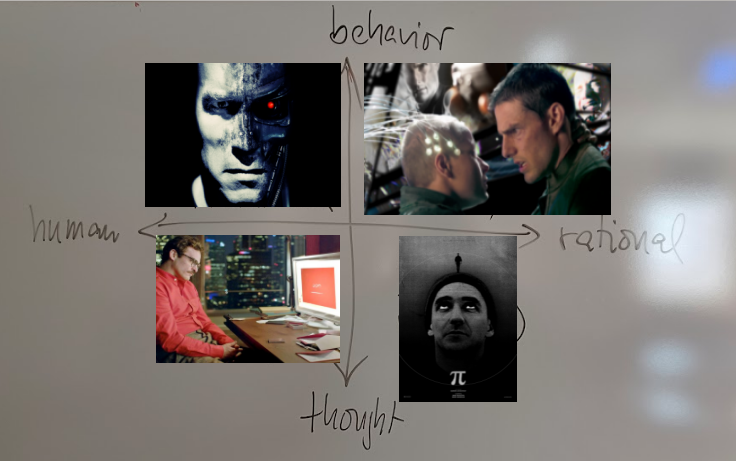
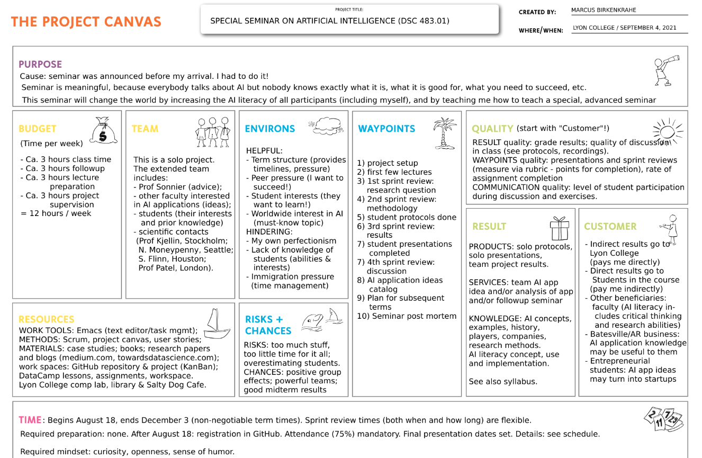
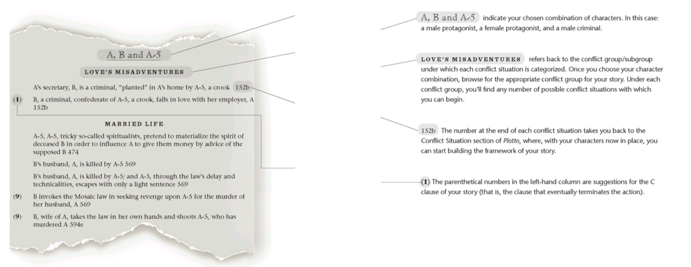
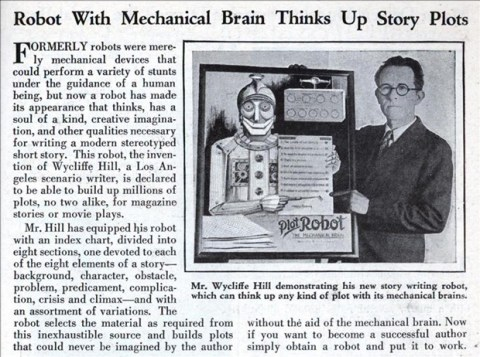
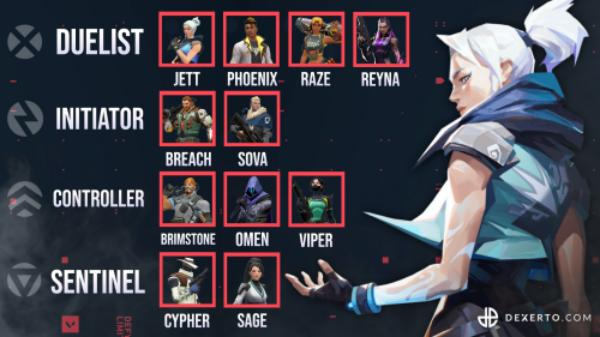
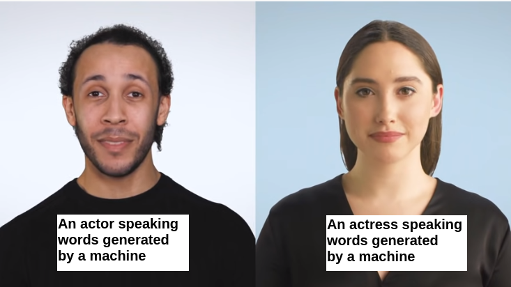

# Table of Contents

-   [Week 2 - August 25](#org424b8ee)
-   [Week 2 - August 27](#org27c2328)
-   [Week 3 - August 30](#orgf60f915)
-   [Week 4 - September 8](#org0da387a)
-   [Week 4 - September 10](#org600a3f9)
-   [Week 5 - September 13](#orgbda5bf9)
-   [Week 5 - September 15](#org4666aa9)
-   [Week 5 - September 17](#org216f975)
-   [Week 6 - September 20/22](#org7e202db)
-   [Week 6 - September 24](#org2f14581)
-   [Week 7 - September 27](#org243012e)
-   [Week 7 - September 29](#org254ff09)
-   [References](#orgd9ca811)

# Week 2 - August 25

-   Housekeeping
-   Four approaches to AI
-   Major issues
-   Next week: AI applications

## Housekeeping

-   Protocol ([GitHub](https://github.com/birkenkrahe/ai482/blob/main/2_what_is_ai/protocol_23_aug.md))
-   Bookmarks ([GitHub](https://github.com/birkenkrahe/ai482/blob/main/bookmarks.md))
-   Missing sessions:
    -   Google meet? (Poll: Y/N)
    -   Agendas will be posted

# Week 2 - August 27

-   Housekeeping
-   Rational agents
-   Major issues
    
    *Image: "Grace, the ultra-lifelike nurse robot" ([Cairns, 2021](#org1853624))*

## Housekeeping

-   [Google meet](https://meet.google.com/pkv-torj-fyt)
-   Staying on top of AI (blogs)
-   AI presentation = individual
-   AI application = team
-   Make them work in tandem

### [Curated] AI blogs

-   [Top 10 blogs and sites (2021)](https://blog.feedspot.com/ai_blogs/)
-   [10 Best AI Blogs To Follow (2017)](https://blog.education-ecosystem.com/10-artificial-intelligence-blogs/)
-   [Google AI Blog](https://ai.googleblog.com/)
-   [Microsoft AI Blog](https://blogs.microsoft.com/ai/)
-   [Amazon AI Blog](https://aws.amazon.com/blogs/machine-learning/)

## References

 [Cairns, R (19 Aug 2021). Meet Grace, the
ultra-lifelike nurse robot. Online: cnn.com.](https://www.cnn.com/2021/08/19/asia/grace-hanson-robotics-android-nurse-hnk-spc-intl/index.html)

# Week 3 - August 30

-   Housekeeping
-   Mon: AI approaches pros/cons
-   Wed: Ideas generation
-   Fri: Project canvas

## Housekeeping

-   [Google meet](https://meet.google.com/nmy-dydn-kwy)
-   [AI Test 2: What is AI?](https://lyon.schoology.com/assignment/5257337255/assessment_questions)
-   [Followup](https://github.com/birkenkrahe/ai482/blob/main/2_what_is_ai/followup_08_27.md) / [Diary](https://github.com/birkenkrahe/ai482/blob/main/diary.md)
-   [Scrum FAQs](https://github.com/birkenkrahe/org/blob/master/FAQ.md#orge594cc2) / TODO: video (MB)

## Ideas generation

-   Goal: choice of topic
-   Presentation (solo)
-   [Submit presentation ideas (Wed)](https://github.com/birkenkrahe/ai482/discussions/4)
-   AI application (**pick a team!**)
-   Project canvas (Fri)

## AI approaches pros/cons

-   [Group exercise](https://github.com/birkenkrahe/ai482/blob/main/2_what_is_ai/2_what_is_ai.md#pros-and-cons)
-   [Results on Kanban board](https://ideaboardz.com/for/AI%20approaches%20pros%20&amp;%20cons/4063343)
-   [Present and discuss in class](https://github.com/birkenkrahe/ai482/blob/main/3_ai_projects/AI_approaches_pros_cons.pdf)

# Week 4 - September 8

> "I'm concerned with the world in which we'll live tomorrow."

## Housekeeping

-   Test 3: research project
-   Project canvas & sprint review
-   Group work: history of AI

## Project

-   [Project Canvas (sample)](https://github.com/birkenkrahe/ai482/blob/main/3_ai_projects/ProjectCanvasSampleAI.pdf)
-   [First sprint review](https://github.com/birkenkrahe/ai482/tree/main/3_ai_projects/1_sprint_review)

## History of AI

-   ["The Thinking Machine" (1961)](https://youtu.be/5YBIrc-6G-0)
-   Structured group discussion<a id="fnr.1" class="footref" href="#fn.1">1</a>
-   Protocol: Fortunato

## Group discussion

<table border="2" cellspacing="0" cellpadding="6" rules="groups" frame="hsides">

<colgroup>
<col  class="org-left" />
</colgroup>
<tbody>
<tr>
<td class="org-left">A: Can technologists learn anything from historical documents? If yes (or no), why (not)?</td>
</tr>

<tr>
<td class="org-left">B: What's the feeling tone of the film? Optimism, scepticism, ambitions?</td>
</tr>

<tr>
<td class="org-left">C: SWOT analysis (Strenghts/Weaknesses/Opportunities/Threats)</td>
</tr>

<tr>
<td class="org-left">D: What are the key questions/issues here: are they still current?</td>
</tr>
</tbody>
</table>

# Week 4 - September 10

-   [Followup: The Thinking Machine I](https://github.com/birkenkrahe/ai482/blob/main/4_ai_history/followup_09_08_2021.md)
-   [Learning & Agile Methods](https://github.com/birkenkrahe/org/blob/master/diary.md)
-   [First sprint reviews](https://github.com/birkenkrahe/ai482/tree/main/3_ai_projects/1_sprint_review) (Team project)
-   Still no ideas? [See Stanford '21 conference](https://hai.stanford.edu/2021-spring-conference-agenda)

# Week 5 - September 13

-   Housekeeping
-   Analogies
-   Are we machines?

## Housekeeping

-   No more tests (participation 50%)
-   Use the protocols instead
-   This week: history and philosophy of AI

## Analogies

-   Full lecture available ([GitHub](https://github.com/birkenkrahe/ai482/blob/main/4_ai_history/analogy.org))
-   *"Your lips are like a red, red rose."*
-   What are the limitations of this analogy?
-   Analogies are persuasion tools

## Are we machines?

-   [The Thinking Machine (15'-33')](https://youtu.be/5YBIrc-6G-0?t=920)
-   Pair up to discuss the analogies
-   Argue: "How are humans NOT like machines."
-   Briefly present your findings

# Week 5 - September 15

> "Intelligent behavior is rule-obeying behavior."

## Automatic creativity?

### [Plotto book (Legro, 2012)](#org8225f16)

### [Wycliffe Hill's 1931 plot robot (Collins, 2009)](#org183bab3)

### [Plotto game (Redgrave, 2018)](#orgc5b9be3)

## Creativity and AI

-   [The Thinking Machine (34'-47')'](https://youtu.be/5YBIrc-6G-0?t=920)
-   When do you feel creative?
-   Do you think AI could help or replace this?
-   What's intelligent about your AI application?
-   Briefly present your findings

## References

 Collins P (6 Jul 2009). The King of All Formulas
[Blog]. [Online: slate.com.](https://slate.com/news-and-politics/2009/07/the-man-who-invented-the-hollywood-schlock-machine.html)

 Legro M (6 Jan 2012). Plotto: The Master Book of All
Plots [Blog]. [Online: brainpickings.org.](https://www.brainpickings.org/2012/01/06/plotto/)

 Redgrave AL (29 Apr 2018). Plotto Demo
[Video]. [Online: youtube.com](https://youtu.be/VbWrs8wm5sA).

# Week 5 - September 17

-   Topic change? Anyone interested in "Grammarly"?
-   History of AI after 1960
-   Next: Intelligent Agents (AIMA)
-   Next: AI in Sales and Marketing (example)

# Week 6 - September 20/22

-   Intelligent agents - PEAS
-   [Lectures in GitHub](https://github.com/birkenkrahe/ai482/tree/main/5_ai_agents)

# Week 6 - September 24

-   Types of intelligent agents ([Iacobelli, 2015](https://youtu.be/UjQ1AzSvCp8?t=1302))
-   AI state of the art
    -   Part I: AI research-to-production gap ([Stanford HAI, 2020](https://youtu.be/tsPuVAMaADY?t=367))
    -   Part II: Change management
    -   Part III: Full cycle of ML projects

*Image source: [Williams, 2020](#org0a5399e).*

# Week 7 - September 27

-   Recap: what do you remember?
-   See also: "[Healthcare's AI Future](https://youtu.be/Gbnep6RJinQ)"
-   Small data algorithms: [GANs/GPT-3](https://github.com/birkenkrahe/ai482/tree/main/6_ai_state_of_the_art#small-data)
-   Today: "Change management and ML"
-   Next: "Full ML project cycle"

# Week 7 - September 29

-   Course outlook
-   Read: "[Deep Learning's Diminishing Returns](#org041b204)" (10 min)

# References

Francisco Iacobelli (May 15, 2021). intelligent Agents Intro
[video]. [Online: youtube.com](https://youtu.be/UjQ1AzSvCp8?t=1308).

Stanford HAI (Sep 23, 2021). Andrew Ng: Bridging AI's
Proof-of-Concept to Production Gap [video]. [Online: youtube.com](https://youtu.be/tsPuVAMaADY?t=367).

 Thompson et al (24 Sep 2021). Deep Learning's Diminishing
Returns. [Online: spectrum.ieee.org](https://spectrum.ieee.org/deep-learning-computational-cost).

 Williams A (Jun 27, 2020). Riot Games give first clues about new
Valorant Agents and abilities [blog]. [Online: dexerto.com](https://www.dexerto.com/valorant/riot-games-give-first-clues-about-new-valorant-agents-and-abilities-1385396/).

# Footnotes

<a id="fn.1" href="#fnr.1">1</a> "Structured group discussion" means that I'm providing a
framework for group discussion and group results (e.g. a set of
questions), and a timeline. Your job is to execute the framework
within the allotted time and present the results as good as you
can. For participation, only participating and trying (harder) is
evaluated, not the quality of the result itself.
