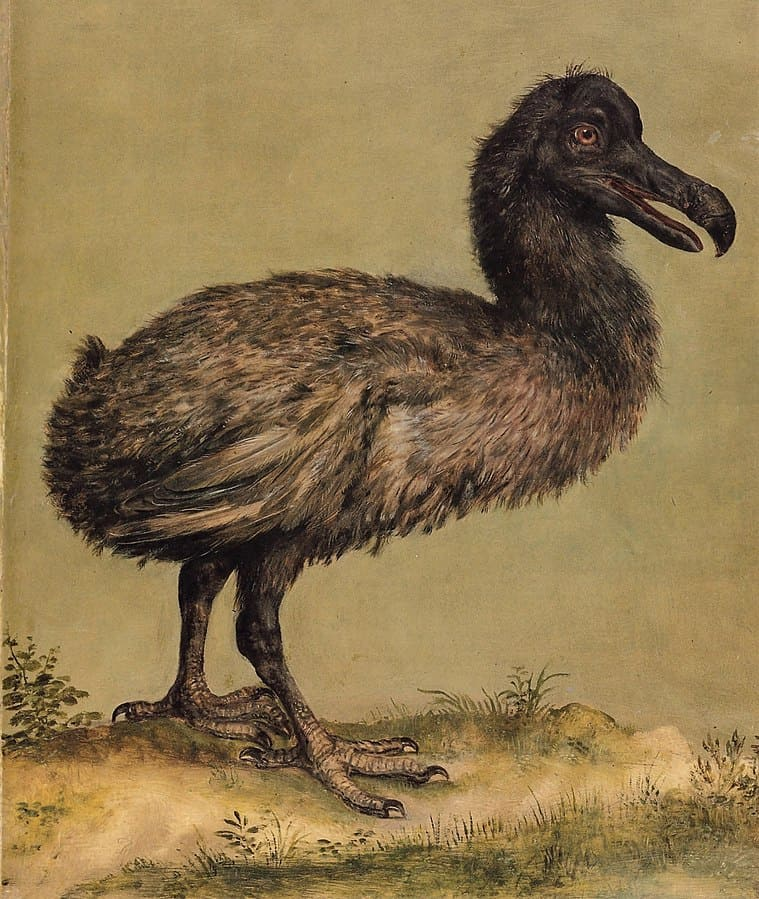

# Table of Contents

-   [Week 2 - August 25](#orgc0399ae)
-   [Week 2 - August 27](#org6f93a24)
-   [Week 3 - August 30](#orgb5addd3)
-   [Week 4 - September 8](#org050b106)
-   [Week 4 - September 10](#org6fc06ef)
-   [Week 5 - September 13](#org18c3f62)
-   [Week 5 - September 15](#orgb4e5419)
-   [Week 5 - September 17](#orgf17e453)
-   [Week 6 - September 20/22](#org404b986)
-   [Week 6 - September 24](#orgd724ba1)
-   [Week 7 - September 27](#orgc93ffa4)
-   [Week 7 - September 29](#orge9a5ffe)
-   [Week 7 - October 1](#org82382f6)
-   [Week 8 - October 6](#org9d9ba6d)
-   [Week 8 - October 8](#orgda5bd05)
-   [Week 9 - October 11](#org3f4e8eb)
-   [Week 9 - October 14](#org025c670)
-   [Week 9 - October 15](#org5a675c5)
-   [Week 10 - October 18](#org5b212dd)
-   [Week 10 - October 22](#orgb3eec4e)
-   [Week 11 - October 25](#org677d37d)
-   [Week 11 - October 27+29](#org4661447)
-   [Week 12 -  November 1](#orgeedd301)
-   [References](#org93376f9)

# Week 2 - August 25

-   Housekeeping
-   Four approaches to AI
-   Major issues
-   Next week: AI applications

## Housekeeping

-   Protocol ([GitHub](https://github.com/birkenkrahe/ai482/blob/main/2_what_is_ai/protocol_23_aug.md))
-   Bookmarks ([GitHub](https://github.com/birkenkrahe/ai482/blob/main/bookmarks.md))
-   Missing sessions:
    -   Google meet? (Poll: Y/N)
    -   Agendas will be posted

# Week 2 - August 27

-   Housekeeping
-   Rational agents
-   Major issues
    
    *Image: "Grace, the ultra-lifelike nurse robot" ([Cairns, 2021](#org0f0e669))*

## Housekeeping

-   [Google meet](https://meet.google.com/pkv-torj-fyt)
-   Staying on top of AI (blogs)
-   AI presentation = individual
-   AI application = team
-   Make them work in tandem

### [Curated] AI blogs

-   [Top 10 blogs and sites (2021)](https://blog.feedspot.com/ai_blogs/)
-   [10 Best AI Blogs To Follow (2017)](https://blog.education-ecosystem.com/10-artificial-intelligence-blogs/)
-   [Google AI Blog](https://ai.googleblog.com/)
-   [Microsoft AI Blog](https://blogs.microsoft.com/ai/)
-   [Amazon AI Blog](https://aws.amazon.com/blogs/machine-learning/)

## References

 [Cairns, R (19 Aug 2021). Meet Grace, the
ultra-lifelike nurse robot. Online: cnn.com.](https://www.cnn.com/2021/08/19/asia/grace-hanson-robotics-android-nurse-hnk-spc-intl/index.html)

# Week 3 - August 30

-   Housekeeping
-   Mon: AI approaches pros/cons
-   Wed: Ideas generation
-   Fri: Project canvas

## Housekeeping

-   [Google meet](https://meet.google.com/nmy-dydn-kwy)
-   [AI Test 2: What is AI?](https://lyon.schoology.com/assignment/5257337255/assessment_questions)
-   [Followup](https://github.com/birkenkrahe/ai482/blob/main/2_what_is_ai/followup_08_27.md) / [Diary](https://github.com/birkenkrahe/ai482/blob/main/diary.md)
-   [Scrum FAQs](https://github.com/birkenkrahe/org/blob/master/FAQ.md#orge594cc2) / TODO: video (MB)

## Ideas generation

-   Goal: choice of topic
-   Presentation (solo)
-   [Submit presentation ideas (Wed)](https://github.com/birkenkrahe/ai482/discussions/4)
-   AI application (**pick a team!**)
-   Project canvas (Fri)

## AI approaches pros/cons

-   [Group exercise](https://github.com/birkenkrahe/ai482/blob/main/2_what_is_ai/2_what_is_ai.md#pros-and-cons)
-   [Results on Kanban board](https://ideaboardz.com/for/AI%20approaches%20pros%20&amp;%20cons/4063343)
-   [Present and discuss in class](https://github.com/birkenkrahe/ai482/blob/main/3_ai_projects/AI_approaches_pros_cons.pdf)

# Week 4 - September 8

> "I'm concerned with the world in which we'll live tomorrow."

## Housekeeping

-   Test 3: research project
-   Project canvas & sprint review
-   Group work: history of AI

## Project

-   [Project Canvas (sample)](https://github.com/birkenkrahe/ai482/blob/main/3_ai_projects/ProjectCanvasSampleAI.pdf)
-   [First sprint review](https://github.com/birkenkrahe/ai482/tree/main/3_ai_projects/1_sprint_review)

## History of AI

-   ["The Thinking Machine" (1961)](https://youtu.be/5YBIrc-6G-0)
-   Structured group discussion<a id="fnr.1" class="footref" href="#fn.1">1</a>
-   Protocol: Fortunato

## Group discussion

<table border="2" cellspacing="0" cellpadding="6" rules="groups" frame="hsides">

<colgroup>
<col  class="org-left" />
</colgroup>
<tbody>
<tr>
<td class="org-left">A: Can technologists learn anything from historical documents? If yes (or no), why (not)?</td>
</tr>

<tr>
<td class="org-left">B: What's the feeling tone of the film? Optimism, scepticism, ambitions?</td>
</tr>

<tr>
<td class="org-left">C: SWOT analysis (Strenghts/Weaknesses/Opportunities/Threats)</td>
</tr>

<tr>
<td class="org-left">D: What are the key questions/issues here: are they still current?</td>
</tr>
</tbody>
</table>

# Week 4 - September 10

-   [Followup: The Thinking Machine I](https://github.com/birkenkrahe/ai482/blob/main/4_ai_history/followup_09_08_2021.md)
-   [Learning & Agile Methods](https://github.com/birkenkrahe/org/blob/master/diary.md)
-   [First sprint reviews](https://github.com/birkenkrahe/ai482/tree/main/3_ai_projects/1_sprint_review) (Team project)
-   Still no ideas? [See Stanford '21 conference](https://hai.stanford.edu/2021-spring-conference-agenda)

# Week 5 - September 13

-   Housekeeping
-   Analogies
-   Are we machines?

## Housekeeping

-   No more tests (participation 50%)
-   Use the protocols instead
-   This week: history and philosophy of AI

## Analogies

-   Full lecture available ([GitHub](https://github.com/birkenkrahe/ai482/blob/main/4_ai_history/analogy.org))
-   *"Your lips are like a red, red rose."*
-   What are the limitations of this analogy?
-   Analogies are persuasion tools

## Are we machines?

-   [The Thinking Machine (15'-33')](https://youtu.be/5YBIrc-6G-0?t=920)
-   Pair up to discuss the analogies
-   Argue: "How are humans NOT like machines."
-   Briefly present your findings

# Week 5 - September 15

> "Intelligent behavior is rule-obeying behavior."

## Automatic creativity?

### [Plotto book (Legro, 2012)](#orgba725b1)

### [Wycliffe Hill's 1931 plot robot (Collins, 2009)](#org4117fe7)

### [Plotto game (Redgrave, 2018)](#orgec5162d)

## Creativity and AI

-   [The Thinking Machine (34'-47')'](https://youtu.be/5YBIrc-6G-0?t=920)
-   When do you feel creative?
-   Do you think AI could help or replace this?
-   What's intelligent about your AI application?
-   Briefly present your findings

## References

 Collins P (6 Jul 2009). The King of All Formulas
[Blog]. [Online: slate.com.](https://slate.com/news-and-politics/2009/07/the-man-who-invented-the-hollywood-schlock-machine.html)

 Legro M (6 Jan 2012). Plotto: The Master Book of All
Plots [Blog]. [Online: brainpickings.org.](https://www.brainpickings.org/2012/01/06/plotto/)

 Redgrave AL (29 Apr 2018). Plotto Demo
[Video]. [Online: youtube.com](https://youtu.be/VbWrs8wm5sA).

# Week 5 - September 17

-   Topic change? Anyone interested in "Grammarly"?
-   History of AI after 1960
-   Next: Intelligent Agents (AIMA)
-   Next: AI in Sales and Marketing (example)

# Week 6 - September 20/22

-   Intelligent agents - PEAS
-   [Lectures in GitHub](https://github.com/birkenkrahe/ai482/tree/main/5_ai_agents)

# Week 6 - September 24

-   Types of intelligent agents ([Iacobelli, 2015](https://youtu.be/UjQ1AzSvCp8?t=1302))
-   AI state of the art
    -   Part I: AI research-to-production gap ([Stanford HAI, 2020](https://youtu.be/tsPuVAMaADY?t=367))
    -   Part II: Change management
    -   Part III: Full cycle of ML projects

*Image source: [Williams, 2020](#orge3a94ef).*

# Week 7 - September 27

-   Recap: what do you remember?
-   See also: "[Healthcare's AI Future](https://youtu.be/Gbnep6RJinQ)"
-   Small data algorithms: [GANs/GPT-3](https://github.com/birkenkrahe/ai482/tree/main/6_ai_state_of_the_art#small-data)
-   Today: "Change management and ML"
-   Next: "Full ML project cycle"

*Image: Two AIs talk about becoming human (Soslow, 2021)*

# Week 7 - September 29

-   Recap: what do you remember?
-   Followup on: [efficiency vs resilience](https://github.com/birkenkrahe/ai482/blob/main/6_ai_state_of_the_art/README.md#org476fe42)
-   New diary entry: [taking stock](https://github.com/birkenkrahe/ai482/blob/main/diary.md#org1e569bc) (Sept 27)

# Week 7 - October 1

-   Today: [AIMA Exercises:](https://aimacode.github.io/aima-exercises/agents-exercises/) anyone? (My part)
-   Oct 6: [AI100 report 2021](https://hai.stanford.edu/news/new-report-assesses-progress-and-risks-artificial-intelligence) (lecture/discussion)
-   Oct 8: [Upload PDF here by 9 AM](https://github.com/birkenkrahe/ai482/tree/main/presentations/2nd_sprint_review) (everybody)

# Week 8 - October 6

-   New diary entry - "[Florida man](https://github.com/birkenkrahe/org/blob/master/diary.md#org56850d9)"
-   Today: [future of AI ("AI100")](https://github.com/birkenkrahe/ai482/tree/main/7_future_of_ai)
-   Fri/Mon: [2nd sprint review](https://github.com/birkenkrahe/ai482/tree/main/presentations/2nd_sprint_review)
-   Tell me your solo presentation topics!

# Week 8 - October 8

-   Fri+Mon: [2nd sprint review](https://github.com/birkenkrahe/ai482/tree/main/presentations/2nd_sprint_review)
-   Fri: Homecoming visit
-   Mon: [sprint review](https://github.com/birkenkrahe/org/blob/master/FAQ.md) critique

# Week 9 - October 11

-   Last [2nd sprint reviews](https://github.com/birkenkrahe/ai482/tree/main/presentations/2nd_sprint_review)
-   [Sprint review](https://github.com/birkenkrahe/org/blob/master/FAQ.md) critique:
    How to create a **great** presentation ([FAQ](https://github.com/birkenkrahe/org/blob/master/FAQ.md#org60f0ff8))
-   New diary/FAQ: [leaving Linux](https://github.com/birkenkrahe/org/blob/master/diary.md#org835fde8)
-   Next: your [presentations](https://github.com/birkenkrahe/ai482/blob/main/schedule.md):
    1.  Jacob on [AI in the military](https://github.com/birkenkrahe/ai482/blob/main/presentations/Sampley_Autonomous%20Drones%20in%20the%20U.S.%20Military.pdf)
    2.  Emma on AI in soccer

# Week 9 - October 14

-   Presentation: [AI in the military](https://github.com/birkenkrahe/ai482/blob/main/presentations/Sampley_Autonomous%20Drones%20in%20the%20U.S.%20Military.pdf) (Jacob Sampley)
-   Lecture: [Machine learning basics](https://github.com/birkenkrahe/ai482/tree/main/8_ai_sales_marketing)<a id="fnr.2" class="footref" href="#fn.2">2</a>

# Week 9 - October 15

-   Presentation Feedback ([protocols](https://github.com/birkenkrahe/ai482/tree/main/protocols#org8c0aa28))
-   Presentation: AI in soccer playing (Emma Brandes)
-   Lecture: [Machine learning basics](https://github.com/birkenkrahe/ai482/tree/main/8_ai_sales_marketing)<a id="fnr.2.100" class="footref" href="#fn.2">2</a>

# Week 10 - October 18

-   Lecture: [Machine learning basics](https://github.com/birkenkrahe/ai482/tree/main/8_machine_learning)
-   [Protocols](https://github.com/birkenkrahe/ai482/tree/main/protocols) (extra credit!)

# Week 10 - October 22

-   [Presentation](https://github.com/birkenkrahe/ai482/tree/main/presentations): Search algorithms (Dat O)
-   [Protocol/Feedback](https://github.com/birkenkrahe/ai482/tree/main/protocols#orgcad7132)

# Week 11 - October 25

## Lecture

[AI for Sales and Marketing](https://github.com/birkenkrahe/ai482/tree/main/9_ai_sales_marketing) (Zero to AI ch.3)

*Image: [machine learning by xkcd](https://xkcd.com/1838/)*

## Homework

Please prepare our session on "AI for Natural Language" on November
1 with some self-study:

1.  To get going, watch 5 minutes of this video (from [here](https://youtu.be/ISa10TrJK7w?t=115) to
    [here](https://youtu.be/ISa10TrJK7w?t=367)) - recent coding successes with AI using natural
    language. This shows recent successes with the GPT-3 model.

2.  Read chapter 5 of "Zero to AI" ([PDF](https://drive.google.com/file/d/1MVSgQhbCX5c2Km7Pjdcy6NiZp3RgauB3/view?usp=sharing)). This is a non-technical
    discussion of different Natural Language Processing (NLP)
    applications. Some questions that you should be able to answer
    afterwards:
    -   Which two metrics are used to measure NLP performance?
    -   Why is sentiment analysis a classification problem?
    -   What does OpenAI's GPT-2 model do?
    -   How does `BrokerBot` differ from `Eliza` the therapist bot?
    -   Which tasks can be automated by AI according to the founder of
        the company featured in the case study at the end?

## What's happening

-   [Research paper recommender at semantic scholar](https://medium.com/ai2-blog/stay-up-to-date-with-the-latest-research-in-your-field-d237d643210)
-   [Open AI and Neuralink](https://youtu.be/ISa10TrJK7w) (video, 3 Oct 2021)<a id="fnr.3" class="footref" href="#fn.3">3</a>
-   News: [AAAI Squirrel AI Award for Cynthia Rudin](https://scitechdaily.com/a-new-nobel-computer-scientist-wins-1-million-artificial-intelligence-prize/)

*Image: Interesting choice of membership categories. (Neurapod)*

# Week 11 - October 27+29

<table border="2" cellspacing="0" cellpadding="6" rules="groups" frame="hsides">

<colgroup>
<col  class="org-left" />

<col  class="org-left" />

<col  class="org-left" />
</colgroup>
<tbody>
<tr>
<td class="org-left"><a href="https://github.com/birkenkrahe/ai482/tree/main/presentations">Presentation</a></td>
<td class="org-left">AI and Football: player health</td>
<td class="org-left">Malcolm</td>
</tr>

<tr>
<td class="org-left"><a href="https://github.com/birkenkrahe/ai482/tree/main/presentations">Presentation</a></td>
<td class="org-left">AI and Soccer: player development</td>
<td class="org-left">Fortunato</td>
</tr>

<tr>
<td class="org-left">Diary (<a href="https://github.com/birkenkrahe/ai482/blob/main/diary.md#monday-october-25">Mon 25</a>)</td>
<td class="org-left">Snapshot and surveillance in China</td>
<td class="org-left">MB</td>
</tr>
</tbody>
</table>

# Week 12 -  November 1

-   AI for Natural Language (reading homework)

## What's happening

-   "Meet Moxie - The Revolutionary Robot Companion for
    Social-Emotional Learning" - <https://embodied.com/>
    
    Video: <https://youtu.be/7-uBtY-MOdI> "Because soft skills are
    essential skills." (Which chain of causation is set up here?)
    
    > "Supporting parents and empowering children to build
    > social-emotional skills that promote confidence and
    > resilience. For children ages 5-10, Moxie’s play-based activities
    > use evidence-based techniques to build social-emotional skills
    > that promote mental well-being."

# References

Francisco Iacobelli (May 15, 2021). intelligent Agents Intro
[video]. [Online: youtube.com](https://youtu.be/UjQ1AzSvCp8?t=1308).

Jack Soslow (Apr 13, 2021). Two AIs talk about becoming
human. (GPT-3) [video]. [Online: youtube.com](https://youtu.be/jz78fSnBG0s).

Neura Pod - Neuralink (Oct 3, 2021). OpenAI&Neuralink
[video]. [Online: youtube.com.](https://youtu.be/ISa10TrJK7w)

Stanford HAI (Sep 23, 2021). Andrew Ng: Bridging AI's
Proof-of-Concept to Production Gap [video]. [Online: youtube.com](https://youtu.be/tsPuVAMaADY?t=367).

 Williams A (Jun 27, 2020). Riot Games give first clues
about new Valorant Agents and abilities [blog]. [Online: dexerto.com](https://www.dexerto.com/valorant/riot-games-give-first-clues-about-new-valorant-agents-and-abilities-1385396/).

# Footnotes

<a id="fn.1" href="#fnr.1">1</a> "Structured group discussion" means that I'm providing a
framework for group discussion and group results (e.g. a set of
questions), and a timeline. Your job is to execute the framework
within the allotted time and present the results as good as you
can. For participation, only participating and trying (harder) is
evaluated, not the quality of the result itself.

<a id="fn.2" href="#fnr.2">2</a> I will only give this lecture if we run out of presentations -
either in a session (because your presentations are finished, and
there is nothing else to discuss, or because you're all done
presenting solo).

<a id="fn.3" href="#fnr.3">3</a> If we've got extra time to spare after a presentation, or if we
don't have a presenter, we'll work through this video to get a glimpse
of some of the exciting new developments in AI. Neuralink is a company
founded by Elon Musk that "is going to change how humans think, act,
learn, and share information."
