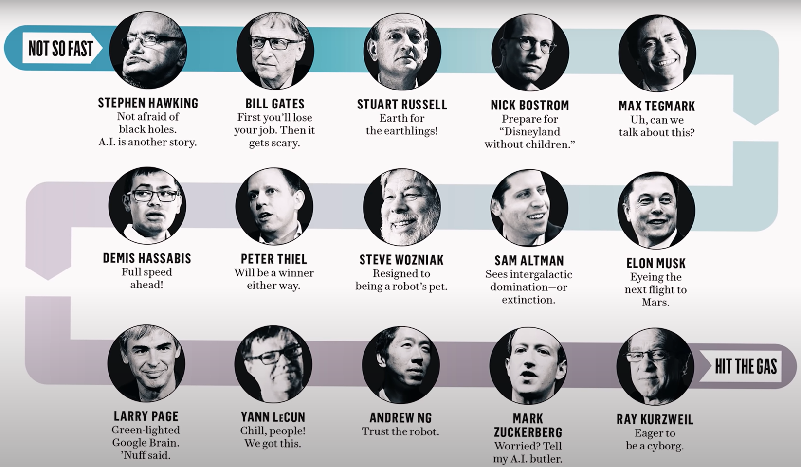

# Table of Contents

1.  [What is this?](#org4e62237)
2.  [Friday, August 27 - Buns & Books](#orgde3caca)
3.  [Monday, September 27 - Deep Learning](#orgae6efd8)
4.  [Monday, October 25 - Snapshot](#orgcd6a4b2)
5.  [References](#orgcdb05ad)

# What is this?

A place for irregular articles of possible interest to students of
the DSC 482.01 course, a special seminar on "Artificial
Intelligence", mostly to avoid lengthy emails and to park content
that I may want to develop later on, if I find the time.

# Friday, August 27 - Buns & Books

## At the Salty Dog

After class today, I went over to the Salty Dog to treat myself to a
much-deserved cappuccino + cinnamon bun. This combo is excellent and
did much to improve my mood (which had already been good anyway).

## At the Library

Once the bun had been handed over to my abdomen, I headed to the
library to drink my coffee: the armchairs near the entrance are
fantastic<a id="fnr.1" class="footref" href="#fn.1">1</a>. Since I was in a library, I put my phone away and
picked up a magazine. Guess what I found? An really interesting
article on AI: "Bot Doc", on a miniature surgical robot
([Feldman/Pratap, 2021](#org039145c)). [I took pictures](https://drive.google.com/drive/folders/1pi3qw5vlkWoChkLqOwOTXOewcGJ2hXrc?usp=sharing) but, of course, to have the
full experience, you should go to the library! This is an example
for a new AI application that you could feature in a presentation
and/or for your own AI application project<a id="fnr.2" class="footref" href="#fn.2">2</a>.

## AI Books

You should do that in any case: they have a great collection of
books on AI. I really don't know why! The books are mostly dated,
but that does not matter so much. I borrowed two, which are
relevant to the next few weeks - "AI - A Philosophical
Introduction" ([Copeland, 1993](#org4790395)), by a professor of logic (now you
know in which quadrant of the graph we are, right?), and "Computers
and Thought" ([Feigenbaum/Feldman eds., 1963](#org4138b56)).

I had only been aware of one book on the philosophy of AI, by
H.L. Dreyfus, "What Computers Still Can't Do" ([1992](#org36aa289)), a pessimistic
account of the progress of AI since its beginnings. Here is a
conversation with Dreyfus on "why machines cannot become human."
([UCTV, 2008](#org267e5b5))<a id="fnr.3" class="footref" href="#fn.3">3</a>:

> "At a time when researchers were proposing grand plans for general
> problem solvers and automatic translation machines, Dreyfus
> predicted that they would fail because their conception of mental
> functioning was naive, and he suggested that they would do well to
> acquaint themselves with modern philosophical approaches to human
> beings. What Computers Can't Do was widely attacked but quietly
> studied. Dreyfus's arguments are still provocative and focus our
> attention once again on what it is that makes human beings unique."
> ([mitpress.edu](https://mitpress.mit.edu/books/what-computers-still-cant-do))

"Computers and Thought" is a scientific monograph with articles by
some of the greats of the field - Turing (the article I already
recommended to you, from 1947), Simon, Newell (both creators of the
"General Problem-solver", another AI attempt in the logic quadrant
of our graph):

> "Computers and Thought showcases the work of the scientists who not
> only defined the field of artificial intelligence, but who are
> responsible for having developed it into what it is
> today. Originally published in 1963, this collection includes
> twenty classic papers by such pioneers as A. M. Turing and Marvin
> Minsky who were behind the pivotal advances in artificially
> simulating human thought processes with computers. Among the now
> hard-to-find articles are reports of computer programs that play
> chess and checkers, prove theorems in logic and geometry, solve
> problems in calculus, balance assembly lines, recognize visual
> temporal patterns, and communicate in natural language. The reports
> of simulation of cognitive processes include computer models of
> human behavior in logic problems, deciding on common stock
> portfolios, and carrying out social interaction. Models of verbal
> learning behavior, predictive behavior in two-choice experiments,
> and concept formation are also included." ([aaai.org](https://www.aaai.org/Press/Books/feigenbaum.php))

I'll dive into these over the weekend when I prepare my upcoming
lectures.

# Monday, September 27 - Deep Learning

A month after the last entry, the AI seminar has somwehat matured:
we've talked about what AI is (and is not), covered some of the
interesting history of AI, looked at the intelligent agent paradigm,
and entered the realm of currently interesting questions (mostly
related to deep learning, a form of machine learning).

As a result of my own immersion into the topic, I come across a lot
of sources some of which are too important not to be passed on, but
class time is so limited that I'd rather do it via diary for those
engaged enough to follow up.

## History of AI

The history of AI is interesting on different levels:
philosophically (history of ideas), practically (consequences), and
scientifically (research). As I pointed out in class, STEM fields
often disregard their history or stash it away to gather dust, as
the plaything of historians and librarians. The reason: these fields
move so fast that there doesn't seem to be time to look
back. Disregarding one's history can incur research burden -
sometimes, results already known have to be rediscovered - and not
crediting first researchers is a form of fraud, too. I became aware
of this for Deep Learning (the topic that Andrew Ng is wrestling
with in his video) via this recent [blog post](https://people.idsia.ch/~juergen/scientific-integrity-turing-award-deep-learning.html) by Schmidhuber
([2021](#org55a909d)). Himself an expert, he documents how the recipients of the
2018 Turing Award (for progress in deep learning), all three of them
giants in their field, were standing on the shoulders of earlier
giants whom they apparently failed to mention.

From my time as a particle physicist, I am aware of similar issues
of intellectual integrity. Often, these occurred because particle
physics is such an old discipline, by comparison with computer
science, or data science and AI<a id="fnr.4" class="footref" href="#fn.4">4</a>, hence memory loss is
systemically induced. Deep Learning does not really have temporal
excuses.

## State of the Art of AI

I'm using Andrew Ng's video lecture for [Stanford HAI (2020)](#org944affc) as a
source for discussion and presentation. Ng is an important
influencer in this space. His company [DeepLearning.ai](https://www.deeplearning.ai/) is focused on
educating large audiences (he is one of the founders of Coursera).

I rather like his style and presentation though of course he is
himself an AI stakeholder and not an independent, impartial
observer (bias!). However, he also seems to be a good scientist,
with integrity and an ability to see his own achievements in the
cold light of truth.

I think the class is a representative sample of the general
population and its (positive and negative) prejudices against AI. I
think just by observing our class dialog one might learn a lot
about how to increase AI literacy in society and in organizations.

Ng focuses on health care examples - this is a major future battle
ground and I recommend listening to this panel discussion between
three AI and healthcare experts ([stanfordonline, 2021](#org0264236)) to get a
better idea of the challenges and opportunities.

As I said in the lecture, AI is already around us, and often
embedded in our systems to a much greater extent than many
assume. I plan to use some of my research money in 2022 to
introduce "[TinyML](https://www.arducam.com/raspberry-pi-pico-tensorflow-lite-micro-person-detection-arducam/)" - machine learning with embedded devices and
micro controllers - to Lyon, since this interests me from a
research point of view, and is also fairly easy to do, affordable
and fun.

# Monday, October 25 - Snapshot

## Curiosity

The AI seminar is picking up speed. There is still so much to talk
and learn about, but between my short lectures and the students'
presentations, I think we'll be able to cover a fair amount of
current AI developments. Enough anyway for the students to go off
and satisfy their curiosity on their own.

The first three student solo presentations were very encouraging!
They were certainly as good as anything that I ever presented to
this class. Keep it up!

## Champions

When I saw this list ([Neura Pod-Neuralink, 2021](#org67c57b2)) of AI champions, I
was wondering how many of them believed in the principal uniqueness
of humans (e.g. because they are Christians). What do you think?

On this list, Russell is a co-author of AIMA, Andrew Ng is known to
you from a video we watched in class, Larry Page created a
successful document search and retrieval algorithm (and founded
Google), and Bill Gates is (indirectly) responsible for your OS.

## China

Scary stuff in this German documentary (by "Deutsche Welle", which
is Germany's BBC World) - use of surveillance technology and AI in
China today and tomorrow.

<https://youtu.be/7gSU_Xes3GQ>

*Image: surveillance data center in Shanghai, China*

# References

 Buchanan BG (1972). Review of Hubert Dreyfus' What
Computers Can't Do: A Critique of Artificial Reason. In: SAIP Memo
AIM-181, Stanford Comp Sci Dept Report STAN-CS-72-325,
Nov 1972. [Online: stanford.edu](http://i.stanford.edu/pub/cstr/reports/cs/tr/72/325/CS-TR-72-325.pdf).

 [Copeland J (1993). Artificial Intelligence> A
Philosophical Introduction. Wiley-Blackwell.](https://www.wiley.com/en-us/Artificial+Intelligence%3A+A+Philosophical+Introduction-p-9780631183853)

 Dreyfus HL. What Computers Can't Do. New York: Harper
& Row (1972).

 [Dreyfus HL. What Computers Still Can't Do. Boston:
MIT Press (1992).](https://mitpress.mit.edu/books/what-computers-still-cant-do)

 Feigenbaum EA, Feldman J (eds.). Computers and
thought. New York: McGraw-Hill (1963). [Online: archive.org.](https://archive.org/details/computersthought00feig)

 Feldman A/Pratap A (2021). Bot Doc. In: Forbes,
August/September 2021:37-39.

 Neura Pod - Neuralink (Oct 3, 2021). OpenAI&Neuralink
[video]:1:55-6:05. [Online: youtube.com.](https://youtu.be/ISa10TrJK7w)

 Schmidhuber J (24 Sep 2021). Scientific Integrity, the
2021 Turing Lecture, and the 2018 Turing Award for Deep Learning
[Blog]. [Online: people.idsia.ch](https://people.idsia.ch/~juergen/scientific-integrity-turing-award-deep-learning.html).

 Stanford HAI (Sep 23, 2020). Andrew Ng: Bridging AI's
Proof-of-Concept to Production Gap [video]. [Online: youtube.com](https://youtu.be/tsPuVAMaADY).

 stanfordonline (Apr 17, 2020). Lecture 1 - Stanford
CS229: Machine Learning - Andrew Ng (Autumn 2018) [video]. [Online:
youtube.com](https://youtu.be/jGwO_UgTS7I?t=2180).

 [University of California Television (1 May
2008). Conversations with History: Hubert Dreyfus [Video]. Online:
YouTube.](https://youtu.be/-CHgt2Szk-I)

# Footnotes

<a id="fn.1" href="#fnr.1">1</a> In fact, a student had fallen asleep on a couch. He was cradling
his laptop. After a few minutes, he got up with the words: "I fell
asleep. What a bad idea." It reminded me of a visit in Paris when I
was 19 or so: there's a famous bookshop, Shakespeare's & Co, across
from the church Notre Dame. I used to go there late at night. The
upper stories had velvet-covered chaise longues. Once, after having
walked around in Paris for hours and hours, I was tired like a dog,
fell asleep on one of those couches, and awoke only on the next
morning: evidently, they had found me and let me sleep there.

<a id="fn.2" href="#fnr.2">2</a> The article contains a few medical terms that I did not know,
like "bariatric surgeon" and "laparoscopy". So much for having studied
Latin and Greek, I suppose. Where are the words when you need them?

<a id="fn.3" href="#fnr.3">3</a> The 1992 book is an update of the classic "What Computers Can't
Do" ([1972](#org97a6e4f)), which was the earliest philosophical attack on AI (not
without pushback, cp. [Buchanan, 1972](#org72c3862)). Twenty years later, the author
remained unrelenting in his critique of AI. Dreyfus and I share a love
for the religious philosopher Soren Kierkegaard, and an awe of the
German phenomenologist Heidegger. Dreyfus' YouTube lectures on these
guys are pretty fascinating.

<a id="fn.4" href="#fnr.4">4</a> The systematic study of particles goes back ca. 2,500 years to
the Greek natural philosophers like Democritus.
