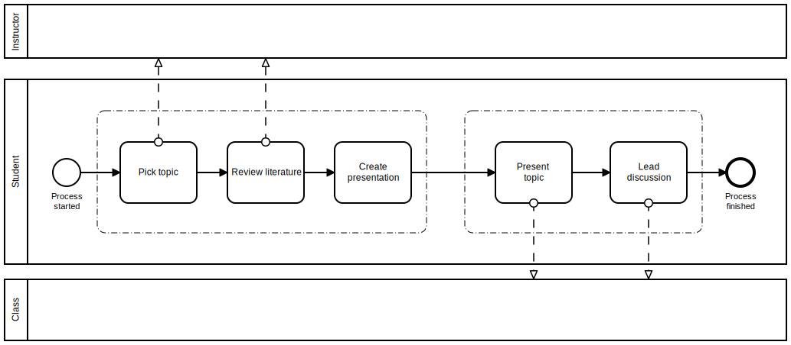

Upload your solo presentations here as a PDF or PPT, and the team
presentations in the respective sprint review folder.   

# Team vs. Solo, Presentation vs. AI Application Project

## Solo presentation

This presentation is already [scheduled](https://github.com/birkenkrahe/ai482/blob/main/schedule.md) (notice that all
presentation dates are now after Fall Break). You can pick a
topic related to your team project, but you don't have to. The
purpose of the presentation is to research a topic and present it
to class. The presentation should take about 30 minutes. If it is
longer, that's OK. You can base it on secondary sources (e.g. a
chapter in AIMA). You have to upload your slides/materials for
the solo presentation **[to this GitHub repo before your
presentation date](https://github.com/birkenkrahe/ai482/tree/main/presentations)**.

Alas, I do not have a rubric for the presentation. I'd like for
the presentation to generate questions for discussion. You should
think about ways to make it more interactive - identifying
questions for discussion is a minimum.

We'll discuss the formal presentation framework before Fall
Break.

## Team project

You should have found a team by now (2-3 people). Your job in
that team is to work towards researching an AI application in a
chosen topic area. You present your idea as part of the sprint
review on September 9 (the first of four reviews). As a team, you
only have 5 minutes, followed by 5 minutes for Q&A. This will
take all of the Friday session. For the sprint review, apply the
FAQ. **[Upload your slides to this GitHub repo](https://github.com/birkenkrahe/ai482/tree/main/3_ai_projects/1_sprint_review)** no later than
Friday, September 9, 9 AM.

To organize your project, you can e.g. use GitHub Projects. Here
is [an example from me](https://github.com/birkenkrahe/ai482/projects/1). You can define your own project and create
a Kanban board, delegate tasks etc. Such a tool is more useful if
you work in a team. Check it out!

# Topic submissions feedback and next steps

I will give feedback directly [in the GitHub discussion forum](https://github.com/birkenkrahe/ai482/discussions/4). The
next steps for everyone is to turn your topic into a (much
smaller) research question so that you can actually research,
validate, and present it. Post your research question in the REPLY
thread of your original submission.

You can also talk to me in, before or after class, or send me a
mail any time. What's not Okay is to just drop a deadline without
a valid excuse (see [syllabus](https://github.com/birkenkrahe/ai482/blob/main/syllabus.md#assignments-and-honor-code)).

