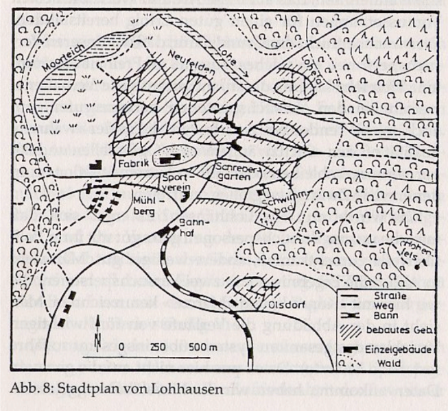
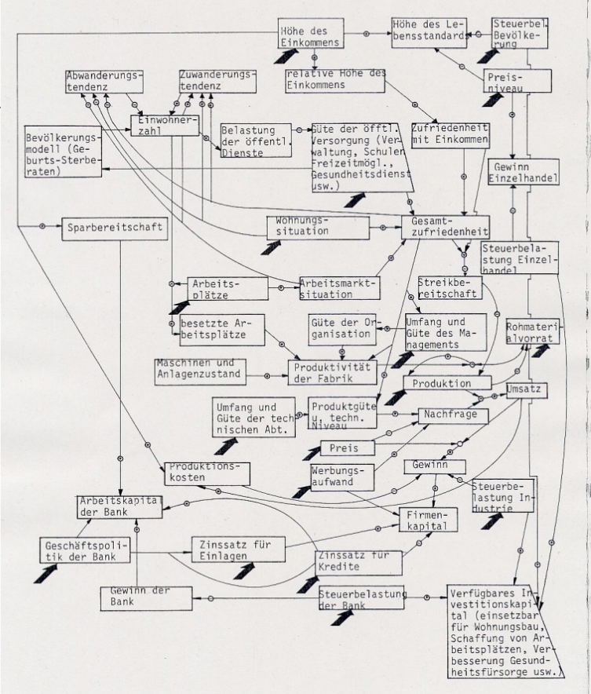
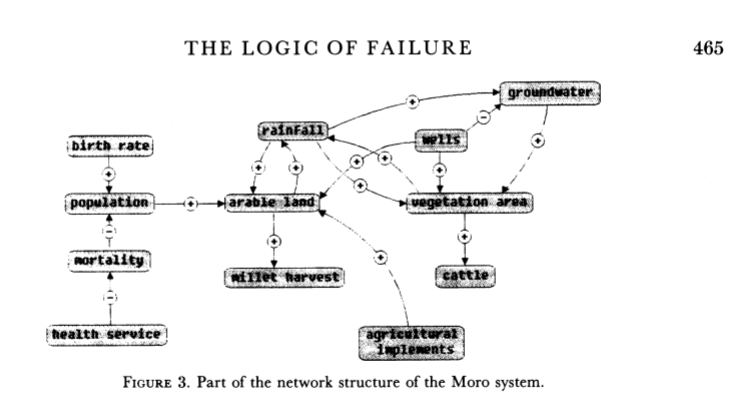

# Table of Contents

1.  [Session Protocols](#org1436e33)
2.  [AI in the military (Jacob Sampley, 13-Oct-2021)](#orgd3b6bda)
3.  [AI in soccer to improve athlete performance (Emma Brandes, 15-Oct-2021)](#org5bd650f)
4.  [Problem Solving & Searching Algorithms (Dat O, 22-Oct-2021)](#orga8ba937)
5.  [Augmented reality (Amber McClurg, 12-Nov-2021)](#orgd2c967a)
6.  [Complexity measures (NLP 2, 15-Nov-2021)](#orgf3aee84)
7.  [References](#org1fd1869)

# Session Protocols

Post your protocol here. Take a look at [my example protocol](https://github.com/birkenkrahe/ai482/blob/main/2_what_is_ai/protocol_23_aug.md).

I have not written protocols for every talk but every speaker should
have received feedback from me via email at least.

# [AI in the military (Jacob Sampley, 13-Oct-2021)](https://github.com/birkenkrahe/ai482/blob/main/presentations/Sampley_Autonomous%20Drones%20in%20the%20U.S.%20Military.pdf)

This presentation was totally worth staying up for all night - very
well done (apart from Jacob's time mgmt prior to the presentation
;-). A great start to the solo presentation series! Jacob really
used his time well: the number of slides was just right for 45
min. 30 min speaking + discussion.

I hope to pick this up at the start on Wed, perhaps re: technology,
because we didn't talk about that at all.

Some potential points of improvement<a id="fnr.1" class="footref" href="#fn.1">1</a>:

1.  There was a clear **research question**, in the subtitle (perhaps
    even a **hypothesis**?). It would have been good to directly answer
    it at the end, "main message" style. Like a paper, a presentation
    benefits from a summary/conclusion. All the information was
    there, on the slides, which were partly organized like a
    paper<a id="fnr.2" class="footref" href="#fn.2">2</a>.
2.  **Audience interaction**: questions to the audience should always
    be **open questions** if you want a discussion, and only closed
    questions for a poll-like interaction (which does wake people
    up): it's sometimes good to ask these throughout the talk.
3.  **Graphics:** Use bar plots instead of tables unless the tables are
    really simple (less than 3-4 rows, and columns). Pie charts are
    also near useless - they worked here only because you had only 2
    categories per chart.
4.  Especially when masked, **diction** is important. When presenting,
    speak slowly, more measured, repeat main points etc. I am setting
    a bad example<a id="fnr.3" class="footref" href="#fn.3">3</a>.

All in all, this was a fantastic presentation, excellently sourced
and delivered, and the questions were well answered and dealt with.

I really enjoyed it - I'm only sorry that I talked so much. You
opened that Pandora box when you permitted questions
throughout. Hope that others will ask more questions in future
presentations!

# [AI in soccer to improve athlete performance (Emma Brandes, 15-Oct-2021)](https://github.com/birkenkrahe/ai482/blob/main/presentations/AI%20in%20soccer%20to%20improve%20athlete%20performance%20DUE%20Nov%2015%20(1).pdf)

Emma presented really interesting, current examples, compared them
and gave us a timeline for these performance and player
performance-oriented applications. She gathered primary data (from
team mates and from her own experience). Excellent amount of
material for session and discussion. The discussion focused on the
actual advantage of these applications for the player, and on the
potential loss of playing skills through data overload. Really
enjoyed the illustration through devices brought to class and
through the video selection.

Points of improvement:

1.  when talking stats, **show** some stats (numbers, tables etc.)
2.  give a better idea on how these devices yield better player
    performance (beyond the commercial hype)
3.  a little more **technical** insight - what exactly is AI here? One
    could e.g. apply models that we have already learnt about, like
    PEAS for intelligent agents. Are these intelligent agents?
4.  **References** ought to include video and image material

# [Problem Solving & Searching Algorithms (Dat O, 22-Oct-2021)](https://github.com/birkenkrahe/ai482/blob/main/presentations/Presentation-DatO.pdf)

This presentation was based on chapter 3 (pp. 81-128) of AIMA. Like
all full chapters in the textbook, it packed a punch - I could
easily lecture for a week on every one of the 6 sub chapters<a id="fnr.4" class="footref" href="#fn.4">4</a>.

Dat did an amazing job of giving an overview of a vast field. He
connected the presented material to previous courses (like
algorithms, data structures etc.), and chose illustrations taken
from educational videos.

I thought it was a thorough introduction that left out exactly what
needed to be left out. Dat used almost the entire time but we still
got to discuss several interesting issues at the end, like:

-   Which skills do you need to work with these algorithms in practice?
-   How much research (if any) is still done in this area (much of it
    is part of the compsci undergraduate curriculum)?
-   Which algorithms are used in which current AI applications?

Especially the last question will be relevant to other presenters as
well. Because there is so much more in this chapter, it will be
useful to you to read it - and much easier now that Dat has given us
an overview.

The solo presentation is also a good stepping stone on his way to
the final presentation and prototype, which will deal with genetic
algorithms.

Points of improvement: almost none. I had wished to see some
implementations (as in: code) for the benefit of those who know how
to write and read code. In AIMA, this is done using pseudocode.

A little more thought about how to get the audience involved would
have improved this presentation even more. This could go as far as
to give them a small task and ask for example, which algorithm would
be suitable for a given sample problem.

Lastly, the examples could have been presented in a closed form -
such a slide would have been easy to memorize. A number of
interesting examples were mentioned. And also - storytelling - but
to turn the presentation of algorithms into a story would have been
a completely different presentation (the easiest way is probably by
presenting the development timeline - when an algorithm was first
developed, improved, used etc.)

# Augmented reality (Amber McClurg, 12-Nov-2021)

After Amber's presentation on the [therapeutic potential of VR](https://github.com/birkenkrahe/ai482/blob/main/presentations/solo/Therapeutic%20Potential%20of%20VR%20McClurg.pdf), we
watched a couple of stupid Facebook (aka "Meta") videos. Here are
the two films that I kept talking about and did not show:

This is Mark Zuckerberg's presentation on the "metaverse" project(s)
for developers and tech people rather than consumers (at least I
think that's the target audience because it's longer and much more
detailed): "[Everything Facebook revealed about the Metaverse in 11
minutes" (2021)](https://youtu.be/gElfIo6uw4g). I found it via this very negative review ("[The demo
of Zuckerberg's dream was a nightmare](https://onezero.medium.com/i-want-no-part-of-our-impending-metaverse-future-459678bb3cc5)")

And here is ["Sight" (2012)](https://vimeo.com/46304267). While dated as a film, it is astonishing
how Facebook (and others) are only now talking about getting this
type of technology into the home. Really, this is not just
augmented, but neurally linked, wearable technology. The film's
ending is ultimately terribly depressing.

I mentioned my experiments with an internship course of
internationally placed seniors in Germany, which took place in
Second Life. I made [this video](https://vimeo.com/19037369) for a conference and to attract
students (2011). My own avatar was a bearded centaur with wings.

I remain un/surprised that VR/AR has not become more
widespread. This is not our primary concern for this course, since
the overlap with AI is sporadic at best, but it could be a possible
scenario for many AI apps whose appeal rests on a similar value
proposition: to take people out of their real lives and insert them
into a virtual reality (which the internet, by the way, is not
because it is not fully immersive).

# Complexity measures (NLP 2, 15-Nov-2021)

Follow-up from the brief discussion about "complexity" (during the
NLP lectures, which is harder to measure than some AI authors make
it look.

### The Logic of Failure

Dietrich Dörner is a theoretical (i.e. computational) psychologist
from Bamberg University (Bavaria, Germany) and author of the
influential book "The Logic of Failure" ([Dörner, 1997](#org09b4c3e)). See also:
review ([Kirkus, 2010](#org1a2e4f0)).

An article by [Dörner (1990)](#org2b8953c) precedes the book and presents the
main arguments with excellent illustrations - from the abstract:

> "Unlike other living creatures, humans can adapt to
> uncertainty. They can form hypotheses about situations marked by
> uncertainty and can anticipate their actions by planning. They can
> expect the unexpected and take precautions against it. In numerous
> experiments, we have investigated the manner in which humans deal
> with these demands. In these experiments, we used computer
> simulated scenarios representing, for example, a small town,
> ecological or economic systems or political systems such as a
> Third World country.

Here is the map of the fictitious town of Lohhausen, which Dörner
simulated, followed by the system model used for the simulation.

I always find the very concept of a "logic of failure" quite
puzzling - isn't logic independent of success or failure but
describes just "what is"? The article's conclusions make it a
little clearer, why he used the term "logic":

> "It is possible to learn strategic flexibility. I believe,
> however, that it is difficult to teach it. It is not a matter of
> learning a few readily grasped general principles, but of learning
> a lot of small, 'local' rules, each of which is applicable in a
> limited area. The point is not to learn how to drive a steamroller
> with which one can flatten all problems in the same way, but to
> learn the adroitness of the puppeteer, who at one time holds many
> strings in his hands and who is able to adapt his movements to the
> given circumstances in the most sophisticated ways."

### Complex systems

Page (in The Model Thinker) mentions 'complexity' but does not
define it except through examples. Dörner made an attempt at a
definition, which we talked about it class (and applied it).

-   "A system is complex when it consists of a great variety of
    variables."
-   "All these variables are closely tied to one another, they
    mutually affect each other and constitute a network of
    independencies."
-   "The system is dynamic, which means that it develops further,
    even without interventions."
-   "The system is intransparent [because] many of the variables
    defy direct observation."
-   "The system is uncertain [because] the acting subject has no
    complete knowledge about the system, about its variables and
    their interdependencies."
    
    

To summarize: complex problems (in complex systems) mean

1.  large number of variables
2.  large network of interdependent variables
3.  dynamic evolution without intervention
4.  intransparency to direct observation
5.  great uncertainty due to incomplete knowledge

The last criterion is actually more like a summary of the previous
four, and it introduces the important term "uncertainty". Complex
systems carry uncertainty, but not all uncertainty is due to
complexity.

For more details, see [Frensch & Funke (1995)](#orge97ccf1) on complex problem
solving.

### References

 [Dörner, D (1990). The logic of failure. In:
Phil. Trans.R. Soc. Lond. B 327:463-473 (1990).](https://www.gwern.net/docs/existential-risk/1990-dorner.pdf)

 [Dörner, D (1997). The Logic of Failure> Recognizing
And Avoiding Error In Complex Situations. Basic Books.](https://www.amazon.com/Logic-Failure-Recognizing-Avoiding-Situations/dp/0201479486)

 [Frensch P, Funke J (1995). Complex Problem Solving:
The European Perspective. Hillsdale NJ: Lawrence Erlbaum.](https://www.researchgate.net/publication/200134353_Complex_Problem_Solving-The_European_Perspective)

 [NA (20 May 2010). The Logic of Failure: Why things go
wrong and what we can do to make them right. In: Kirkus Review.](https://www.kirkusreviews.com/book-reviews/dietrich-dorner/the-logic-of-failure/)

# References

CNET (Oct 28, 2021). Everything Facebook revealed about the
Metaverse in 11 minutes [video]. [URL: youtu.be/gElfIo6uw4g](https://youtu.be/gElfIo6uw4g).

Robot Genius (2012). Sight [video]. [URL: vimeo.com.](https://vimeo.com/46304267)

Stephen Moore (Oct 29 2021). I Want No Part of Our Impending
Metaverse Future The demo of Zuckerberg’s dream was a nightmare
[blog]. URL: [onezero.medium.com.](https://onezero.medium.com/i-want-no-part-of-our-impending-metaverse-future-459678bb3cc5)

# Footnotes

<a id="fn.1" href="#fnr.1">1</a> Remember: unless explicitly noted, the assumption is that lists
are ordered. The human mind orders them automatically from top to
bottom. Keep this in mind by using numbering and by putting the most
important stuff to the top (especially important in presentations
because people run out of time towards the end of slides and/or
presentations).

<a id="fn.2" href="#fnr.2">2</a> In fact, at second thought, it would have been better to choose
either essay or presentation mode.

<a id="fn.3" href="#fnr.3">3</a> I really don't have any excuses: foreigners and teachers should
be held to much more stringent presentation standards. Alas, because
we speak so much, and audiences are often silent and forgiving (unlike
in business), bad habits tend to fester. Also, many teachers are
resistant to change.

<a id="fn.4" href="#fnr.4">4</a> I had meant to work through the chapter weeks ago but then one
thing happened and then another and I didn't get to reading through it
until shortly before the presentation, and I found it very difficult,
even with my background. A lot of the descriptions and examples in
AIMA are exceptionally dense. Several of the footnotes and the
bibliography hide recent research and are state-of-the-art. AIMA is
definitely not a typical textbook in this regard - just like AI is not
a typical course topic (because it's evolving so fast in front of your
very eyes!).
